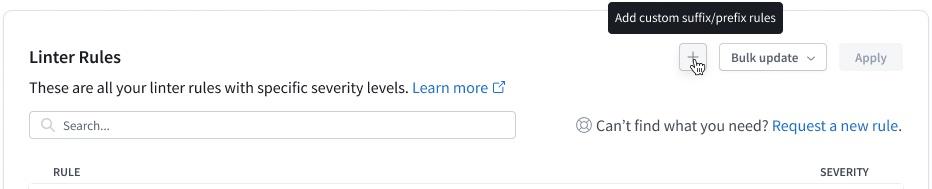
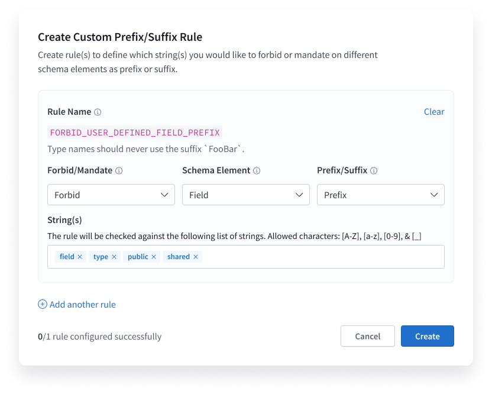

This reference lists the default rules that you can enforce with [GraphOS schema linting](./schema-linter/). You can also create [custom rules](#custom-rules) to forbid or require prefixes or suffixes you define on specific schema elements.

Rules are categorized by the part(s) of your schema that they correspond to.

## Schema

These rules apply to the entire schema.

#### `DOES_NOT_PARSE`

The schema linter raises this violation if it attempts to read a malformed GraphQL schema. Check your schema for any syntax errors.

<hr />

#### `QUERY_DOCUMENT_DECLARATION`

A GraphQL schema should never include definitions of GraphQL _operations_ (such as queries and mutations).

<p style="margin-bottom: 0">❌</p>

```graphql title="schema.graphql"
type Query {
  users: [User!]!
}

#highlight-start
query GetUsers {
  # Don't define operations in a schema document
  users {
    id
  }
}
#highlight-end
```

#### `ALL_ELEMENTS_REQUIRE_DESCRIPTION`

Each element in the schema must include a description.

<p style="margin-bottom: 0">❌</p>

```graphql title="schema.graphql"
type User {
  username: String!
}
```

<p style="margin-bottom: 0">✅</p>

```graphql title="schema.graphql"
# Represents a user
type User {
  # The username of the user
  username: String!
}
```

## Fields

These rules apply to _all_ fields, except for [`FIELDS_HAVE_DESCRIPTIONS_QUERY_MUTATION`](#fields_have_descriptions_query_mutation) which only applies to fields in queries and mutations.

#### `FIELD_NAMES_SHOULD_BE_CAMEL_CASE`

Field names should always use `camelCase`.

<p style="margin-bottom: 0">❌</p>

```graphql title="schema.graphql"
type User {
  # highlight-start
  FirstName: String! # PascalCase
  # highlight-end
}
```

<p style="margin-bottom: 0">✅</p>

```graphql title="schema.graphql"
type User {
  # highlight-start
  firstName: String # camelCase
  # highlight-end
}
```

<hr />

#### `RESTY_FIELD_NAMES`

A field's name should never start with any of the following verbs:

- `get`
- `list`
- `post`
- `put`
- `patch`

> Most fields should not start with _any_ verb, with the exception of `Mutation` fields. For `Mutation` fields, use a verb that more specifically describes the action being performed (such as `create`, `delete`, or `edit`).

<p style="margin-bottom: 0">❌</p>

```graphql title="schema.graphql"
type Query {
  getUsers: [User!]! # highlight-line
}
```

<p style="margin-bottom: 0">✅</p>

```graphql title="schema.graphql"
type Query {
  users: [User!]! # highlight-line
}
```

#### `FIELDS_HAVE_DESCRIPTIONS_QUERY_MUTATION`

All query and mutation fields have descriptions.

<p style="margin-bottom: 0">❌</p>

```graphql title="schema.graphql"
type Mutation {
  createBlogPost(blogPostContent: BlogPostContent!): Post
}
```

<p style="margin-bottom: 0">✅</p>

```graphql title="schema.graphql"
type Mutation {
  # Create a new blog post
  createBlogPost(
    # The content of the blog post to be created
    blogPostContent: BlogPostContent!
  ): Post
}
```

## Types

These rules apply to _all_ types that appear in a GraphQL schema, including:

- Objects
- Interfaces
- Inputs
- Enums
- Unions

#### `TYPE_NAMES_SHOULD_BE_PASCAL_CASE`

All type names should use `PascalCase`.

<p style="margin-bottom: 0">❌</p>

```graphql title="schema.graphql"
# highlight-start
type streamingService { # camelCase
  # highlight-end
  id: ID!
}
```

<p style="margin-bottom: 0">✅</p>

```graphql title="schema.graphql"
# highlight-start
type StreamingService { # PascalCase
  # highlight-end
  id: ID!
}
```

<hr />

#### `TYPE_PREFIX`

Type names should never use the prefix `Type`.

<p style="margin-bottom: 0">❌</p>

```graphql title="schema.graphql"
type TypeBook { # highlight-line
  title: String!
}
```

<p style="margin-bottom: 0">✅</p>

```graphql title="schema.graphql"
type Book { # highlight-line
  title: String!
}
```

<hr />

#### `TYPE_SUFFIX`

Type names should never use the suffix `Type`.

<p style="margin-bottom: 0">❌</p>

```graphql title="schema.graphql"
type BookType { # highlight-line
  title: String!
}
```

<p style="margin-bottom: 0">✅</p>

```graphql title="schema.graphql"
type Book { # highlight-line
  title: String!
}
```

#### `DEFINED_TYPES_ARE_USED`

All defined types are used at least once in the schema.

Types that are defined but then not used are most likely due to a mistake such as incomplete refactoring. Unused types take up space and can confuse readers.

<p style="margin-bottom: 0">❌</p>

```graphql title="schema.graphql"
type someUnusedType { # Also fails the TYPE_SUFFIX rule!
  name: String!
}
```

<p style="margin-bottom: 0">✅</p>

```graphql title="schema.graphql"
type Book {
  title: String!
}

type Query {
  books: [Book!]!
}
```

## Objects

#### `OBJECT_PREFIX`

An object type's name should never use the prefix `Object`.

<p style="margin-bottom: 0">❌</p>

```graphql title="schema.graphql"
type ObjectBook { # highlight-line
  title: String!
}
```

<p style="margin-bottom: 0">✅</p>

```graphql title="schema.graphql"
type Book { # highlight-line
  title: String!
}
```

<hr />

#### `OBJECT_SUFFIX`

An object type's name should never use the suffix `Object`.

<p style="margin-bottom: 0">❌</p>

```graphql title="schema.graphql"
type BookObject { # highlight-line
  title: String!
}
```

<p style="margin-bottom: 0">✅</p>

```graphql title="schema.graphql"
type Book { # highlight-line
  title: String!
}
```

## Interfaces

#### `INTERFACE_PREFIX`

An interface type's name should never use the prefix `Interface`.

<p style="margin-bottom: 0">❌</p>

```graphql title="schema.graphql"
interface InterfaceBook { # highlight-line
  title: String
  author: String
}
```

<p style="margin-bottom: 0">✅</p>

```graphql title="schema.graphql"
interface Book { # highlight-line
  title: String
  author: String
}
```

<hr />

#### `INTERFACE_SUFFIX`

An interface type's name should never use the suffix `Interface`.

<p style="margin-bottom: 0">❌</p>

```graphql title="schema.graphql"
interface BookInterface { # highlight-line
  title: String
  author: String
}
```

<p style="margin-bottom: 0">✅</p>

```graphql title="schema.graphql"
interface Book { # highlight-line
  title: String
  author: String
}
```

## Inputs & arguments

#### `INPUT_ARGUMENT_NAMES_SHOULD_BE_CAMEL_CASE`

A GraphQL argument's name should always use `camelCase`.

<p style="margin-bottom: 0">❌</p>

```graphql title="schema.graphql"
type Mutation {
  #highlight-start
  createBlogPost(BlogPostContent: BlogPostContent!): Post # PascalCase
  #highlight-end
}
```

<p style="margin-bottom: 0">✅</p>

```graphql title="schema.graphql"
type Mutation {
  #highlight-start
  createBlogPost(blogPostContent: BlogPostContent!): Post # camelCase
  #highlight-end
}
```

<hr />

#### `INPUT_TYPE_SUFFIX`

An input type's name should always use the suffix `Input`.

<p style="margin-bottom: 0">❌</p>

```graphql title="schema.graphql"
input BlogPostDetails { #highlight-line
  title: String!
  content: String!
}
```

<p style="margin-bottom: 0">✅</p>

```graphql title="schema.graphql"
input BlogPostDetailsInput { #highlight-line
  title: String!
  content: String!
}
```

## Enums

#### `ENUM_VALUES_SHOULD_BE_SCREAMING_SNAKE_CASE`

Enum values should always use `SCREAMING_SNAKE_CASE`.

<p style="margin-bottom: 0">❌</p>

```graphql title="schema.graphql"
enum Amenity {
  # highlight-start
  public_park # snake_case
  # highlight-end
}
```

<p style="margin-bottom: 0">✅</p>

```graphql title="schema.graphql"
enum Amenity {
  # highlight-start
  PUBLIC_PARK # SCREAMING_SNAKE_CASE 😱
  # highlight-end
}
```

<hr />

#### `ENUM_PREFIX`

An enum type's name should never use the prefix `Enum`.

<p style="margin-bottom: 0">❌</p>

```graphql title="schema.graphql"
enum EnumResidence { # highlight-line
  HOUSE
  APARTMENT
  CONDO
}
```

<p style="margin-bottom: 0">✅</p>

```graphql title="schema.graphql"
enum Residence { # highlight-line
  HOUSE
  APARTMENT
  CONDO
}
```

<hr />

#### `ENUM_SUFFIX`

An enum type's name should never use the suffix `Enum`.

<p style="margin-bottom: 0">❌</p>

```graphql title="schema.graphql"
enum ResidenceEnum { # highlight-line
  HOUSE
  APARTMENT
  CONDO
}
```

<p style="margin-bottom: 0">✅</p>

```graphql title="schema.graphql"
enum Residence { # highlight-line
  HOUSE
  APARTMENT
  CONDO
}
```

<hr />

#### `ENUM_USED_AS_INPUT_WITHOUT_SUFFIX`

If an enum type is used as an input argument, its name _should_ use the suffix `Input`.

<p style="margin-bottom: 0">❌</p>

```graphql title="schema.graphql"
enum Role { # highlight-line
  EDITOR
  VIEWER
}

type Query {
  users(role: Role): [User!]! # highlight-line
}
```

<p style="margin-bottom: 0">✅</p>

```graphql title="schema.graphql"
enum RoleInput { # highlight-line
  EDITOR
  VIEWER
}

type Query {
  users(role: RoleInput): [User!]! # highlight-line
}
```

<hr />

#### `ENUM_USED_AS_OUTPUT_DESPITE_SUFFIX`

If an enum is used as the return type of a _non_-input field, its name _should not_ use the suffix `Input`.

<p style="margin-bottom: 0">❌</p>

```graphql title="schema.graphql"
enum RoleInput { # highlight-line
  EDITOR
  VIEWER
}

type Query {
  userRole(userId: ID!): RoleInput # highlight-line
}
```

<p style="margin-bottom: 0">✅</p>

```graphql title="schema.graphql"
enum Role { # highlight-line
  EDITOR
  VIEWER
}

type Query {
  userRole(userId: ID!): Role # highlight-line
}
```

## Directives

#### `DIRECTIVE_NAMES_SHOULD_BE_CAMEL_CASE`

Directive names should always use `camelCase`.

<p style="margin-bottom: 0">❌</p>

```graphql title="schema.graphql"
directive @SpecialField on FIELD_DEFINITION # PascalCase
```

<p style="margin-bottom: 0">✅</p>

```graphql title="schema.graphql"
directive @specialField on FIELD_DEFINITION # camelCase
```

<hr />

#### `CONTACT_DIRECTIVE_MISSING`

A subgraph schema should always provide owner contact details via the `@contact` directive. [Learn more.](../graphs/federated-graphs#contact-info-for-subgraphs)

<p style="margin-bottom: 0">✅</p>

```graphql title="schema.graphql"
directive @contact(
  "Contact title of the subgraph owner"
  name: String!
  "URL where the subgraph's owner can be reached"
  url: String
  "Other relevant notes can be included here; supports markdown links"
  description: String
) on SCHEMA

extend schema
  @contact(
    name: "Products Team"
    url: "https://myteam.slack.com/archives/teams-chat-room-url"
    description: "Send urgent issues to [#oncall](https://yourteam.slack.com/archives/oncall)."
  )
```

<hr />

#### `DEPRECATED_DIRECTIVE_MISSING_REASON`

The `@deprecated` directive should always include a `reason` argument.

<p style="margin-bottom: 0">❌</p>

```graphql title="schema.graphql"
type Product {
  title: String @deprecated #highlight-line
  name: String!
}
```

<p style="margin-bottom: 0">✅</p>

```graphql title="schema.graphql"
type Product {
  title: String @deprecated(reason: "Use Product.name instead") #highlight-line
  name: String!
}
```

<hr />

#### `TAG_DIRECTIVE_USES_UNKNOWN_NAME`

The `@tag` directive should always use an approved value for its `name` argument. You specify approved values in [GraphOS Studio](./schema-linter/#configuring-the-linter).

## Custom rules

You can create custom rules to forbid or require certain terms as prefixes or suffixes in a specific schema element. You can create rules for the following elements:

- Fields
- Types
- Objects
- Interfaces
- Inputs
- Enums
- Unions

A rule can include multiple strings to forbid or require, but each rule can _either_ only forbid _or_ require the terms and can only apply to one schema element.

### Custom rule configuration

To create a new rule, click the **+** button above your list of linter rules.



In the modal that opens, select the following:

- Which **Schema element** you want to apply the rule to
- Whether you want to **Forbid** or **Require** certain terms
- Whether the terms should be considered **Prefixes** or **Suffixes**
- The **Strings** the rule should check for; the allowed characters are `[A-Z]`, `[a-z]`, `[0-9]`, and `[_]`

> **Note:** Rules are case-sensitive.

Apollo dynamically generates the rule name based on your selections. For example, if you create a rule forbidding certain prefixes for interfaces, the rule name would be `INTERFACE_FORBID_USER_DEFINED_PREFIX`.



You can add as many rules as you like by clicking **Add another rule**. Once you've finished, don't forget to click **Create**.

Your custom rules appear in the list of rules with the **Custom** tag. Once created, you can edit them by clicking the pencil icon on the right of the rule's name.

As with other linter rules, you can [configure their severity](./schema-linter/#setting-severity-levels), including setting their severity to **Ignore**, if you want to disable them. To delete a rule, click the pencil icon and then click the trash can icon next to it in the custom rule modal.
