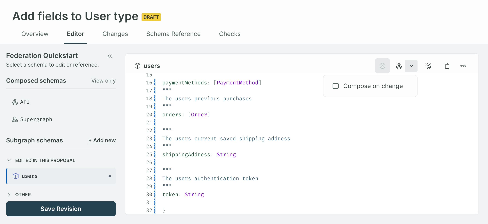

<GraphOSEnterpriseRequired />

## Start a proposal

You can create a new proposal in [GraphOS Studio](https://studio.apollographql.com?referrer=docs-content) from either:

- A graph's proposals list

  - To access the proposals list page, click the pencil icon with the tooltip that says **Go to schema change proposals**.

    

- A variant's schema SDL
  - To access a variant's SDL, click the variant from the **Graphs** page, select **Schema** from the left nav, and then select **SDL**.

    

From either location:

1. Click the **Propose changes** button in the top right. A modal entitled **Propose schema changes** appears.
   
2. Enter a descriptive **proposal title** that outlines the schema changes you plan to propose.

   <Note>

   You cannot change a proposal's title once it's created.

   </Note>

3. Select a **source variant**. (This is only necessary if you've opened your proposal from the proposals list page.)

   <Note>

   The source variant's schema is used to start the proposal, but the proposal is not kept in sync with any schema changes that occur while the proposal is in progress.

   </Note>

4. Optionally, enter the rationale for the proposed changes. This rationale appears as your proposal's README on the proposal overview and gives collaborators and reviewers context for the proposed changes. This field accepts [Markdown](https://www.markdownguide.org/getting-started/).

    <Note>

    If you want to edit the proposal's README later, you can do so from its [**Overview** tab](./review-proposals/#overview).

    </Note>

5. Click **Create Proposal**.

Once you've created the proposal, you land on the newly created proposal's **Editor** tab. This tab is where you [make the schema changes](#edit-subgraph-schemas) you want to propose.

## Edit subgraph schemas

You can directly edit one or more subgraph schemas on a proposal's **Editor** tab.

To start a new subgraph, click **+Add new** from the subgraph schema selector in the left nav.

You can also delete and rename existing subgraph schemas by clicking the **•••** menu to the right of a subgraph's name.

### Lint changes

To lint the schema changes you've made, click the broom icon in the top right of the editor.

Clicking the button opens a panel where you can run the [schema linter](./schema-linter) on the current changes in the editor.
After successfully running a lint on your schema, the panel displays any linter violations so you can fix them accordingly.

If you are having trouble finding the exact location of where the lint violation occurred, click the line in the violations list to highlight it in the editor.

<Note>

When a coordinate with a lint violation is changed so that it no longer exists—either because you've renamed or deleted a field—it appears grayed out in the violations list. See, for example, the `line 52 + User.token` in the screenshot above. This indicates you can ignore the violation.

</Note>

Once you've made changes in the editor, rerun linting by clicking the rerun button in the top right of the **Schema linting** panel.

### Save revisions

Once you've made changes, click the **Save Revision** button in the top right of the editor to save them to your proposal.
A modal appears where you can optionally include a summary of your changes. This field accepts [Markdown](https://www.markdownguide.org/getting-started/).

This summary appears in the activity your proposal's overview tab. A proposal can include as many revisions as necessary.

<Tip>

You can think of each revision as equal to a [commit](<https://en.wikipedia.org/wiki/Commit_(version_control)>) in the version control paradigm. Making each revision an atomic change can more easily give reviewers an overview of the changes that make up a proposal.

</Tip>

## Schema checks

[Schema checks](./schema-checks) automatically run each time you save a revision. These appear in a proposal's **Checks** tab.

Checks run against the schema of the source variant from which the proposal was created.
This enables checks to capture breaking changes based on the source variant's operation history.

<Note>

Checks run against the source variant's schema as it was when the proposal was created.
Changes to the source variant schema made after the proposal was created aren't considered during checks.
For example, if the source variant schema includes a new type, unless the proposal also adds the type, then the proposal's checks show that type as being deleted.

</Note>

## Self-review and commentary

While working on a proposal and before requesting reviews from teammates, you may want to review the proposal yourself. See the [Review proposals](./review-proposals) article for how to review different aspects of a proposal and [provide commentary](./review-proposals/#add-comments) on it.

## Change proposal status

You can manually change the proposal's status from the overview page by clicking **Edit status**. You have the following choices:

- **Draft**: default status upon creation
- **Open for feedback**: signals the proposal is ready for review
- **Closed**: signals the proposal is abandoned or suspended
  - Closed proposals cannot receive further revisions
  - You can always reopen a proposal by resetting the status to Draft or Open for feedback

**Approved** and **Implemented** statuses are automatically set once [necessary conditions](./schema-proposals#proposal-workflow) have been met.

## Request review

Add reviewers by clicking **Manage reviewers** on the proposal's overview tab:

### Approved reviews

<ApprovedSchemaProposals />

