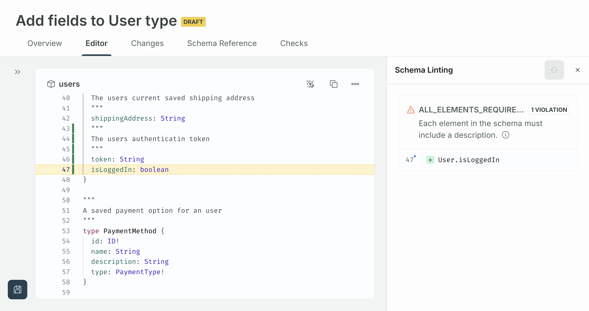

<GraphOSEnterpriseRequired />

## Start a proposal

You can create a new proposal in [GraphOS Studio](https://studio.apollographql.com?referrer=docs-content) from either:

- The proposals list page

  - To access the proposals list page, click the pencil icon with the tooltip that says **Go to schema change proposals**.
    

- A variant's schema SDL page
  - To access a variant's SDL, click the variant from the **Graphs** page, select **Schema** from the left nav, and then select **SDL**.
    {' '}
    

From either location:

1. Select **Propose changes**. A modal entitled **Propose schema changes** appears.
   
2. Enter a descriptive **proposal title** that outlines the changes you plan to propose.

   <Note>

   You cannot change a proposal's title once it's been created.

   </Note>

3. Select a **source variant**. (This is only necessary if you've opened your proposal from the proposals list page.)

   <Note>

   The source variant's schema is used to start the proposal, but the proposal is not kept in sync with the variant's schema if it changes while the proposal is being worked on.

   </Note>

4. Optionally, enter the rationale for the proposed changes in Markdown. This description appears in your proposal's README and gives collaborators and reviewers context for the proposed changes.

    <Note>

    If you want to edit the proposal's description later, you can do so from its [**Overview** tab](#overview).

    </Note>

5. Click **Create Proposal**.

Once you've created the proposal, you land on the newly created proposal's **Editor** tab. This is where you can [make the schema changes](#edit-subgraph-schemas) you want to propose.

## Edit subgraph schemas

On a proposal's **Editor** tab, you can directly edit one or more subgraph schemas. To propose adding a new subgraph, click **+Add new** from the subgraph schema selector in the left nav.

### Lint changes

To lint the schema changes you've made, you can click the broom icon in the top right of the editor.

Clicking the button opens a panel where you can run the [schema linter](./schema-linter) on the current changes made in the editor.

After successfully running a lint on your schema, you can see any linter violations if they exist so you can change them accordingly.

Once you have made changes to your schema, you can rerun your lint using the rerun button in the top right of the panel.

When a coordinate that has a lint violation is modified such that it no longer exists (i.e. renaming a type/deleting a field), it shows up as greyed out so you know to ignore it while working on the other violations you may have.

If you are having trouble finding the exact location of where the lint violation occurred, you can click the line in the results list to reveal the violating line in the editor.

### Save revisions

Once you've made changes, click **Save Revision** in the top right of the editor to save them to your proposal.
A modal appears where you can optionally include a summary of your changes.
This summary appears in your proposal's overview tab.

A proposal can include as many revisions as necessary.

<Tip>

In the version control paradigm, you can think of each each revision as equal to a [commit](<https://en.wikipedia.org/wiki/Commit_(version_control)>).
To give reviewers an overview of the revisions that make up a proposal, it can be helpful to make each revision an atomic change.

</Tip>

## Schema checks

[Schema checks](./schema-checks) automatically run each time you save a revision. These appear in a proposal's **Checks** tab.

Checks run against the source variant that the proposal was created from.
This enables checks to capture breaking changes based on operation history from the source variant.

<Note>

The checks run against the source variant's schema as it was when the proposal was created.
Changes to the source variant that were made after the proposal was created are not incorporated into the schema.
For example, if the source variant schema includes a new type, unless the proposal also adds the type, then the proposal's checks show that type as being deleted.

</Note>

## Self-review and commentary

While working on a proposal and before requesting reviews from teammates, you may want to review the proposal yourself. See the [Review proposals doc](./review-proposals) for how you can review different aspects of a proposal and [provide commentary](./review-proposals/#add-comments) on it.

## Request review

Once your proposal is ready for review, you can add reviewers by clicking **Manage reviewers** on the proposal's overview tab.
Adding reviewers automatically sets the [proposal's status](#change-proposal-status) to **Open for Feedback*.

Once a proposal receives the minimum number of approvals, its status changes to **Approved**.

<Note>

Changes made to an approved proposal will not change the approved status of the Proposal.

</Note>

## Change proposal status

You can manually change the proposal's status from the overview page to one of the following:

- Draft: default status upon creation
- Open for feedback: default status once reviewers are selected
- Closed: you may want to close your proposal in case it no longer needs review 

