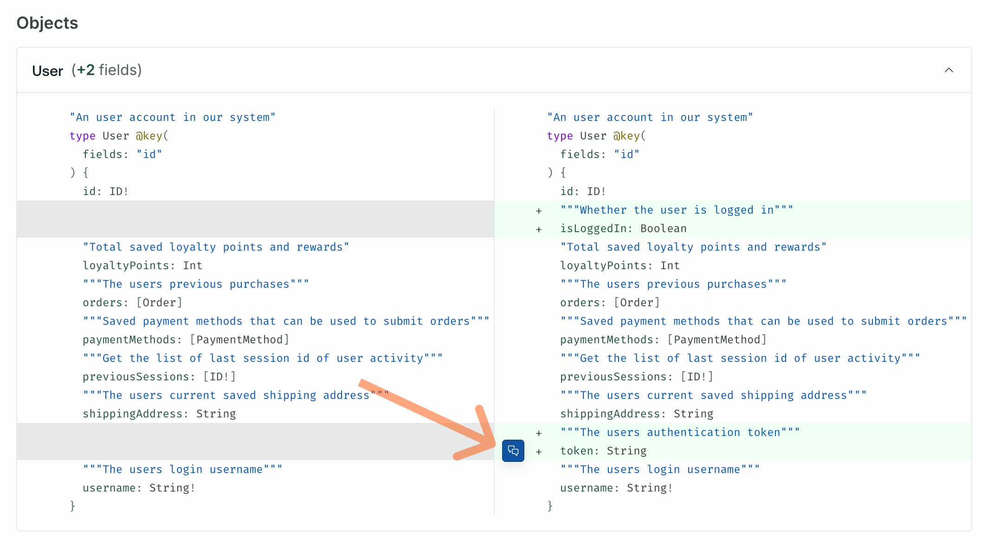
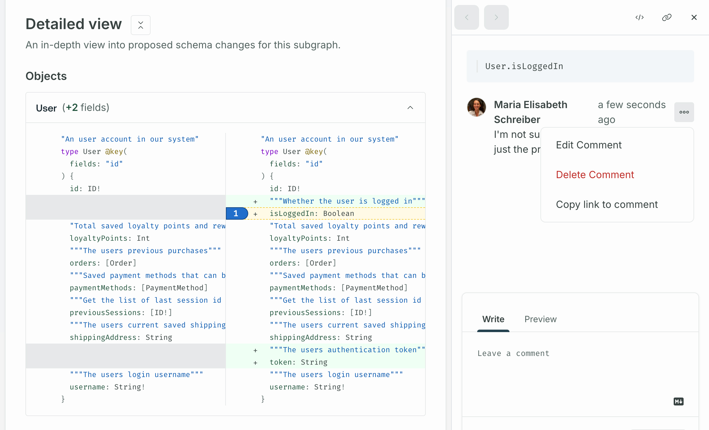
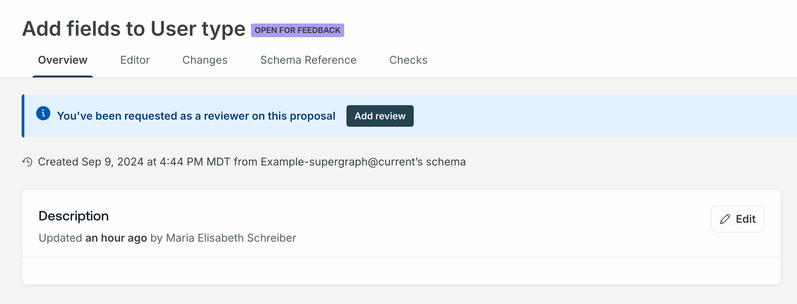

<GraphOSEnterpriseRequired />

This article describes actions in the **Proposal review** stage of the [schema proposal process](./schema-proposals#proposal-process).

## Review a proposal

Proposal creators and reviewers can review different aspects of a proposal from its four non-editor tabs in [GraphOS Studio](https://studio.apollographql.com?referrer=docs-content).

- A proposal's **Overview** tab is where team members with [the appropriate permissions](./configure-proposals#configure-permissions-and-approvals) can:
  - View and edit a proposal's description by clicking the pencil icon on the **README**.
  - Use the **Proposal activity** log to monitor changes over time and leave overall commentary.
  - View the proposal's status and author.
  - Select reviewers.
- The [**Changes**](#changes) tab shows both a summary and detailed view of the schema changes that make up a proposal.
  - All viewers can also [provide commentary](#add-comments) on changes from the **Changes** tab.
- The [**Schema Reference**](#schema-reference) tab shows the entire supergraph schema reference with the proposal's changes applied.
- The [**Checks**](./propose-changes#schema-checks) tab shows all [schema checks](./schema-checks) that have run for [saved revisions](./propose-changes#save-revisions).

### Changes

A proposal's **Changes** tab shows both a **Summary** and **Detailed view** of the schema changes that make up a proposal:

- The **Summary** shows the number of objects, interfaces, and other types that were changed in the proposal. Each type shows the number of lines there were added, deleted, and modified.

- The **Detailed view** shows a collapsible diff for each changed type.

#### Add comments

You can comment on any lines in the detailed view's diff. Hover over the line and click on the chat icon that appears.

Write your comment in the panel that appears on the right.

Click on the **•••** button next to a comment to edit or delete it.

Share a comment by clicking the link button to copy its URL.

The blue tab that appears next to a line shows the number of comments that line has.

### Schema Reference

The **Schema Reference** tab shows the entire supergraph schema reference with the proposal's changes applied. Select **Proposal changes only** to view only the changes.

You can use the other filters to the left of **Proposal changes only** to hone in on certain subgraphs, tags, directives, and more.

The left nav shows you the number of types the proposal changes. Clicking into a type, for example **Object**, shows the specific objects that were changed. You can click on any changed type to see which fields were added and removed.

## Add a review

Once you've reviewed a proposal, click the **Add review** button on the top right of the proposal's overview tab to formalize your review.

A modal appears where you can leave general commentary on the proposal and select to approve the proposal or not.

You can edit your review by clicking the pencil icon next to your name in the list of **Reviewers**.

### Approved reviews

<ApprovedSchemaProposals />
