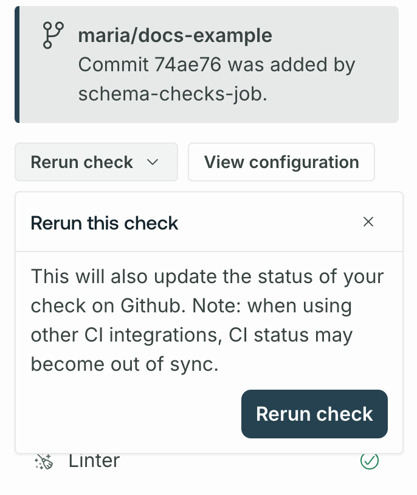
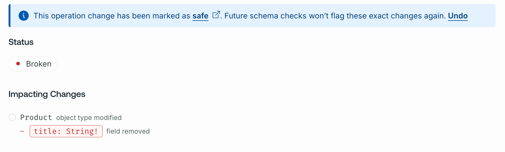

This guide covers running your first schema check and integrating checks into your CI pipeline. See [Configure Schema Checks](./check-configurations) for configuration options.

## Prerequisites

Before running your first schema check do the following:

1. Ensure you've published all your subgraph schemas to GraphOS and that those schemas are up to date. [Learn how to publish schemas.](./)
2. Ensure your supergraph is sending operation metrics to GraphOS. [Operations checks](./schema-checks#operations-checks-1) uses historical metrics to determine whether a potentially dangerous schema change is safe.

   - If you have a [cloud supergraph](../graphs/#cloud-supergraphs), your router reports metrics automatically.
   - [See setup for other graph types.](../metrics/sending-operation-metrics/)

   <Note>

   If GraphOS has no operation metrics to compare against, all potentially dangerous schema changes result in a failed check.

   </Note>

3. [Install the Rover CLI](/rover/getting-started/) in your development environment and [authenticate it with GraphOS](/rover/configuring/#authenticating-with-graphos).

## Running checks

Let's say you've made local changes to one of your subgraph schemas. After you [complete the prerequisites](#prerequisites), you can run schema checks against those changes with the `rover subgraph check` command.

<Note>

If you have a [monograph](../graphs/#monographs), use [`rover graph`](/rover/commands/graphs/#validating-schema-changes) commands instead of `rover subgraph` commands.

</Note>

The `rover subgraph check` command looks something like this:

```bash showLineNumbers=false
rover subgraph check \
  docs-example-graph@main \
  --name products \
  --schema ./schema.graphql
```

It requires the following:

- Your graph ref
  - Your graph ref is available from your supergraph's **Overview** page in GraphOS Studio.
- The name of the subgraph with schema changes
- The locally modified version of your schema

  - In the example command above, the schema is provided via a `.graphql` file.
  - If your schema is not in a standalone `.graphql` file, you can run your GraphQL server locally and pipe its schema directly from `rover graph introspect`, like so:

    ```bash showLineNumbers=false

    rover subgraph introspect http://localhost:4000 \
     | rover subgraph check docs-example-graph@main \
     --name products \
     --schema -

    ```

Try changing something in the local version to see a check in action. If everything is set up correctly, the command's output looks similar to the output shown in [the check response](#the-check-response).

### The checks lifecycle

When you run `rover subgraph check`:

1. GraphOS generates a diff between your local schema and the published schema for the variant you're checking against.
2. GraphOS uses this diff to determine whether the changes affect any operations executed against your supergraph within a [customizable time window](./check-configurations/) (by default, this is the last seven days).
3. GraphOS returns the diff and a list of operations affected by the changes.
4. Rover prints the check result and returns a non-zero exit code if at least one breaking change is found. You can also view the check result in the Studio UI.

#### The check response

Running `rover subgraph check` outputs the diff of all detected schema changes and highlights breaking changes. For example:

```bash disableCopy showLineNumbers=false
$ rover subgraph check docs-example-graph@current --subgraph products --schema ./schema.graphql

Validated the proposed subgraph against metrics from docs-example-graph@current
Compared 1 schema changes against 24 operations
┌────────┬────────────────────┬─────────────────────────────────────────────────────────┐
│ Change │        Code        │                       Description                       │
├────────┼────────────────────┼─────────────────────────────────────────────────────────┤
│ PASS   │ FIELD_CHANGED_TYPE │ field `Query.books`: type `[Book]` changed to `[Book!]` │
└────────┴────────────────────┴─────────────────────────────────────────────────────────┘

View full details at https://studio.apollographql.com/service/docs-example-graph/checks/<DETAILS>
```

Each change to the schema is labeled either `PASS` or `FAIL`. For a complete list of schema change codes, see the [Reference](./checks-reference#types-of-schema-changes).

<Note>

Because schema checks detect breaking changes by analyzing recent operations, your graph must [report metrics to GraphOS](#prerequisites) for operations checks to work. If there are no operation metrics to compare against, all potentially dangerous schema changes are labeled `FAIL`.

</Note>

The `rover subgraph check` command returns a non-zero result if any check fails.

The output includes a Studio URL that provides full details on the changes and their impact on existing clients and operations:


If you've [integrated schema checks with your GitHub PRs](#integrating-with-github), the **Details** link in your GitHub check takes you to this same details page.

If you run a check within a Git repository, `rover subgraph check` sends both the commit hash and that hash's author to GraphOS to display on the check. If you haven't [integrated schema checks with GitHub](#integrating-with-github), the author appears as **Unknown**. If you want to override author, commit, or other values, you can [set environment variables in Rover](/rover/configuring/#overriding).

### Rerunning checks

You can rerun checks from GraphOS Studio. Select the check and click **Rerun check**.



The new run uses the current [check configuration options](./check-configurations), regardless of the configuration at the time of the original run.
Similarly, the new run's time window is based on the current time, not when the original check ran.

<Note>

If you've [integrated schema checks with your GitHub PRs](#integrating-with-github), rerunning the check also updates the status of the check in GitHub.

</Note>

### Overriding flagged changes

Occasionally, schema checks might flag a change that you know is safe. For example, you might change an input type's field from nullable to non-nullable (usually a breaking change) when you're certain your clients never provide a null value for the field.

You can override flagged changes on an operation-by-operation basis or update your check configurations to ignore certain kinds of changes.

<Note>

If you use the GraphOS Router to [report operation metrics](../metrics/sending-operation-metrics), you can configure [extended reference reporting](/router/configuration/overview/#extended-reference-reporting) for more accurate operations checks.

</Note>

#### Override changes per operation

[**Org admins** and **Graph admins**](../org/members) can override flagged changes on an operation-by-operation basis in GraphOS Studio.
From the associated check's details page, select the **Override** dropdown under a flagged operation:


For each operation with flagged changes, you can override those changes in the following ways:

- **Mark change as safe**: In this case, schema checks will not flag these exact changes for the operation in future executions. This effectively "approves" the changes for the operation.
  - If a future check detects approved changes along with new unsafe changes to the operation, the new unsafe changes will be flagged.
- **Ignore the operation**: In this case, schema checks will completely ignore the operation when checking all changes in any future execution.
  - This option is useful when you know an operation originates only from clients or client versions you don't actively support.

You can **Undo** an override from the banner that appears on any overridden operations.



#### Ignored conditions settings

You can update your check configurations so operations checks don't flag the following kinds of changes:

- **Ignore breaking changes when there are no operations**: This setting ignores any potentially breaking changes when an operations check is run against zero operations.
- **Ignore default value changes**: This setting ignores changes to default values.

  <Note>
    This setting ignores default value changes but doesn't ignore default value
    removals.
  </Note>

You enable these settings from the **Configuration** tab of your variant's **Checks** page.
Learn about other [check configurations](./check-configurations).

## Using in CI

Schema checks are especially useful when you add them to your CI pipeline, such as Jenkins or CircleCI. This allows you to obtain check results and display them directly on your team's pull requests.

Apollo recommends defining a separate CI job for each [variant](#checking-against-multiple-environments) (production, staging, etc.) you want to validate your changes against. The `rover subgraph check` command returns a non-zero exit code when it detects a breaking change, meaning the CI job fails when the check fails.

### Authenticating Rover

The `rover config auth` command is interactive, which means you shouldn't use it in CI environments. Instead, you can authenticate Rover with Studio by setting the `APOLLO_KEY` environment variable in CI. For details, see [Configuring Rover](/rover/configuring).

### Example CI configuration

The following config defines a schema check job for a CircleCI pipeline. Your config's syntax varies depending on your CI tool, but the job's steps are the same.

```yaml {30} title="config.yml"
version: 2

jobs:
  # ...other jobs...

  # Define a separate job for each environment you validate against.
  check_against_staging:
    docker:
      - image: circleci/node:12

    steps:
      - checkout

      - run: npm install

      # Start the GraphQL server. If a different command is used to
      # start the server, use it in place of `npm start` here.
      - run:
          name: Starting server
          command: npm start
          background: true

      # Make sure the server has enough time to start up before running
      # commands against it.
      - run: sleep 5

      # In CI environments, this command authenticates via the `APOLLO_KEY`
      # environment variable.
      - run: rover subgraph check docs-example-graph@current --name products --schema ./schema.graphql
```

## Next steps

Once you've enabled schema checks, you can [configure them](./check-configurations) to suit your use case. Configurations include excluding certain historical operations from operations checks, ignoring certain types of schema changes, and more.

### Integrating with GitHub

[Connecting schema checks to GitHub](./github-integration) enables GraphOS to send a webhook back to your GitHub project on each call to `rover subgraph check`. This provides built-in pass/fail status checks on your pull requests:


### Integrating with other version control services

If you're using GitHub Enterprise, Bitbucket, or another version control service, we recommend setting up your CI tool to post a comment on each pull request with the results of schema checks. By surfacing schema diffs and breaking changes directly in your PR, you can avoid searching your CI logs to determine why a check failed.
