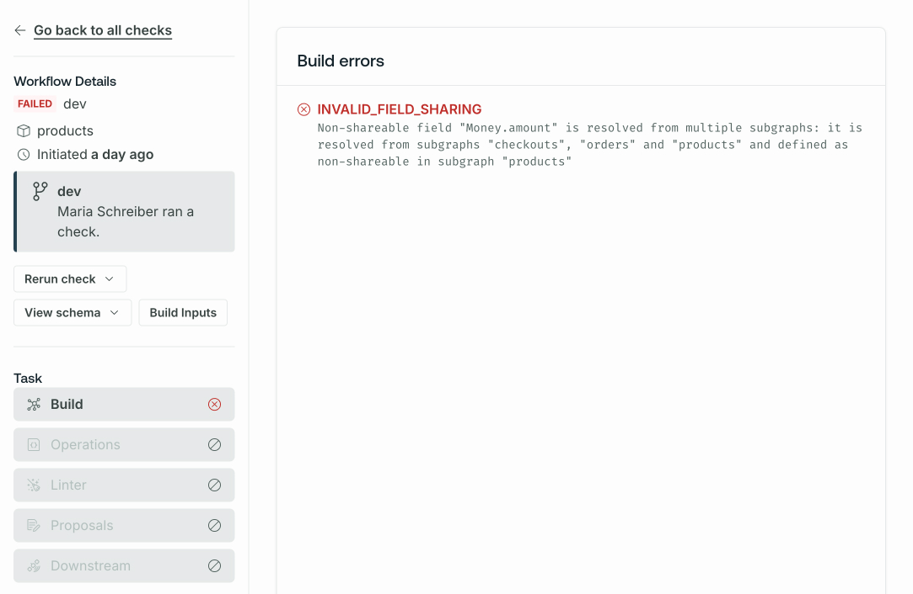
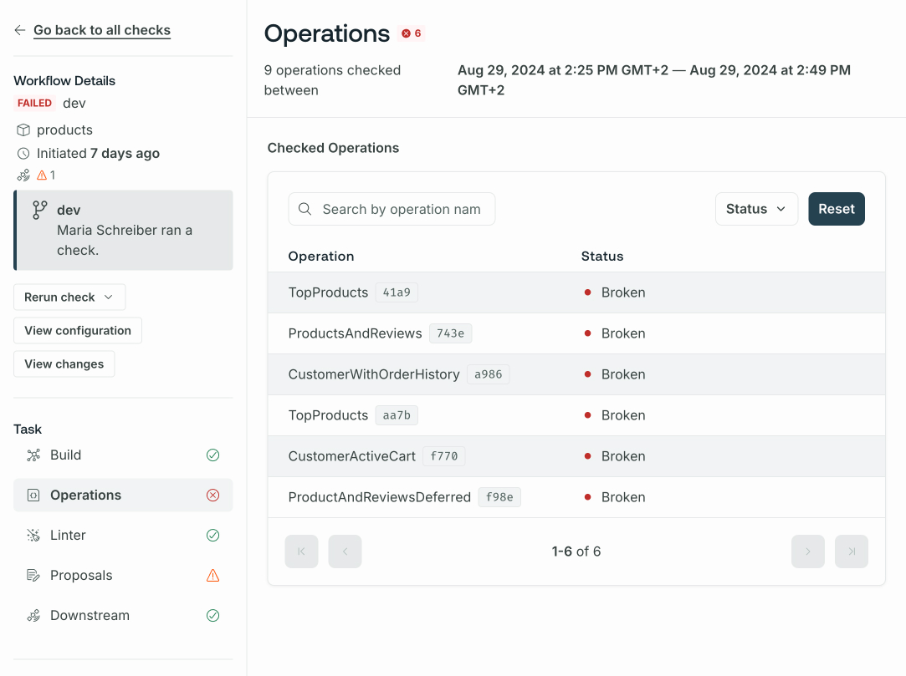

Certain changes to your graph's schema (such as removing a field or type) might break one of your application's clients. GraphOS schema checks help you identify breaking changes before you make them. They can also help you identify when a potentially dangerous change is, in fact, safe.

You run checks using the Rover CLI and can integrate checks into your CI pipeline. GraphOS Studio displays check results, helping you make informed decisions about evolving your graph.


Except for [proposal and contract checks](#types-of-checks), schema checks are free as part of [all Apollo plans](https://www.apollographql.com/pricing/).

## Types of checks

GraphOS can perform the following types of schema checks:

<table className="field-table">
<thead>
<tr>
<th>Check Type</th>
<th>Description</th>
</tr>
</thead>
<tbody>
<tr>
<td>

#### Build checks

</td>
<td>

For supergraphs, verify whether proposed changes to a subgraph
schema successfully compose with other subgraph schemas. Also known as _composition checks_.

</td>
</tr>
<tr>
<td>

#### Operations checks

</td>
<td>
Compare proposed schema changes against historical operations to
verify whether the changes break any of your graph's active clients.
</td>
</tr>
<tr>
<td>

#### Linter checks

</td>
<td>
Analyze proposed schema changes for violations of formatting rules
and other GraphQL best practices.
</td>
</tr>
<tr>
<td>

#### Proposals checks

(Enterprise only)

</td>
<td>
Check whether your proposed schema changes have matching and approved{' '}
<a href="./schema-proposals">schema proposals</a>.
</td>
</tr>
<tr>
<td>

#### (Downstream) contract checks

(Enterprise only)

</td>
<td>

When running schema checks on a source variant, check whether your
proposed schema changes break any downstream [contract](./contracts) variants.

</td>
</tr>
</tbody>
</table>

This article provides further details on build and operations checks.

- For details on linter checks, see [Schema linting](./schema-linter/).
- For details on proposals checks, see [Schema proposals check configuration](./schema-proposals/configuration#configure-schema-checks).
- For details on contract checks, see [Contract checks](./contract-setup/#run-contract-checks).

### Build checks

When you run a schema check, GraphOS performs a _build check_ before performing any other checks. A build check verifies that changes you make to a subgraph schema are valid GraphQL definitions and are compatible with your other subgraph schemas, enabling them to [compose](/federation/federated-types/composition/) into a supergraph schema for your router. For that reason, build checks are sometimes called composition checks.

If a build check fails, GraphOS performs no other checks for the provided schema.

You can inspect a particular build check from your graph's **Checks** page in GraphOS Studio to view its result. If composition succeeded, you can view the composed supergraph schema. Regardless of success, you can view the proposed subgraph schema.



### Operations checks

If a build check succeeds, GraphOS then validates schema changes with _operations checks_. Operations checks use your graph's historical client operation data to determine whether any clients would be negatively affected by the proposed schema changes. For example, an operations check would flag a change that removes a field that multiple clients use in their operations.



## Limitations

### Operations check cardinality

Operations checks run against a maximum of 10,000 distinct operations. GraphOS Studio displays when a larger cardinality has been reached.

### Input field usage reporting

<Note>

This limitation only applies to reporting metrics from Apollo Server and older versions of the Apollo Router Core.

If you use the GraphOS Router to [report operation metrics](../metrics/sending-operation-metrics), you can configure [enhanced operation signature normalization](/router/configuration/overview/#enhanced-operation-signature-normalization) and [extended reference reporting](/router/configuration/overview/#extended-reference-reporting) to track input field usage.

</Note>

GraphOS tracks operation usage. To deduplicate operations, Apollo uses [operation signatures](../metrics/operation-signatures) to denormalize the arguments and inputs. However, operation signatures don't track which fields on input types are used.

For example, by default, GraphOS doesn't track how many times the input field `GetUsersInput.firstName` is used in this schema:

```graphql disableCopy showLineNumbers=false
type Query {
  getUsers(filters: GetUsersInput): [User]
}

input GetUsersInput {
  firstName: String
  lastName: String
}

type User {
  id: ID!
  firstName: String!
  lastName: String!
}
```

## Next steps

To learn how to run your first schema check, integrate checks into your CI pipeline, and customize checks behavior, refer to [Run schema checks](./check-configurations).
You can also [connect schema checks to GitHub](./github-integration) to add links to check results on the pull requests that initiate them. See the [Checks reference](./checks-reference) for the types of schema changes that checks detect.
