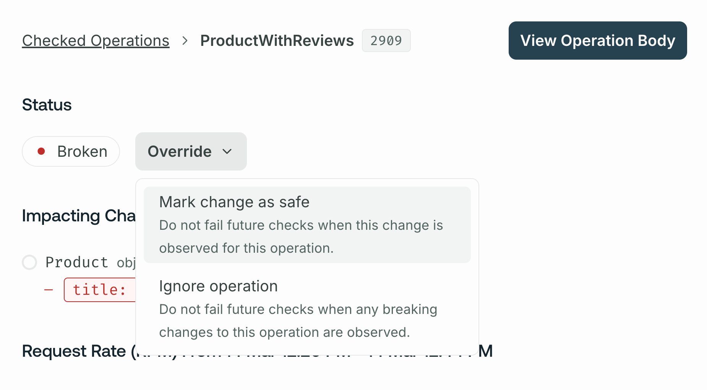

Certain changes to your graph's schema (such as removing a field or type) might break one of your application's clients. GraphOS schema checks help you identify breaking changes before you make them. They can also help you identify when a potentially dangerous change is, in fact, safe.

You can review the results of schema checks inside GraphOS Studio from your graph's **Checks** page, helping you make informed decisions about evolving your graph:


With the exception of [contract checks](#types-of-checks), schema checks are free as part of [all Apollo plans](https://www.apollographql.com/pricing/).

## Types of checks

GraphOS can perform the following types of schema checks:

- [Composition checks](#composition-checks): For supergraphs, verify whether your proposed changes to a subgraph schema successfully compose with your other subgraph schemas.

- [Operation checks](#operation-checks): Compare your proposed schema changes against historical operations to verify whether the changes break any of your graph's active clients.

- [Linter checks](./schema-linter/): Analyze your proposed schema changes for violations of formatting rules and other GraphQL best practices.

- [Proposal checks](./schema-proposals/configuration#configure-schema-checks) (Enterprise only): Check whether your proposed schema changes have matching and approved [schema proposals](./schema-proposals).

- [Contract checks](./contract-setup/#run-contract-checks) (Enterprise only): When running schema checks on a source variant, also check whether your proposed schema changes break any downstream contract variants.

Most of this article covers composition and operation checks.

- For details on linter checks, see [Schema linting](./schema-linter/).
- For details on proposal checks, see [Schema proposals check configuration](./schema-proposals/configuration#configure-schema-checks).
- For details on contract checks, see [Contract checks](./contract-setup/#run-contract-checks).

## Prerequisites

To enable schema checks for your supergraph, do the following if you haven't yet:

1. Make sure you've published all your subgraph schemas to GraphOS and that those schemas are up to date.
   - [Learn how to publish schemas.](./)
2. For operation checks, make sure your supergraph is sending operation metrics to GraphOS. GraphOS uses historical metrics to determine whether a potentially dangerous schema change is safe.

   <Caution>

   If GraphOS has no operation metrics to compare against, all potentially dangerous schema changes result in a failed check.

   </Caution>

   - If you have a [cloud supergraph](../graphs/#cloud-supergraphs), your router reports metrics automatically.
   - [See setup for other graph types.](../metrics/sending-operation-metrics/)

3. [Install the Rover CLI](/rover/getting-started/) in your development environment and [authenticate it with GraphOS](/rover/configuring/#authenticating-with-graphos).

## Running your first check

Let's say you've made local changes to one of your subgraph schemas. After you [complete the prerequisites](#prerequisites), you can run schema checks against those changes with the `rover subgraph check` command.

<Note>

If you have a [monograph](../graphs/#monographs) (which is not recommended), use [`rover graph`](/rover/commands/graphs/#validating-schema-changes) commands instead of `rover subgraph` commands.

</Note>

The `rover subgraph check` command looks like this:

```bash showLineNumbers=false
rover subgraph check docs-example-graph@main --name products --schema ./schema.graphql
```

It requires the following:

- Your registered graph's _graph ref_, which a string with the format `graph-id@variant-name` (for example, `docs-example-graph@main`). This is available from your supergraph's README page in GraphOS Studio.

- The locally modified version of your schema. In the command above, the schema is provided via a `.graphql` file.

  - If your schema is not in a standalone `.graphql` file, you can run your GraphQL server locally and pipe its schema directly from `rover graph introspect`, like so:

    ```bash showLineNumbers=false
    rover subgraph introspect http://localhost:4000 | rover subgraph check docs-example-graph@main --name products --schema -
    ```

Try changing something in the local version of your schema and see what happens! If everything is set up correctly, the command's output looks similar to the output shown in [The check response](#the-check-response).

## The checks lifecycle

When you run `rover subgraph check`:

1. GraphOS generates a diff between your local schema and the published schema for the variant you're checking against.
2. GraphOS uses this diff to determine whether the changes affect any operations that have been executed against your supergraph within a [customizable time window](./check-configurations/) (by default, this is the last seven days).
3. GraphOS returns the diff, along with a list of the operations affected by the changes.
4. Rover prints the check result and returns a non-zero exit code if at least one breaking change is found.

### The check response

Running `rover subgraph check` outputs the diff of all detected schema changes and highlights breaking changes:

```console
$ rover subgraph check docs-example-graph@current --subgraph products --schema ./schema.graphql

Validated the proposed subgraph against metrics from docs-example-graph@current
Compared 1 schema changes against 24 operations
┌────────┬────────────────────┬─────────────────────────────────────────────────────────┐
│ Change │        Code        │                       Description                       │
├────────┼────────────────────┼─────────────────────────────────────────────────────────┤
│ PASS   │ FIELD_CHANGED_TYPE │ field `Query.books`: type `[Book]` changed to `[Book!]` │
└────────┴────────────────────┴─────────────────────────────────────────────────────────┘

View full details at https://studio.apollographql.com/service/docs-example-graph/checks/<DETAILS>
```

Each change to the schema is labeled either `PASS` or `FAIL`.

<Note>

Because breaking changes are detected by analyzing recent operations, your graph must [report metrics to GraphOS](#prerequisites) for schema checks to work. If there are no operation metrics to compare against, all potentially dangerous schema changes are labeled `FAIL`.

</Note>

The `rover subgraph check` command returns a nonzero result if any check fails.

The output also includes a Studio URL that provides full details on the changes and their impact on existing clients and operations:


If you've [integrated schema checks with your GitHub PRs](#integrating-with-github), the **Details** link in your GitHub check takes you to this same details page.

If you run a check within a Git repository, `rover subgraph check` sends both the commit hash and that hash's author to GraphOS to display on the check. If you haven't [integrated schema checks with GitHub](#integrating-with-github), the author appears as **Unknown**. If you want to override author, commit, or other values, you can [set environment variables in Rover](/rover/configuring/#overriding) to do so.

### Rerunning checks

You can rerun checks from GraphOS Studio. Select the check and click **Rerun check**.


When you rerun a check, the new run uses the current [check configuration options](./check-configurations/), regardless of the configuration at the time of the original run. Similarly, the new run's time window is based on the current time, not when the original check ran.

The new checks run incorporates any changes made to excluded or included clients, checked variants, and any operations marked as safe or ignored.

<Note>

If you've [integrated schema checks with your GitHub PRs](#integrating-with-github), a rerun of the check also updates the status of the check in GitHub.

</Note>

## Composition checks

When you run `rover subgraph check`, GraphOS performs a _composition check_ before performing any other checks. A composition check verifies that changes you make to a subgraph schema are valid GraphQL definitions and are compatible with your other subgraph schemas, enabling them to [compose](/federation/federated-types/composition/) into a supergraph schema for your router.

If a composition check fails, Studio does not perform additional checks for the provided schema.

From your graph's **Checks** page in GraphOS Studio, you can click a particular composition check to view its result. If composition succeeded, you can view the composed supergraph schema. Regardless of success, you can view the proposed subgraph schema.

## Operation checks

If a [composition check](#composition-checks) succeeds, GraphOS then validates schema changes with _operation checks_. Operation checks use your graph's historical client operation data to determine whether any clients would be negatively affected by the proposed schema changes. For example, an operation check would flag a change that removes a field that multiple clients use in their operations.

<Note>

If you use the GraphOS Router to [report operation metrics](../metrics/sending-operation-metrics), you can configure extended reference reporting for more accurate operation checks. [Learn more.](/router/configuration/overview/#extended-reference-reporting)

</Note>

### Operation check statuses

<table class="field-table">
  <thead>
    <tr>
      <th>Status</th>
      <th>Description</th>
    </tr>
  </thead>
<tbody>
<tr>
<td>

##### Broken

</td>
<td>

The operation is invalid and not executable against the new schema.

</td>
</tr>

<tr>
<td>

##### Potentially affected

</td>
<td>

The operation is valid against the new schema but may result in errors or unexpected behavior.

</td>
</tr>

<tr>
<td>

##### Unaffected

</td>
<td>

The operation is unaffected by schema change(s).

</td>
</tr>

<tr>
<td>

##### Safe

</td>
<td>

A user has marked schema change(s) for this operation as [safe](#overriding-flagged-changes).

</td>
</tr>

<tr>
<td>

##### Ignored

</td>
<td>

A user has chosen to [ignore](#overriding-flagged-changes) schema change(s) for this operation.

</td>
</tr>

</tbody>
</table>


### Overriding flagged changes

Occasionally, schema checks might flag a change that you know is safe. For example, you might change an input type's field from nullable to non-nullable (usually a breaking change) when you're certain that your clients never provide a null value for the field.

You can override flagged changes on an operation-by-operation basis or update your check settings to ignore certain kinds of changes.

#### Override changes per operation

[**Org admins** and **Graph admins**](../org/members) can override flagged changes on an operation-by-operation basis in GraphOS Studio.
From the associated check's details page, select the **Override** dropdown under a flagged operation:



For each operation with flagged changes, you can override those changes in the following ways:

- **Mark change as safe**: In this case, schema checks will not flag these exact changes for the operation in any future execution. This effectively "approves" the changes for the operation.
  - If a future check detects approved changes along with new unsafe changes to the operation, the new unsafe changes will be flagged.
- **Ignore the operation**: In this case, schema checks will completely ignore the operation when checking all changes in any future execution.
  - This option is useful when you know an operation originates only from clients or client versions you don't actively support.

You can **Undo** an override from the banner that appears on any overridden operations.


#### Ignored conditions settings

You can update your check settings so operation checks don't flag the following kinds of changes:

- **Ignore breaking changes when there are no operations**: Turning this setting on ignores any potentially breaking changes when an operation check is run against zero operations.
- **Ignore default value changes**: Turning this setting on ignores any changes to default values.

  <Note>
    This setting ignores default values changes but doesn't ignore default value
    removals.
  </Note>

You enable these settings from the **Configuration** tab of your variant's **Checks** page.
Learn about other checks settings on the [Configure Schema Checks page](./check-configurations).

## Linter checks

For more info on linter checks, see [Schema linting](./schema-linter/).

## Proposals checks

<EnterpriseFeature linkWithAnchor="https://www.apollographql.com/pricing#delivery-pipeline" />

For more info on proposals checks, see the [schema proposals documentation](./schema-proposals/).

## Contract checks

<EnterpriseFeature linkWithAnchor="https://www.apollographql.com/pricing#delivery-pipeline" />

For more info on contract checks, see the [contracts documentation](./contracts/).

## Using in CI

Schema checks are especially useful when you add them to your CI pipeline (such as Jenkins or CircleCI). By doing so, you can obtain check results and display them directly on your team's pull requests.

We recommend defining a separate CI job for each [variant of your schema](./check-configurations#checking-against-multiple-environments) (production, staging, etc.) that you want to validate your changes against. The `rover subgraph check` command returns a non-zero exit code when it detects a breaking change, meaning the job fails when the check fails.

### Authenticating Rover

The `rover config auth` command is interactive, which means you shouldn't use it in CI environments. Instead, you can authenticate Rover with Studio by setting the `APOLLO_KEY` environment variable in CI. For details, see [Configuring Rover](/rover/configuring).

### Example configuration

The following config defines a schema check job for a CircleCI pipeline. Your config's syntax varies depending on your CI tool, but the job's steps are the same.

```yaml {30} title="config.yml"
version: 2

jobs:
  # ...other jobs...

  # Define a separate job for each environment you validate against.
  check_against_staging:
    docker:
      - image: circleci/node:12

    steps:
      - checkout

      - run: npm install

      # Start the GraphQL server. If a different command is used to
      # start the server, use it in place of `npm start` here.
      - run:
          name: Starting server
          command: npm start
          background: true

      # Make sure the server has enough time to start up before running
      # commands against it.
      - run: sleep 5

      # In CI environments, this command authenticates via the `APOLLO_KEY`
      # environment variable.
      - run: rover subgraph check docs-example-graph@current --name products --schema ./schema.graphql
```

### Integrating with GitHub

If you're using GitHub, you can install the [Apollo Studio GitHub app](https://github.com/marketplace/apollo-studio#pricing-and-setup). This app enables GraphOS to send a webhook back to your GitHub project on each call to `rover subgraph check`, providing built-in pass/fail status checks on your pull requests:


### Integrating with other version control services

If you're using GitHub Enterprise, Bitbucket, or another version control service, we recommend setting up your CI tool to post a comment on each pull request with the results of schema checks. By surfacing schema diffs and breaking changes directly in your PR, you can avoid searching your CI logs to determine why a check failed.

## Customizing checks

See [Configuring schema checks](./check-configurations/).

## Types of schema changes

Not every change to a schema is a potentially breaking change. Additive changes (such as adding a field to a type) are usually safe and do not affect active clients. Deletions and modifications (such as removing a field or changing a return type), however, can break clients that use affected types and fields.

<Note>

If you use the GraphOS Router to [report operation metrics](../metrics/sending-operation-metrics), you can configure extended reference reporting for more accurate schema checks. [Learn more.](/router/configuration/overview/#extended-reference-reporting)

</Note>

### Potentially breaking changes

<Note>

You can use [ignored conditions settings](#ignored-conditions-settings) to ignore all potentially breaking changes when detected on a variant without traffic.

</Note>

#### Removals

These changes remove a schema element. If an operation is actively using a removed element, that operation will start returning an error.

| Name                              | Description                                                                                                                             |
| --------------------------------- | --------------------------------------------------------------------------------------------------------------------------------------- |
| `FIELD_REMOVED`                   | A field used by at least one operation was removed.                                                                                     |
| `TYPE_REMOVED`                    | A scalar or object used by at least one operation was removed.                                                                          |
| `ARG_REMOVED`                     | An argument used by at least one operation was removed from a field.                                                                    |
| `TYPE_REMOVED_FROM_UNION`         | A type was removed from a union used by at least one operation.                                                                         |
| `FIELD_REMOVED_FROM_INPUT_OBJECT` | A field was removed from an input type. That field is referenced by an argument on another field that's used by at least one operation. |
| `VALUE_REMOVED_FROM_ENUM`         | A value was removed from an enum used by at least one operation.                                                                        |
| `TYPE_REMOVED_FROM_INTERFACE`     | An object was removed from an interface used by at least one operation.                                                                 |

#### Addition of required arguments

These changes add a required input to a schema element. If an operation is actively using an element of your graph and doesn't add the new required input argument, the graph will return an error to affected clients.

| Name                                   | Description                                                                                               |
| -------------------------------------- | --------------------------------------------------------------------------------------------------------- |
| `REQUIRED_ARG_ADDED`                   | A non-nullable argument was added to field that's used by at least one operation.                         |
| `REQUIRED_FIELD_ADDED_TO_INPUT_OBJECT` | A non-nullable field without a default value was added to an input object used by at least one operation. |

#### In-place updates

These changes update an existing schema element. If an operation is actively using an element that is updated, the operation might start receiving an error from your graph. It also might receive an unexpected result.

<Note>

In some cases, in-place updates are compatible with affected clients at runtime (such as a type rename or a conversion from an object to an interface that uses the same fields). However, schema checks still marks these as breaking changes, because validation does not have enough information to ensure that they are safe.

</Note>

| Name                                    | Description                                                                                                                                            |
| --------------------------------------- | ------------------------------------------------------------------------------------------------------------------------------------------------------ |
| `FIELD_CHANGED_TYPE`                    | An existing field used by at least one operation changed its type.                                                                                     |
| `FIELD_ON_INPUT_OBJECT_CHANGED_TYPE`    | An existing field of an input object changed its type. That field is referenced by an argument on another field that's used by at least one operation. |
| `TYPE_CHANGED_KIND`                     | An existing type used by at least one operation changed its "kind." For example, an object type was changed to a union type.                           |
| `ARG_CHANGED_TYPE`                      | An existing argument on a field used by at least one operation changed its type.                                                                       |
| `ARG_CHANGED_TYPE_OPTIONAL_TO_REQUIRED` | An existing argument on a field used by at least one operation changed from an optional type to a required type.                                       |

#### Default values

These changes update the default value for an argument or input type. If an operation is using an element of your graph and does not specify a value for this argument, the operation might get an unexpected result when the schema is updated if it was relying on the original default value.

<Note>

You can use [ignored conditions settings](#ignored-conditions-settings) to ignore default value changes. Default value removals can still be breaking changes.

</Note>

| Name                                       | Description                                                                                      |
| ------------------------------------------ | ------------------------------------------------------------------------------------------------ |
| `ARG_DEFAULT_VALUE_CHANGE`                 | An existing field used by at least one operation had a default value added, changed, or removed. |
| `INPUT_OBJECT_FIELD_DEFAULT_VALUE_CHANGE`  | An existing input object field used by at least one operation had a default value changed.       |
| `INPUT_OBJECT_FIELD_DEFAULT_VALUE_REMOVED` | An existing input object field used by at least one operation had a default value removed.       |

### Non-breaking changes

These changes are detected by schema checks, but they are "safe." They never affect the behavior of any existing clients if deployed.

#### Schema additions

| Name                                     | Description                                                                                                                                                               |
| ---------------------------------------- | ------------------------------------------------------------------------------------------------------------------------------------------------------------------------- |
| `FIELD_ADDED`                            | A field was added to an existing type.                                                                                                                                    |
| `TYPE_ADDED`                             | A type was added to the schema.                                                                                                                                           |
| `VALUE_ADDED_TO_ENUM`                    | A value was added to an enum. If clients contain a switch statement on the enum's value and do not include a `default` case, this change might cause unexpected behavior. |
| `TYPE_ADDED_TO_UNION`                    | A type was added to a union used by at least one operation.                                                                                                               |
| `TYPE_ADDED_TO_INTERFACE`                | An interface was applied to an object used by at least one operation.                                                                                                     |
| `OPTIONAL_ARG_ADDED`                     | A nullable argument was added to an existing field.                                                                                                                       |
| `OPTIONAL_FIELD_ADDED_TO_INPUT_OBJECT`   | An optional field was added to an existing input object.                                                                                                                  |
| `INPUT_OBJECT_FIELD_DEFAULT_VALUE_ADDED` | An existing input object field used by at least one operation had a default value added.                                                                                  |

#### Deprecations

| Name                             | Description                                             |
| -------------------------------- | ------------------------------------------------------- |
| `FIELD_DEPRECATED`               | An existing field was deprecated.                       |
| `FIELD_DEPRECATION_REMOVED`      | A previously deprecated field is no longer deprecated.  |
| `FIELD_DEPRECATED_REASON_CHANGE` | The specified reason for a field's deprecation changed. |
| `ENUM_DEPRECATED`                | An existing enum was deprecated.                        |
| `ENUM_DEPRECATION_REMOVED`       | A previously deprecated enum is no longer deprecated.   |
| `ENUM_DEPRECATED_REASON_CHANGE`  | The specified reason for an enum's deprecation changed. |

#### Descriptions

| Name                            | Description                                   |
| ------------------------------- | --------------------------------------------- |
| `TYPE_DESCRIPTION_CHANGE`       | An existing type's description changed.       |
| `FIELD_DESCRIPTION_CHANGE`      | An existing field's description changed.      |
| `ENUM_VALUE_DESCRIPTION_CHANGE` | An existing enum value's description changed. |
| `ARG_DESCRIPTION_CHANGE`        | An existing argument's description changed.   |

## Limits

### Operation check cardinality

Operation checks will run against a maximum of 10,000 distinct operations. A warning message will display on the UI when a larger cardinality has been reached.

### Input field usage reporting

<Note>

The input field usage limitation applies to reporting metrics from Apollo Server and older versions of the Apollo Router Core.

If you use the GraphOS Router to [report operation metrics](../metrics/sending-operation-metrics), you can configure [enhanced operation signature normalization](/router/configuration/overview/#enhanced-operation-signature-normalization) and [extended reference reporting](/router/configuration/overview/#extended-reference-reporting) to track input field usage.

</Note>

GraphOS tracks operation usage. To deduplicate operations, Apollo uses [operation signatures](../metrics/operation-signatures) which denormalize the arguments and inputs. This means that the result of the operation signature does not track which fields on input types are used.

For example, GraphOS will not be able to track how many times the input field `GetUsersInput.firstName` is used in this schema:

```graphql
type Query {
  getUsers(filters: GetUsersInput): [User]
}

input GetUsersInput {
  firstName: String
  lastName: String
}

type User {
  id: ID!
  firstName: String!
  lastName: String!
}
```
