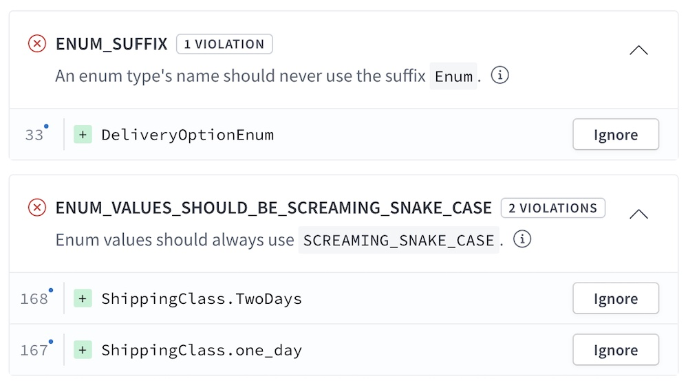
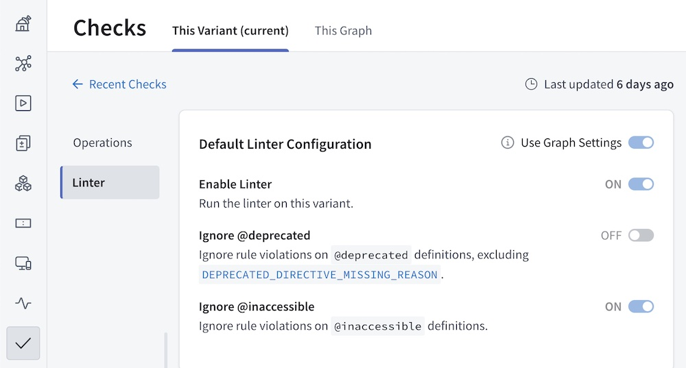
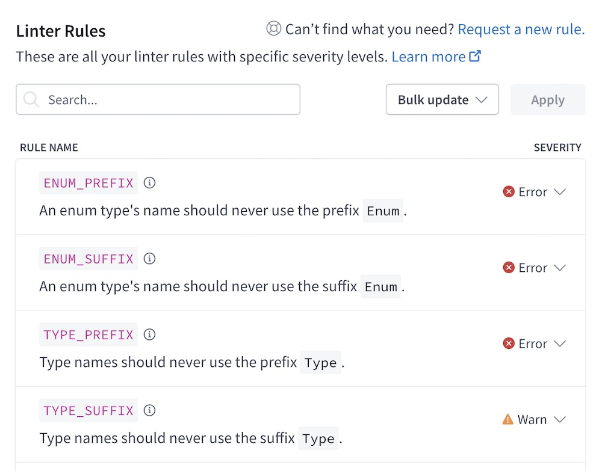
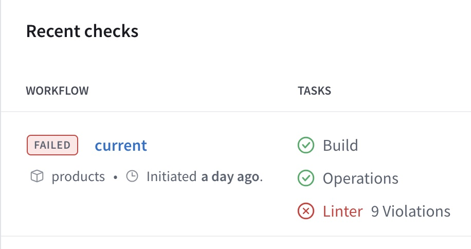

GraphOS provides **schema linting** to help you enforce formatting conventions and other GraphQL best practices with every proposed change to your graph's schema.



- **If you set up [schema checks](./schema-checks/) for your graph,** linting runs as a separate check type alongside build and operation checks.
- You can also perform [one-off linting with the Rover CLI](#one-off-linting-with-the-rover-cli).

<Note>

GraphOS schema linting only analyzes parts of your modified schema that differ from your published schema. It does not flag any existing violations.

</Note>

## Configuring the linter

The GraphOS schema linter uses a [predefined collection of rules](./linter-rules/) to identify issues with proposed schema changes.
The predefined collection includes [schema composition](/federation/federated-types/composition) rules.

- **Currently,** you can define **graph-wide linter defaults** that apply to all variants of a particular graph.
- **In a future release,** you'll also be able to configure how _individual_ variants of your graph treat violations of each linter rule.

**Navigate to your linter's configuration:**

1. In [GraphOS Studio](https://studio.apollographql.com/?referrer=docs-content), go to your graph's **Checks** page.
2. Click **Configuration** in the upper right to open the checks configuration page.
3. From the checks configuration page, open the **Linter** section:

    

4. **To configure graph-wide linter defaults** for _all_ of your variants, click the **This Graph** tab.

    - **In a future release,** you'll be able to configure variant-specific behavior from the **This Variant** tab.

This page organizes linter options into the following categories:

- **General Linter Configuration** provides high-level options, including disabling the linter entirely.
- **Approved @tag names** enables you to specify approved values for the `name` argument of the `@tag` directive. This directive is used most commonly with [GraphOS contracts](./contracts/).
  - If you don't use the `@tag` directive, you can ignore this category.
  - Using a _non_-approved value for `name` raises the `TAG_DIRECTIVE_USES_UNKNOWN_NAME` violation.
- **Linter Rules** enables you to [set the severity level](#setting-severity-levels) for violations of each rule.

If you're viewing configuration for a single variant, each category displays a **Use Graph Settings** toggle in the upper right. If this toggle is enabled, the variant uses whatever graph-wide defaults are set for that category. At this time, the **Use Graph Settings** toggle is _always_ enabled for _all_ variants.

### Setting severity levels

The **Linter Rules** category of your linter configuration displays all predefined rules and the current **severity** level for each:



Click a rule's severity to set it to any of the following:

- **Error.** Any violation of this rule causes the associated linter check to fail.
    - This in turn causes the _entire schema checks run_ to fail, which is useful for failing builds in CI.
- **Warn.** Violations of this rule are flagged in checks reports, but they _don't_ cause the associated linter check to fail.
- **Ignore.** Violations of this rule are ignored entirely.

## Running the linter

Schema linting runs automatically as part of your graph's [schema checks](#linting-via-schema-checks). You can also perform [one-off linting](#one-off-linting) of local schema changes via the Rover CLI.

### Linting via schema checks

If you set up [schema checks](./schema-checks) for your graph, schema linting automatically runs as a separate check type alongside build and operation checks. You can view the results of _all_ check types from your graph's **Checks** page in Studio:




<Tip>

**For the best experience running linter checks, install v0.16 or later of the Rover CLI.** Earlier versions of Rover can't correctly output the results of linter checks, but they do correctly exit with a nonzero code if a linter check fails.

</Tip>

### One-off linting

<Note>

**One-off linting requires v0.16 or later of the Rover CLI.** [Install the latest version.](/rover/getting-started)

</Note>

The Rover CLI provides `subgraph lint` and `graph lint` commands for running the GraphOS linter against your local schema changes.

- Use `subgraph lint` for subgraphs in a supergraph.
- Use `graph lint` for [monographs](../graphs/#monographs) (not recommended).

The `rover subgraph lint` and `rover graph lint` commands validate all [linter rules](./linter-rules) _except_ for [composition rules](./linter-rules#composition-rules). Use [`rover subgraph check`](/rover/commands/subgraphs#subgraph-check) or [`rover supergraph compose`](/rover/commands/supergraphs#supergraph-compose) to validate composition rules locally.

```bash title="Example command"
rover subgraph lint --name products --schema ./products-schema.graphql my-graph@my-variant
```

The argument `my-graph@my-variant` in the example above is a **graph ref** that specifies the ID of the graph you're comparing your schema changes against, along with which [variant](../graphs/#variants) you're comparing against.

Command options include:

<table class="field-table">
<thead>
<tr>
<th>Name</th>
<th>Description</th>
</tr>
</thead>
<tbody>
<tr class="required">
<td>

###### `--schema`

</td>
<td>

**Required.** The path to a local `.graphql` or `.gql` file, in [SDL format](/resources/graphql-glossary/#schema-definition-language-sdl).

Alternatively, you can provide `-`, in which case the command uses an SDL string piped to `stdin` instead (see [Using `stdin`](/rover/conventions#using-stdin)).

</td>
</tr>

<tr class="required">
<td>

###### `--name`

</td>

<td>

**Required** for `subgraph lint`. **Omit** for `graph lint`. The name of the published subgraph to compare schema changes against.

</td>
</tr>

<tr>
<td>

###### `--ignore-existing-lint-violations`

</td>

<td>

If provided, the linter _only_ flags violations that are present in the diff between your local schema and your published schema.

By default, one-off linting flags _all_ violations in your local schema. 

</td>
</tr>

</tbody>
</table>

## Linter rules

See this [reference list of rules](./linter-rules).