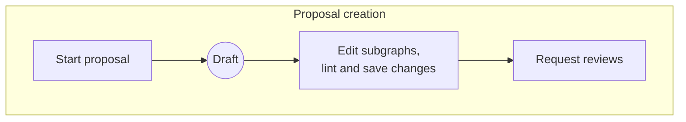
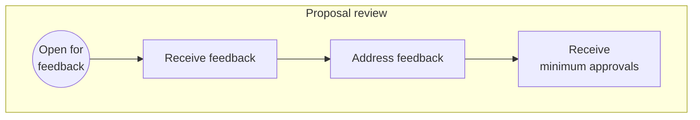
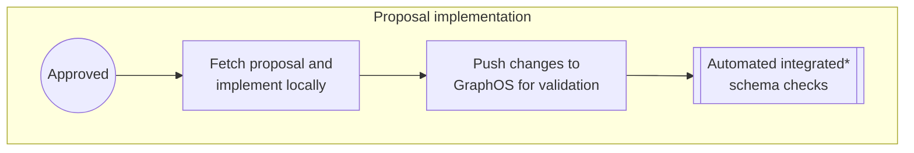
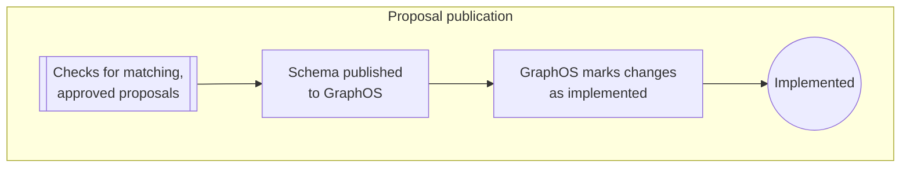
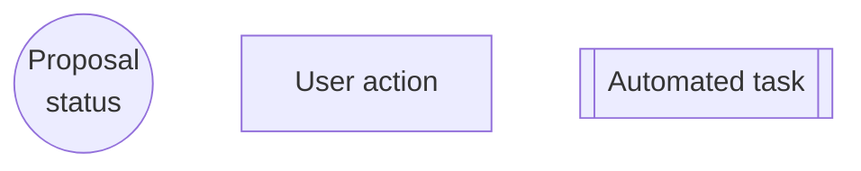

<GraphOSEnterpriseRequired />

As your supergraph schema grows in complexity, changing it can become increasingly cumbersome.
Changes in one subgraph can impact others unintentionally, and changes' impacts on composition and client operations become harder to assess before publication.

When schema design changes are agreed upon, ensuring they are honored later in the subgraph development lifecycle can become another chore.
These difficulties multiply when attempting to change multiple subgraph schemas simultaneously.
Schema development can stall without the clear cross-team communication needed to understand, verify, and track changes.

**Schema proposals** provide a centralized, GraphOS-native schema change management process that strengthens schema governance and fosters collaboration. In particular, schema proposals empower graph consumers to actively participate in schema change through reviews, comments, and approvals. This increased coordination leads to more informed design decisions, ultimately streamlining development cycles.

## Benefits of native schema change management

Managing schema changes directly in GraphOS Studio provides the following benefits:

- Editing, reviewing, and approving changes in GraphOS allows for GraphQL-aware schema diffing.
- The process leverages GraphOS [schema checks](./schema-checks)&mdash;including [schema linting](./schema-linter)&mdash;at every stage. This minimizes the likelihood of errors and inconsistencies and provides an immediate understanding of the changes' impacts on composition and client operations.
- Centralizing the schema change process consolidates a comprehensive audit trail of discussions and changes to the schema.

## How schema proposals work

Schema proposals are [created](./propose-changes), [reviewed](./review-proposals), and [approved](./review-proposals#approved-reviews) in GraphOS Studio. After approval, the proposal is implemented locally&mdash;including resolver and any other supporting code changes&mdash; before being published back to GraphOS Once [configured](./configure-proposals), GraphOS uses [schema checks](./schema-checks/#proposals-checks) to ensure that your organization only publishes changes that were part of an approved proposal.

Before describing the details of this proposal process, it's helpful to know the statuses a proposal progresses through.

### Proposal statuses

| Status            | Description                                                                                                                                                                                                    |
| ----------------- | -------------------------------------------------------------------------------------------------------------------------------------------------------------------------------------------------------------- |
| Draft             | Default status upon creation and until the proposal is ready for review.                                                                                                                                       |
| Open for feedback | Signals the proposal is ready for review.                                                                                                                                                                      |
| Approved          | The [minimum number of reviewers](./configure-proposals#required-approvals) has approved the proposal.                                                                                                         |
| Implemented       | All the proposal's changes have been [published](./publishing-schemas).    Implemented proposals cannot receive further revisions and their status cannot be updated.                                  |
| Closed            | Signals the proposal is suspended or abandoned.     Closed proposals cannot receive further revisions. You can always reopen a proposal by resetting the status to **Draft** or **Open for feedback**. |

A proposal doesn't have to progress linearly from **Draft** to **Implemented**. It may be **Closed** before returning to **Draft** and continuing through the process.

### Proposal process

These proposal statuses enable the following end-to-end schema change management process:

<Note>

Integrated schema checks refer to [composition, operation, linter, and contract checks](./schema-checks#types-of-checks).

</Note>

##### Legend

## Next steps

To learn more about each stage in the process, refer to the following articles:

- [Proposal configuration](./configure-proposals)
- [Proposal creation](./propose-changes)
- [Proposal review](./review-proposals)
- [Proposal implementation and publication](./implement-proposals)
