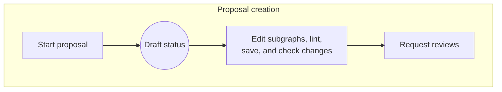
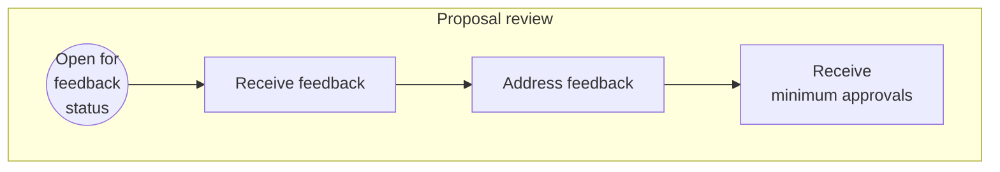
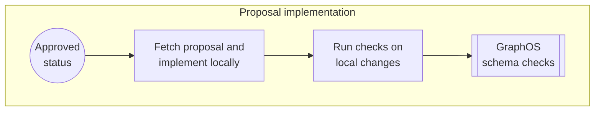
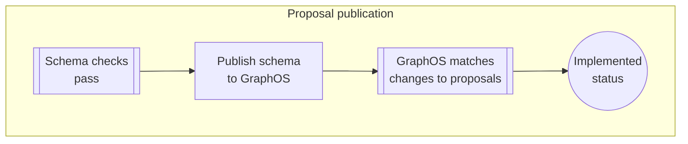
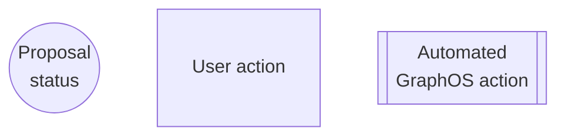

<GraphOSEnterpriseRequired />

As your supergraph schema grows in complexity, changing it can become increasingly difficult.
The impacts of schema changes on [composition](/federation/federated-types/composition/) and client operations become harder to assess before publication.
Once schema design changes are agreed upon, ensuring they are honored later in the subgraph development lifecycle can become another challenge.

These challenges multiply when attempting to update multiple subgraph schemas simultaneously.
Schema development can stall without the clear cross-team communication needed to understand, verify, and track changes.

## Schema proposals for schema change management

**Schema proposals** provide GraphOS-native schema change management.
The centralized proposal process fosters collaboration and strengthens schema governance:

- Subgraph developers can propose changes in the context of the supergraph and use automated checks and reviewer feedback to validate them.
- Graph consumers can actively participate by commenting on, reviewing, and approving proposals.
- Graph owners and governance teams can use proposals to set standards and ensure that only approved changes are published.

This increased coordination improves design decisions and accountability, making development cycles more efficient.

## Benefits of native schema change management

Managing schema changes _directly in GraphOS Studio_ provides the following benefits:

- The proposal process **leverages GraphOS [schema checks](./schema-checks)&mdash;including [schema linting](./schema-linter)&mdash;at every step**.
  - This provides an immediate understanding of the changes' impacts on composition and client operations.
  - It also minimizes the likelihood of errors and inconsistencies.
- Editing, reviewing, and approving changes in GraphOS allows for **GraphQL-aware schema diffing**.
  - For example, if you add new fields and types in the GraphOS [proposals editor](#edit-subgraph-schemas), GraphOS diffs those additions as new fields and types, regardless of how they are formatted.
  - GraphQL-naive text diffing won't understand and diff changes if they aren't conventionally formatted.
- Centralizing the schema change process **consolidates a comprehensive audit trail** of discussions and schema changes.

## How schema proposals work

Schema proposals are [created](./propose-changes), [reviewed](./review-proposals), and [approved](./review-proposals#approved-reviews) in GraphOS Studio. After approval, the proposal is implemented &mdash;including resolver and any other supporting code changes&mdash; before being published back to GraphOS. You can [configure schema checks](./schema-checks/#proposals-checks) to ensure your organization only publishes changes that are part of an approved proposal.

Before describing the details of this proposal process, it's helpful to understand the statuses a proposal progresses through.

### Proposal statuses

<table className="field-table">
  <thead>
    <tr>
      <th>Status</th>
      <th>Automatic or   manually set</th>
      <th>Description</th>
    </tr>
  </thead>

<tbody>
<tr>
<td>

##### Draft

</td>
<td>
Automatic at proposal creation but can be   <a href="./propose-changes#change-proposal-status">manually reset</a>
</td>
<td>
Default status upon creation until the proposal is ready for review.
</td>
</tr>
<tr>
<td>

##### Open for feedback

</td>
<td><a href="./propose-changes#change-proposal-status">Manual</a></td>
<td>Signals the proposal is ready for review.
  
- If <a href="./configure-proposals/#default-reviewers">default reviewers</a> are configured, they become assigned for review.</td>
</tr>
<tr>
<td>

##### Approved

</td>
<td>Automatic</td>
<td>
The{' '}
<a href="./configure-proposals#required-approvals">
minimum number of reviewers
</a>{' '}
has approved the proposal.
   
- If you've <a href="./configure-proposals/#require-default-reviewer-approval">required default reviewer approval</a>, at least one approval must be from a <a href="./configure-proposals/#default-reviewers">default reviewer</a>.
</td>
</tr>
<tr>
<td>

##### Implemented

</td>
<td>Automatic</td>
<td>
All the proposal's changes have been{' '}
<a href="./publishing-schemas">published</a>.  
  - Implemented proposals cannot receive further revisions.   -
Their status cannot be updated.
</td>
</tr>
<tr>
<td>

##### Closed

</td>
<td><a href="./propose-changes#change-proposal-status">Manual</a></td>
<td>
Signals the proposal is suspended or abandoned.  
  - Closed proposals cannot receive further revisions.   - You
can reopen a proposal by setting the status to <strong> Draft</strong> or <strong>Open for feedback</strong>.
</td>
</tr>
</tbody>
</table>

A proposal doesn't have to progress linearly from **Draft** to **Implemented**. It may be **Closed** before returning to **Draft** and continuing through the process.

### Proposal process

Schema proposal statuses enable the following end-to-end schema change management process:

##### Legend

## Next steps

Schema proposal default configurations let you start using them out of the box. If you want to finetune your graph's proposal process, including permissions, approval requirements, and more, check out [Configure proposals](./configure-proposals).

To learn more about each stage in the process, refer to the following articles:

- [Propose changes](./propose-changes)
- [Review proposals](./review-proposals)
- [Implement proposals](./implement-proposals) (covers both implementation and publication)

