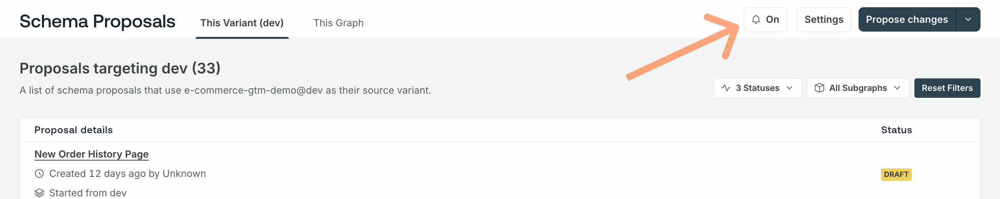

<EnterpriseFeature />

<PreviewFeature>

Schema proposals are currently in invite-only [preview](/resources/product-launch-stages/#preview). Get in touch with your account team if you'd like to request access or have any questions or feedback.

</PreviewFeature>

[Org and graph admins](../../org/members/#organization-wide-member-roles) can configure these aspects of schema proposals:

| Configuration                | Description                                                                              |
| ---------------------------- | ---------------------------------------------------------------------------------------- |
| [**Permissions**](#configure-permissions-and-approvals)                     | Which roles can create and edit proposals                                             |
| [**Default reviewers**](#default-reviewers)               | Which team members are default reviewers and whether default reviewer approval is required |
| [**Required approvals**](#required-approvals)                       | The minimum number of approvals needed for a proposal to achieve [**Approved** status](./#proposal-statuses) |
| [**Schema checks**](#configure-schema-checks)                   | Whether and how [schema checks](../schema-checks) incorporate proposals                                    |
| [**Notifications**](#notifications)                  | Whether to send email notifications for proposal activity                              |

Configurations are available on a graph's **Settings** page in [GraphOS Studio](https://studio.apollographql.com?referrer=docs-content).

<Note>

Schema proposal configurations are on a **per-graph** basis&mdash;not per-organization or per-proposal. This includes [notifications](#notifications), which are sent on a per-graph, per-teammate basis.

</Note>

## Configure permissions and approvals

Permissions for proposal actions are set at the graph level with the following defaults:

| Proposal Action        | Org Admin | Graph Admin | Contributor | Observer / Documenter | Consumer |
| :--------------------- | :-------: | :---------: | :---------: | :-------------------: | :------: |
| Change proposal status |     ✓     |      ✓      |             |                       |          |
| Create proposals       |     ✓     |      ✓      |      ✓      |           ✓           |          |
| Edit proposals         |     ✓     |      ✓      |      ✓      |           ✓           |          |
| Add reviewers          |     ✓     |      ✓      |      ✓      |           ✓           |          |
| View proposals         |     ✓     |      ✓      |      ✓      |           ✓           |    ✓     |
| Make comments          |     ✓     |      ✓      |      ✓      |           ✓           |    ✓     |
| Approve proposals      |     ✓     |      ✓      |      ✓      |           ✓           |    ✓     |

[Org and graph admins](../../org/members/#organization-wide-member-roles) can configure which roles can create and edit proposals. Permissions for other proposal actions aren't configurable. Refer to the [configuration reference table](#configuration-reference) below for default and valid values.

### Configuration reference

<table class="field-table">
  <thead>
    <tr>
      <th style="min-width: 200px">Configuration/   Default value</th>
      <th>Description/  Valid values</th>
    </tr>
  </thead>

<tbody>

<tr>

<td>

##### Permissions

Defaults:

- Create: `Observers`

- Edit: `Admins`

</td>

<td>

The minimum [role](../../org/members/#organization-wide-member-roles) required to create or edit proposals.

 

`Observers` is the least restrictive setting and `Admins` the most restrictive.

The `Observers` default for creating proposals means all organization members except Consumers and Billing Managers can create proposals.

The `Admins` default for editing proposals means only org and graph admins can edit proposals they didn't create.

_Proposal authors can always edit their own proposals regardless of their role._

<strong>Valid values:</strong>

`Admins`, `Contributors`, `Documentors`, or `Observers`

</td>

</tr>
<tr>
<td>

##### Default reviewers

Default: `None`

</td>
<td>

The team members automatically marked as reviewers once a proposal's status becomes [**Open for feedback**](./#proposal-statuses).

<strong>Valid values:</strong>

Any member of your organization can be a default reviewer except for [billing managers](../../org/members/#organization-wide-member-roles).

</td>

</tr>

<tr>
<td>

##### Required approvals

Default: `3`

</td>
<td>

The minimum number of approvals a proposal must receive for its status to become [**Approved**](./#proposal-statuses).

<strong>Valid values:</strong>

1 - 6

</td>

</tr>

</tbody>
</table>

<Note>

Changing the number of required approvals may update the status of existing proposals that aren't [**Closed** or **Implemented**](./creation#change-proposal-status). This depends on whether the current number of approvals meets the new number of required approvals. For example, a previously **Approved** proposal may become **Open for feedback** if it no longer meets the number of required approvals.

</Note>

### Require default reviewer approval

By default, any team member's approval can contribute to the [minimum number of required approvals](#required-approvals).
Once you've added [**default reviewers**](#default-reviewers), you can require at least one approval to come from a default reviewer by selecting **Require at least one default reviewer for all proposals on this graph.**

## Configure schema checks

You can configure [schema checks](../schema-checks) to include a **Proposals** task that verifies whether the changes a check is running on have matching and approved schema proposals.

By default, the severity of this task is **Off**. You can select from the following severity levels:

- (Default) With the severity set to **Off**, the proposals task isn't part of the checks that changes must pass for the schema check to succeed.
- Setting the severity to **Error** means the proposals task fails when the change being checked isn't included in approved proposals.
- Setting the severity to **Warning** means the proposals tasks can still pass even when the change being checked isn't included in approved proposals. However, warnings appear in the check run.

Integrating the Proposals task into schema checks strengthens schema governance when [publishing changes](./#proposal-workflow).
See the [proposals implementation](./implementation) article for more information on how to use schema checks as part of your proposal workflow.

## Notifications

By default, all team members receive email notifications for the following:

- If you're selected as a reviewer on a proposal, whether because you are a [default reviewer](#default-reviewers), or you've been manually selected
- Whenever you are `@`mentioned in a comment

Additionally, the following roles receive email notifications for the following proposal actions:

|                 | Comments | Saved Revisions | Status Changes | Reviews   |
|-----------------|----------|-----------------|----------------|-----------|
| Proposal author | ✔️        | ✔️               | ✔️              | ✔️         |
| Commenter       | ✔️ **     | ❌              | ❌             | ❌        |
| Reviewer        | ❌       | ✔️               | ❌             | ❌        |
| Proposal editor | ❌       | ❌              | ❌             | ❌        |

<Note>

\*\*Commenters only receive notifications for new comments on threads that they've commented on. They don't receive notifications for all new comments on a proposal.

</Note>

Notifications are cumulative. For example, if you comment on a particular thread and review a proposal, you get notifications for both new comments on the thread and saved revisions.

### Turn off notifications

Notifications are enabled by default. To turn off your notifications, go to the schema proposal's overview page and click the bell icon.

To re-enable them, click the same bell icon.

<Note>

Notifications are enabled on a per-team member, per-graph basis. 

</Note>