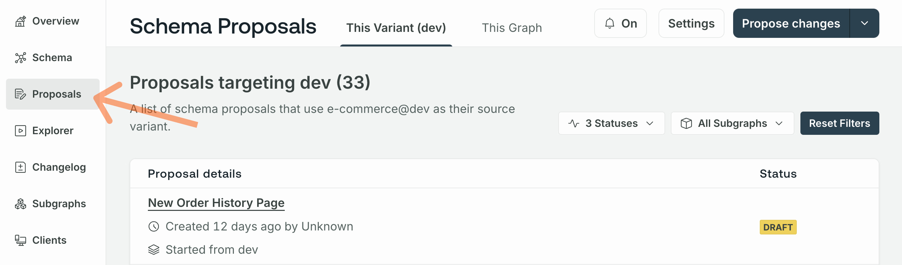

<EnterpriseFeature linkWithAnchor="https://www.apollographql.com/pricing#collaboration"/>

This article describes actions in the **Proposal creation** stage of the [schema proposal workflow](./#proposal-workflow).

<SchemaProposalCreationMermaid />

<UnavailableForMonographs featureName="schema proposals" />

## Start a proposal

You can create a new proposal in [GraphOS Studio](https://studio.apollographql.com?referrer=docs-content) from a graph's proposals page.
To access the page, either:

  - Open the **Proposals** page from the left navigation from a particular graph.

    

  - On the **Graphs** page, click the pencil icon with the tooltip that says **Go to schema change proposals** for a particular graph.

    

Follow the steps below to create a new proposal:

1. Click the **Propose changes** button in the top right. A dialog entitled **Propose schema changes** appears.
   
2. Enter a descriptive **proposal title** that outlines the schema changes you plan to propose.

   <Note>

   If you want to edit the proposal's title later, you can do so from its **Overview** tab.

   </Note>

3. If you've started the proposal from a graph rather than a particular variant, select a **source variant**. The source variant's schema is used to start the proposal, but the proposal isn't kept in sync with any schema changes that occur while the proposal is in progress.

   <Tip>

   **Apollo recommends creating schema proposals from development variants**.

   Proposing schema changes from a development variant minimizes the risks associated with making direct changes to a production schema. It allows for the earliest detection of issues and potential improvements.

   </Tip>

4. Optionally, enter the rationale for the proposed changes. This rationale appears as your proposal's **Description** on the proposal's overview and gives collaborators and reviewers context for the proposed changes. This input accepts [Markdown](https://www.markdownguide.org/getting-started/).

    <Note>

    If you want to edit the proposal's description later, you can do so from its **Overview** tab.

    </Note>

5. Click **Create Proposal**.

Once you've created the proposal, you land on the newly created proposal's **Editor** tab. This tab is where you make the schema changes you want to propose.

## Edit subgraph schemas

You can directly edit one or more subgraph schemas from a proposal's **Editor** tab.

To start a new subgraph, click **+Add new** from the subgraph schema selector in the left nav.
You can also delete existing subgraphs and rename newly created ones by clicking the **•••** menu to the right of a subgraph's name.

### Lint changes

To lint the schema changes you've made, click the Lint schema button in the top right of the editor.

Clicking the button opens a panel where you can run the [schema linter](../schema-linter) on the current changes in the editor.
After successfully running a lint on your schema, the panel displays any linter violations so you can fix them accordingly.

If you are having trouble finding the exact location of where the lint violation occurred, click the line in the violations list to highlight it in the editor.

<Note>

 A violation line number may no longer exist because you've renamed or deleted a field. When this happens, the violation appears grayed out in the violations list.

</Note>

Once you've made changes in the editor, rerun the linter by clicking the rerun button in the top right of the schema linting panel.

### Save revisions

Once you've made changes, click the **Save Revision** button in the bottom left of the editor to save them.
A dialog appears where you can optionally include a summary of your changes. This input accepts [Markdown](https://www.markdownguide.org/getting-started/).

The revision summary appears in the activity your proposal's overview tab. A proposal can include as many revisions as necessary.

<Tip>

You can think of each revision as equal to a [commit](<https://en.wikipedia.org/wiki/Commit_(version_control)>) in the version control paradigm. Making each revision an atomic change can give reviewers an overview of the changes that make up a proposal.

</Tip>

## Schema checks

[Schema checks](../schema-checks) automatically run each time you save a revision. These appear in a proposal's **Checks** tab.

Checks run proposal changes against the most recent version of the proposal's source variant schema.
For example, if your proposal removes a field that was already removed in the latest published version of the source variant, the check doesn't consider the removal a change.
This allows checks to detect breaking changes in the proposal as efficiently as possible.

## Self-review and commentary

While working on a proposal and before requesting reviews from teammates, you may want to review the proposal yourself. See the [Review proposals](./review) article for how to review different aspects of a proposal and [provide commentary](./review/#add-comments) on it.

## Change proposal status

You can change the proposal's status from the overview page by clicking **Edit status**. You have the following options:

- **Draft**: default status upon creation
- **Open for feedback**: signals the proposal is ready for review
- **Closed**: signals the proposal is abandoned or suspended
  - Closed proposals can't receive further revisions
  - You can always reopen a proposal by resetting the status to Draft or Open for feedback

**Approved** and **Implemented** statuses are automatically set once [necessary conditions](./#proposal-statuses) have been met.

## Request review

Add reviewers by clicking **Manage reviewers** on the proposal's overview tab:

If proposals have [default reviewers](./configuration#default-reviewers) configured, these are automatically selected once the proposal's status is **Open for feedback**.

### Approvals

<ApprovedSchemaProposals />

