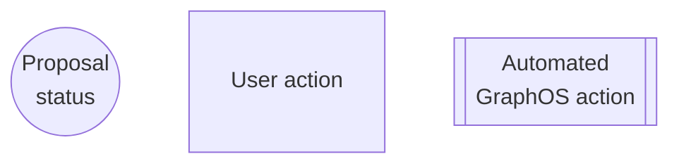

<EnterpriseFeature linkWithAnchor="https://www.apollographql.com/pricing#collaboration"/>

As your supergraph schema grows, managing changes becomes more difficult.
Assessing the impact of subgraph schema changes on [composition](/federation/federated-types/composition/) and client operations becomes more complex.
Once schema design changes are agreed upon, implementing them during subgraph development poses another challenge.

These challenges grow when updating multiple subgraph schemas simultaneously and collaborating across teams.
Schema development can stall without the clear cross-team communication needed to understand, verify, and track changes.

## Schema proposals for schema change management

GraphOS schema proposals provide centralized schema change management.
The centralized proposal process fosters collaboration and strengthens schema governance:

- Subgraph developers can propose changes in the context of the supergraph using automated checks and reviewer feedback for validation.
- Graph consumers can actively participate by commenting on, reviewing, and approving proposals.
- Graph owners and governance teams can use proposals to set standards and ensure only approved changes are published.

This increased coordination improves design decisions and accountability, streamlining development cycles.

## Benefits of native schema change management

Managing schema changes directly in GraphOS Studio provides the following benefits:

- The proposal process uses GraphOS [schema checks](../schema-checks)&mdash;including [schema linting](../schema-linter)&mdash;at every step.
  - This minimizes the likelihood of errors and inconsistencies.
  - It also offers an immediate understanding of the changes' impacts on composition and client operations.
- Editing, reviewing, and approving changes in GraphOS allows for GraphQL-aware schema diffing.
  - For example, GraphOS diffs additions of new fields and types in the [proposals editor](./creation#edit-subgraph-schemas) as new fields and types, regardless of formatting.
  - In contrast, GraphQL-naive text diffing may not understand and diff changes unless they're conventionally formatted.
- Centralizing the schema change process consolidates a comprehensive audit trail of discussions and schema changes.

## How schema proposals work

Team members [create](./creation), [review](./review), and [approval](./review#approvals) schema proposals in GraphOS Studio. After approval, the team implements the proposal&mdash;including resolvers and any supporting code changes&mdash; before publishing the schema changes to GraphOS.

<SchemaProposalImplementationNote />

[Org and graph admins](../../org/members/#organization-wide-member-roles) can [configure schema checks](../schema-checks/#proposals-checks) to ensure an organization only publishes changes approved through a proposal.

Before diving into schema proposal workflow, it's helpful to understand proposal statuses.

### Proposal statuses

<table className="field-table">
  <thead>
    <tr>
      <th>Status</th>
      <th>Automatic or   manually set</th>
      <th>Description</th>
    </tr>
  </thead>

<tbody>
<tr>
<td>

##### Draft

</td>
<td>
Automatic at proposal creation but can be   <a href="./creation#change-proposal-status">manually reset</a>
</td>
<td>
Default status upon creation until the proposal is ready for review.
</td>
</tr>
<tr>
<td>

##### Open for feedback

</td>
<td><a href="./creation#change-proposal-status">Manual</a></td>
<td>Signals the proposal is ready for review.
  
- If <a href="./configuration/#default-reviewers">default reviewers</a> are configured, they become assigned for review.</td>
</tr>
<tr>
<td>

##### Approved

</td>
<td>Automatic</td>
<td>
Signals the{' '}
<a href="./configuration/#required-approvals">
minimum number of reviewers
</a>{' '}
has approved the proposal.
   
- If you've <a href="./configuration/#require-default-reviewer-approval">required default reviewer approval</a>, at least one approval must be from a <a href="./configuration/#default-reviewers">default reviewer</a>.
</td>
</tr>
<tr>
<td>

##### Implemented

</td>
<td>Automatic</td>
<td>
Signals all the proposal's changes have been{' '}
<a href="../publishing-schemas">published</a>.  
  - Implemented proposals can't receive further revisions.   -
Their status can't be updated.
</td>
</tr>
<tr>
<td>

##### Closed

</td>
<td><a href="./creation#change-proposal-status">Manual</a></td>
<td>
Signals the proposal is suspended or abandoned.  
  - Closed proposals can't receive further revisions.   - You
can reopen a proposal by setting the status to <strong> Draft</strong> or <strong>Open for feedback</strong>.
</td>
</tr>
</tbody>
</table>

A proposal doesn't have to progress linearly from **Draft** to **Implemented**. For example, it may be **Closed** before returning to **Draft** and continuing through the process.

### Proposal workflow

Schema proposal statuses enable the following end-to-end schema change management workflow:

<SchemaProposalCreationMermaid />

<SchemaProposalReviewMermaid />

<SchemaProposalImplementationMermaid />

<SchemaProposalPublicationMermaid />

##### Legend

## Next steps

Schema proposal default configurations let you start using proposals out of the box. If you want to fine-tune your graph's proposal process, check out [Configure proposals](./configuration). Configurations include permissions, approval requirements, email notifications, and more.

To learn more about each stage in the process, refer to the following articles:

- [Propose changes](./creation)
- [Review proposals](./review)
- [Implement proposals](./implementation) (covers both implementation and publication)