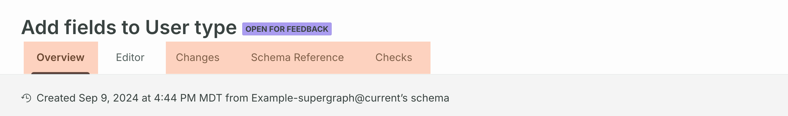

<EnterpriseFeature linkWithAnchor="https://www.apollographql.com/pricing#collaboration"/>

This article describes actions in the **Proposal review** stage of the [schema proposal workflow](./#proposal-workflow).

<SchemaProposalReviewMermaid />

## Review a proposal

Proposal creators and reviewers can review different aspects of a proposal from its non-editor tabs in [GraphOS Studio](https://studio.apollographql.com?referrer=docs-content).

- A proposal's **Overview** tab is where team members with [the appropriate permissions](./configuration#configure-permissions-and-approvals) can:
  - View and edit a proposal's description by clicking the pencil icon on the description.
  - Use the **Proposal activity** log to monitor changes and leave commentary.
  - View the proposal's status and author.
  - Select reviewers.
- The [**Changes**](#changes) tab shows both a summary and detailed view of the schema changes that make up a proposal.
  - All viewers can provide line-specific [comments](#add-comments) from the **Changes** tab.
- The **Checks** tab shows all [schema checks](./creation#schema-checks) that have run for [saved revisions](./creation#save-revisions).
  - Both reviewers and authors should ensure schema checks pass for a finalized proposal.

### Changes

A proposal's **Changes** tab shows both a **Summary** and **Detailed view** of the schema changes that make up a proposal:

- The **Summary** shows the number of objects, interfaces, and other types that changed in the proposal. Each type shows the number of lines added, deleted, and modified.

- The **Detailed view** shows a collapsible diff for each changed type.

You can use the left nav to view changes for a particular subgraph, or see the changes in the context of the composed [supergraph schema](/federation/federated-types/overview/#supergraph-schema) or [resulting API schema](/federation/federated-types/overview/#api-schema).

#### Add comments

You can comment on any line in the detailed view's diff. Hover over the line and click the chat icon that appears.

Write your comment in the panel that appears on the right.
Click on the **•••** button next to a comment to edit or delete it.

Share a comment thread by clicking the link button to copy its URL.

The blue tab that appears next to a line shows the number of comments that line has.

## Add a review

Once you've reviewed a proposal, click the **Add review** button on the top right of the proposal's overview tab to formalize your review.

A dialog appears where you can leave general commentary and select to approve the proposal.

You can edit your review by clicking the pencil icon next to your name in the list of **Reviewers**.

### Approvals

<ApprovedSchemaProposals />
