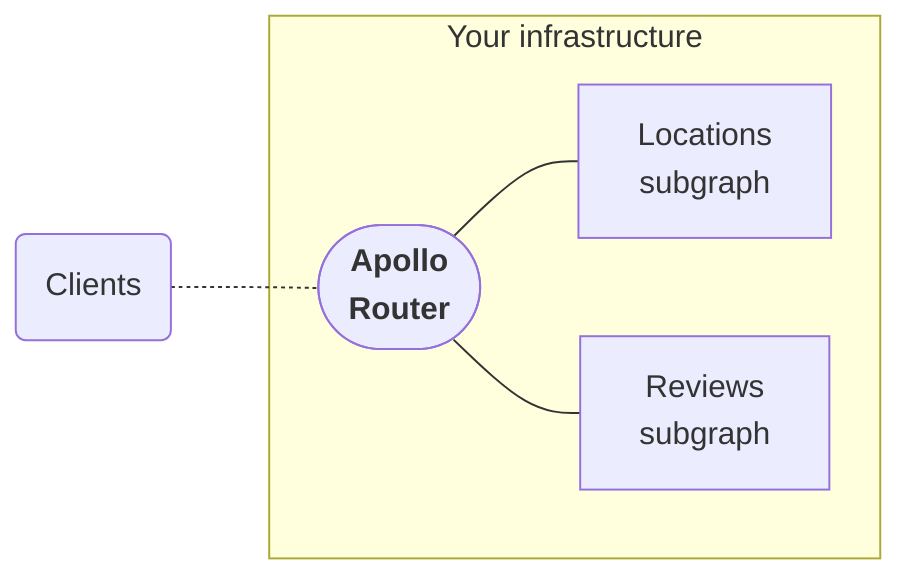
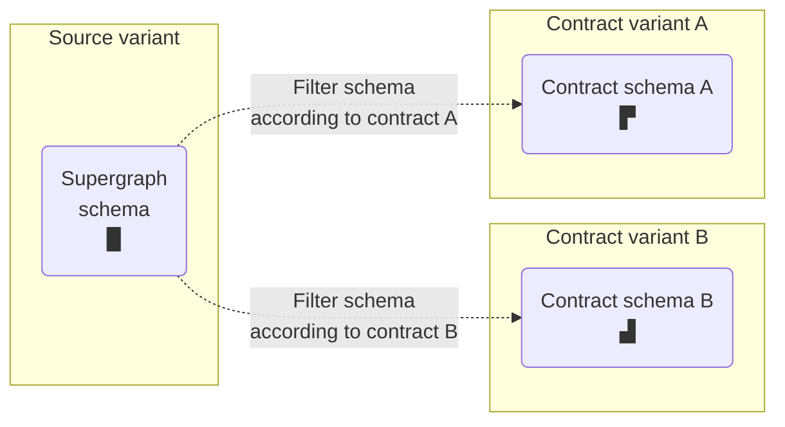

**With an Apollo GraphOS Enterprise plan,** you gain access to powerful routing, delivery, governance, and reporting features for your supergraph. This article summarizes the most notable of these features and provides links to the full documentation for each.

See the left navigation for a list of all Enterprise-specific articles from across the GraphOS documentation.

<Tip>

To compare GraphOS feature support across all plan types, see our [pricing page](https://www.apollographql.com/pricing/).

</Tip>

## Enterprise trial

You can sign up for a GraphOS Enterprise trial to freely test out most Enterprise features for the duration of the trial period.

  <ButtonLink
    size="lg"
    colorScheme="indigo"
    href="https://studio.apollographql.com/signup?type=enterprise-trial&referrer=docs-content"
    style={{
      marginRight: '10px'
    }}
  >
    Start an Enterprise trial
  </ButtonLink>
  <ButtonLink href="../org/plans/#enterprise-trials" size="lg">
    See details
  </ButtonLink>

## Self-hosted routing

With GraphOS Enterprise, you can deploy your supergraph's [Apollo Router](/router/) instances into your own infrastructure, instead of using a GraphOS-provisioned cloud router:

These router instances connect to GraphOS to fetch their managed configuration and report fine-grained operation metrics.

This architecture helps you satisfy sophisticated requirements around data compliance and performance, and it also enables you to further customize your router's behavior with Enterprise-specific functionality (described [below](#apollo-router-features)).

<Tip>

[Create a self-hosted supergraph.](../quickstart/self-hosted/)

</Tip>

### Apollo Router features

[The Apollo Router](/router/) supports a collection of features specific to GraphOS Enterprise organizations. These include:

- **Real-time updates** via [GraphQL subscriptions](/router/executing-operations/subscription-support/)
- **Authentication of inbound requests** via [JSON Web Token (JWT)](/router/configuration/authn-jwt/)
- [**Authorization** of specific fields and types](/router/configuration/authorization) through the [`@requiresScopes`](/router/configuration/authorization#requiresscopes), [`@authenticated`](/router/configuration/authorization#authenticated), and [`@policy`](/router/configuration/authorization#policy) directives
- Incremental migration between subgraphs through [the progressive `@override` directive](/federation/entities-advanced/#incremental-migration-with-progressive-override).
- Redis-backed [**distributed caching** of query plans and persisted queries](/router/configuration/distributed-caching/)
- Redis-backed [**entity caching** of subgraph responses](/router/configuration/entity-caching/)
- **Custom request handling** in any language via [external coprocessing](/router/customizations/coprocessor/)
- **Mitigation of potentially malicious requests** via [operation limits](/router/configuration/operation-limits) and [safelisting](../operations/persisted-queries/)

<Tip>

[Learn more about Enterprise features in the Apollo Router.](/router/enterprise-features/)

</Tip>

## Schema pipeline

GraphOS provides schema [pipeline tools](../delivery) to efficiently develop and deploy changes to your supergraph schema.

### Schema change management with proposals

[Schema proposals](../delivery/schema-proposals) provide GraphOS-native schema change management.
The centralized proposal process fosters collaboration and strengthens schema governance:

- Subgraph developers can propose changes in the context of the supergraph using automated checks and reviewer feedback for validation.
- Graph consumers can actively participate by commenting on, reviewing, and approving proposals.
- Graph owners and governance teams can use proposals to set standards and ensure only approved changes are published.

This increased coordination improves design decisions and accountability, streamlining development cycles.

<Tip>

[Learn more about schema proposals.](../delivery/schema-proposals/)

</Tip>

### Schema filtering with contracts

GraphOS [**Contracts**](../delivery/contracts/) enable you to filter your supergraph schema's types and fields according to different inclusion and exclusion rules you define:

You can then deploy a [self-hosted router](#self-hosted-routing) instance that uses one of your **contract schemas**. Client apps that connect to this **contract router** can query only the fields that are included in the contract schema:

Contracts are especially useful if you want to expose a subset of your supergraph as a public API.

<Tip>

[Learn more about GraphOS contracts.](../delivery/contracts/)

</Tip>

## Organization management

You can integrate GraphOS with your organization's identity provider (IdP) to enable single sign-on (SSO) for [GraphOS Studio](https://studio.apollographql.com/?referrer=docs-content).

SSO configuration is available for the following:

- [Okta](../org/sso/okta-integration-guide/)
- [Azure AD](../org/sso/azure-ad-integration-guide/)
- [Generic SAML](../org/sso/saml-integration-guide/)

Additionally, Enterprise organizations can export an [audit log](../org/audit-log/) of material actions taken by organization members.

## Metrics and reporting

GraphOS Studio offers a performant and intuitive UI to help all GraphOS users monitor and understand their supergraph's usage and performance.
The following features are only available to GraphOS Enteprise organizations:

- The [Apollo Datadog integration](../metrics/datadog-integration) lets you forward performance metrics to your Datadog account. Datadog supports an advanced function API, which enables you to create sophisticated visualizations and alerts for GraphQL metrics.
- [Build status notifications](../metrics/notifications/) let you notify your team via webhook whenever GraphOS attempts to build a new supergraph schema for your federated graph.
