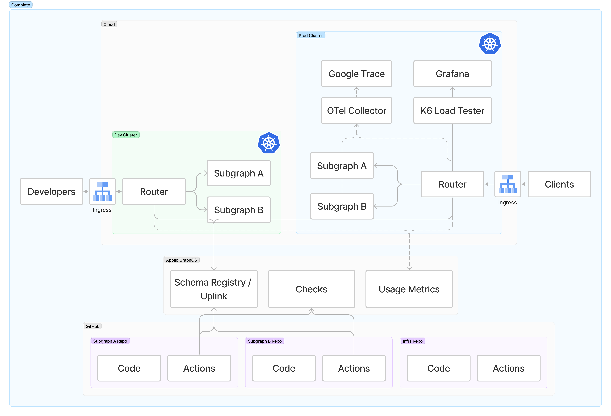

Apollo's Solution Architecture team supplies a reference architecture that is a blueprint to self-hosting the router and subgraphs in an enterprise cloud environment using Kubernetes and Helm.

It consists of the following github repos:

- [build-a-supergraph](https://github.com/apollosolutions/build-a-supergraph) - The main repository that contains the step-by-step guide to utilizing the architecture and deploying it to AWS or GCP
- [build-a-supergraph-infra](https://github.com/apollosolutions/build-a-supergraph-infra) - The "temmplate" repository for cloud deployment of the router, collector, grafana, performance tests, and zipkin
- [build-a-supergraph-subgraph-a](https://github.com/apollosolutions/build-a-supergraph-subgraph-a) and [build-a-supergraph-subgraph-b](https://github.com/apollosolutions/build-a-supergraph-subgraph-b) - Demo sub-graphs for demo purposes

## Getting Started
To get started with the reference architcture, start in the main [build-a-supergraph](https://github.com/apollosolutions/build-a-supergraph) respository and follow the instructions. It will walk you through everything from setup to CI/CD to load testing the resulting architecture.

## Architecture Overview

The reference architcture utilizes multiple Kubernetes clusters to break the architecture into dev and prod environments. Inside of those environments are pods that host the router and sub graphs.

Additionally, the cluster contains pods for trace collection and a k6 load testing with Grafana for viewing the results.

In the case of both the dev and prod clusters, the router fetches it's schema cia the Schema Registry / Uplink. The schema is pushed to the registry when the sub graphs are run through CI/CD via Github Actions.