<EnterpriseFeature>

While you can run the Apollo Router Core regardless of your Apollo plan, connecting the router to GraphOS and using a GraphOS Router requires an [Enterprise plan](https://www.apollographql.com/pricing#graphos-router). You can test it out by signing up for a free [Enterprise trial](https://studio.apollographql.com/signup?type=enterprise-trial&referrer=docs-content).

</EnterpriseFeature>

In this guide, learn about the fundamental concepts and configuration underlying Apollo's reference architecture for enterprise deployment of GraphOS with a self-hosted GraphOS Router. Use this overview as a companion reference to the [Apollo reference architecture repository](https://github.com/apollosolutions/reference-architecture).

## About Apollo's reference architecture

In a modern cloud-native stack, your components must be scalable with high availability. The Apollo Router Core is built with this in mind. The router is [much faster and less resource-intensive than the Apollo Gateway](https://www.apollographql.com/blog/announcement/backend/apollo-router-our-graphql-federation-runtime-in-rust/#apollo-router-vs-apollo-gateway-benchmarks), Apollo's original runtime.

Apollo provides a reference architecture for self-hosting the router and subgraphs in an enterprise cloud environment using Kubernetes and Helm. It demonstrates how to deploy the router and subgraphs in a cloud environment, including the use of [Apollo GraphOS](/graphos) and the following enterprise GraphOS Router features:

- [Authentication/Authorization directives](/router/configuration/authorization) within the schema to secure your supergraph
- [External coprocessing](/router/customizations/coprocessor) to enable complex customizations to the router
- [Persisted Queries](/router/configuration/persisted-queries) to improve performance and security through safelisting only known operations

Furthermore, the reference architecture demonstrates how to use the router with [OpenTelemetry](https://opentelemetry.io/) to collect and analyze performance and utilization metrics for your supergraph, as well as testing performance using [k6](https://k6.io/).

<Tip>

Check out the [Deploying the Apollo Router at Apollo](https://www.apollographql.com/blog/announcement/platform/deploying-the-apollo-router-at-apollo/) blog post to learn about Apollo's internal use of the router, including the performance improvements and resource utilization reductions.

</Tip>

## Getting started

To get started with the reference architecture, follow the README in the [reference](https://github.com/apollosolutions/reference-architecture) repository. The README provides a how-to guide that walks you through building a supergraph with the reference architecture.

## Architecture overview

The reference architecture uses two Kubernetes clusters, one for a development environment and other for a production environment. Each cluster has pods for:

- Hosting the router
- Hosting subgraphs
- Hosting a client
- Collecting traces
- Load testing K6 and viewing results with Grafana

For both environments, GraphOS serves as a schema registry. Each subgraph publishes schema updates to the registry via CI/CD, and GraphOS validates and composes them into a supergraph schema. The router regularly polls an endpoint called [Apollo Uplink](/federation/managed-federation/uplink/) to get the latest supergraph schema and routing configurations from GraphOS.

The router also pushes performance and utilization metrics to GraphOS via Uplink so you can [analyze them in GraphOS Studio](../metrics/).

### Development environment

The development environment consists of the router and subgraphs hosted in a Kubernetes cluster in either AWS or GCP. GraphOS validates subgraph schemas using [schema checks](/federation/managed-federation/federated-schema-checks/) and makes them available to the router via [Uplink](/federation/managed-federation/uplink/). The router also reports usage metrics back to GraphOS.

```mermaid
flowchart TB
    developers[Developers]
	subgraph cloud["Cloud (AWS or GCP)"]
		subgraph devcluster["Dev Cluster"]
			subgraph routeringresscontainer["Ingress"]
				routeringress{"🔀"}
			end
            subgraph clientingresscontainer["Ingress"]
				clientingress{"🔀"}
			end
            client[Client]
			router["Router"]
			subgraphs[["Subgraphs"]]
		end
	end

  subgraph graphos["Apollo GraphOS"]
    uplink["Schema Registry/Uplink"]
    checks["Schema Checks"]
    metrics["Usage Metrics"]
  end

  subgraph github["GitHub"]
      githubactions["Subgraph CI/CD (GitHub Actions)"]
  end

	%% Relationships
  clientingress --> client
	client --> routeringress
  developers --> routeringress
  developers --> clientingress
	routeringress --> router
	router --> subgraphs
	uplink -.-> router
  router -.-> metrics
  githubactions -.-> uplink
  uplink -.-> checks
```

### Production environment

The production environment is similar to the development environment with some additions.

- The router and subgraphs send their OpenTelemetry data to a collector. You can then view the data in Zipkin.
- A K6 load tester sends traffic to the router and stores load test results in InfluxDB for viewing in Grafana.

```mermaid
flowchart TB
  developers[Developers]
	subgraph cloud["Cloud (AWS or GCP)"]
		subgraph prodcluster["Prod Cluster"]
			subgraph routeringresscontainer["Router Ingress"]
				routeringress{"🔀"}
			end
            subgraph clientingresscontainer["Client Ingress"]
				clientingress{"🔀"}
			end

      client[Client]
			router["Router"]
			subgraphs[["Subgraphs"]]

      collector["OTel Collector"]
			zipkin[Zipkin]

			k6["K6 Load Tester"]
			grafana["Grafana"]
      influxdb[("InfluxDB")]
		end
	end

  subgraph graphos["Apollo GraphOS"]
    uplink["Schema Registry/Uplink"]
    checks["Schema Checks"]
    metrics["Usage Metrics"]
  end

  subgraph github["GitHub"]
      githubactions["Subgraph CI/CD (GitHub Actions)"]
  end

    %% Relationships
    clientingress --> client
	  client --> routeringress
    developers --> routeringress
    developers --> clientingress
    routeringress --> router
    router --> subgraphs
	  uplink -.-> router
    router -.-> metrics
    githubactions -.-> uplink

    uplink -.-> checks
    router -.-> collector
    subgraphs -.-> collector
    collector -.-> zipkin
    k6 -.-> router
    k6 -.-> influxdb
    grafana --> influxdb
```

## CI/CD

The reference architecture uses [GitHub Actions](https://docs.github.com/en/actions) for its CI/CD. These actions include:

- PR-level schema checks
- Building containers using Docker
- Publishing subgraph schemas to Apollo Uplink
- Deployments for:
  - Router
  - Subgraphs
  - Client
  - OpenTelemetry Collector
  - Grafana
- Running load tests using k6

### Development actions

When a PR is submitted to one of the subgraphs, GitHub Actions uses GraphOS to validate schema changes using schema checks.

When the PR is merged, GitHub Actions publishes schema updates to Uplink, and GraphOS validates them using schema checks before making them available to the router. Additionally, the subgraph service is deployed.

### Production deploy

When you manually trigger a production deployment, GitHub Actions publishes schema updates to Uplink and GraphOS validates them using schema checks before making them available to the router. Additionally, the subgraph service is deployed.

### Deploy router

When you manually trigger a router deployment, GitHub Actions deploys the router to the Kubernetes cluster.

### Deploy OpenTelemetry collector

When you manually trigger an OpenTelemetry deployment, GitHub Actions deploys the OpenTelemetry Collector and Zipkin to the Kubernetes cluster.

### Deploy load test infrastructure

When you manually trigger a load test infrastructure deployment, GitHub Actions deploys the K6 Load Tester, Grafana, the load tests, and InfluxDB to the Kubernetes cluster.

### Run load tests

When you manually trigger a load test run, GitHub Actions triggers the K6 Load Tester to pull the Load Tests from the environment, run the tests against the router, and store the results in InfluxDB.

## Further reading

- [Router introduction](/router/)
- [Containerizing the router](/router/containerization/overview)
- [Managing router resources in Kubernetes](/technotes/TN0016-router-resource-management/)
- [Sending router operation metrics to GraphOS](/router/configuration/telemetry/apollo-telemetry)
- [OpenTelemetry tracing in the router](/router/configuration/telemetry/exporters/tracing/otlp)
- [Enterprise features of the router](/router/enterprise-features)
