Apollo's Solution Architecture team supplies a reference architecture that is a blueprint to self-hosting the router and subgraphs in an enterprise cloud environment using Kubernetes and Helm.

It consists of the following github repos:

- [build-a-supergraph](https://github.com/apollosolutions/build-a-supergraph) - The main repository that contains the step-by-step guide to utilizing the architecture and deploying it to AWS or GCP
- [build-a-supergraph-infra](https://github.com/apollosolutions/build-a-supergraph-infra) - The "temmplate" repository for cloud deployment of the router, collector, grafana, performance tests, and zipkin
- [build-a-supergraph-subgraph-a](https://github.com/apollosolutions/build-a-supergraph-subgraph-a) and [build-a-supergraph-subgraph-b](https://github.com/apollosolutions/build-a-supergraph-subgraph-b) - Demo sub-graphs for demo purposes

## Getting Started
To get started with the reference architcture, start in the main [build-a-supergraph](https://github.com/apollosolutions/build-a-supergraph) respository and follow the instructions. It will walk you through everything from setup to CI/CD to load testing the resulting architecture.

## Architecture Overview
The reference architcture utilizes multiple Kubernetes clusters to break the architecture into dev and prod environments. Inside of those environments are pods that host the router and sub graphs.

Additionally, the cluster contains pods for trace collection and a K6 load testing with Grafana for viewing the results.

In the case of both the dev and prod clusters, the router fetches it's schema cia the Schema Registry / Uplink. The schema is pushed to the registry when the sub graphs are run through CI/CD via Github Actions.

### Development Environment

```mermaid
flowchart TB
	developers[Developers]
	subgraph cloud["Cloud (AWS or GCP)"]
		subgraph devcluster["Dev Cluster"]
			subgraph ingresscontainer["Ingress"]
				ingress{"🔀"}
			end

			router["Router"]
			subgrapha["Subgraph A"]
			subgraphb["Subgraph B"]
		end
	end

  subgraph graphos["Apollo GraphOS"]
    uplink["Schema Registry/Uplink"]
    checks["Schema Checks"]
    metrics["Usage Metrics"]
  end

  subgraph github["Github"]
      githubactions["Subgraph CI/CD (Github Actions)"]
  end
	
	%% Relationships
	developers --> ingress
	ingress --> router
	router --> subgrapha
	router --> subgraphb
	uplink -.-> router
  router -.-> metrics
  githubactions -.-> uplink
  uplink -.-> checks
	
```


### Production Environment

```mermaid
flowchart TB
	developers[Developers]
	subgraph cloud["Cloud (AWS or GCP)"]
		subgraph devcluster["Prod Cluster"]
			subgraph ingresscontainer["Ingress"]
				ingress{"🔀"}
			end

			router["Router"]
			subgrapha["Subgraph A"]
			subgraphb["Subgraph B"]

			collector["OTel Collector"]
			tracestorage[("Trace Storage")]
			zipkin[Zipkin]
			
			k6["K6 Load Tester"]
			grafana["Grafana"]

		end
	end

  subgraph graphos["Apollo GraphOS"]
    uplink["Schema Registry/Uplink"]
    checks["Schema Checks"]
    metrics["Usage Metrics"]
  end

  subgraph github["Github"]
      githubactions["Subgraph CI/CD (Github Actions)"]
  end
	
	%% Relationships
	developers --> ingress
	ingress --> router
	router --> subgrapha
	router --> subgraphb
	
	router -.-> collector
	subgrapha -.-> collector
	subgraphb -.-> collector
	zipkin -.-> tracestorage
	collector -.-> tracestorage
	
	k6 -.-> router
	k6 -.-> grafana

  uplink -.-> router
  router -.-> metrics
  githubactions -.-> uplink
  uplink -.-> checks
	
```


## CI/CD (Github Actions)
This architecture utilizes Github Actions for it's CI/CD. Included in this is:

- PR level schema checks
- Building of containers using Docker
- Deployment to the Kubernetes clusters
- Publishing of schema to the Apollo Uplink
- Deployment of the Router to the Kubernetes cluster
- Deployment of OTEL collector
- Deployment of Grafana
- Running Load Test

### Development Merge/Push/Deploy
These jobs are triggered by submitting a PR and on merge of a PR.


### Production Deploy
This job is manually triggered within Github Actions.


### Deploy Router
This job is manually triggered within Github Actions.


### Deploy OTEL Collector
This job is manually triggered within Github Actions.


### Deploy Load Test Infrastructure
This job is manually triggered within Github Actions.


## Router
The Router is deployed to Kubernetes by utilizing the apollograph helm charts provided for router deployments.

```yaml title="Chart.yaml"
dependencies:
  - name: router
    version: 1.33.2
    repository: oci://ghcr.io/apollographql/helm-charts
```

Configuration for the router is provided in the `values.yaml` file in `router.router.configuration`. These config values are provided to router at run time.

```yaml title="values.yaml"
router:
  router:
    configuration:
      health_check:
        listen: 0.0.0.0:8080
      sandbox:
        enabled: true
      homepage:
        enabled: false
```

This approach allows you to get up and running with Router in Kubernetes with minimal effort required.

<!---->