Apollo supplies a reference architecture that is a blueprint to self-hosting the router and subgraphs in an enterprise cloud environment using Kubernetes and Helm.

It consists of the following Github repositories:

- [build-a-supergraph](https://github.com/apollosolutions/build-a-supergraph) - The main repository that contains the step-by-step guide to utilizing the architecture and deploying it to AWS or GCP
- [build-a-supergraph-infra](https://github.com/apollosolutions/build-a-supergraph-infra) - The "template" repository for Kubernetes deployment of the router, collector, Grafana, performance tests, and Zipkin
- [build-a-supergraph-subgraph-a](https://github.com/apollosolutions/build-a-supergraph-subgraph-a) and [build-a-supergraph-subgraph-b](https://github.com/apollosolutions/build-a-supergraph-subgraph-b) - Demo sub-graphs for demonstration purposes

## Design Considerations

In a modern cloud-native stack, your components must be scalable with high availability. This reference architecture takes this into consideration with 
autoscaling built in. Additionally, the Router component is also built to scale. It is many times faster and less resource intensive when compared to the Gateway.

<Tip>

Check out our blog post [Deploying the Apollo Router at Apollo](https://www.apollographql.com/blog/announcement/platform/deploying-the-apollo-router-at-apollo/) to learn about Apollo's 
internal utilization of the Router, including the performance improvements and resource utilization reductions.
</Tip>

In this architecture, GraphOS serves the important role of being the Schema Registry and Uplink. This allows the router to get the latest schema and routing configuration from GraphOS as
subgraph changes are published via CI/CD. Additionally, the the router is able to push performance and utilization metrics to GraphOS via this same Uplink.

## Getting Started
To get started with the reference architecture, start in the main [build-a-supergraph](https://github.com/apollosolutions/build-a-supergraph) repository and start with the README. It will walk you through everything from setup to CI/CD to load testing the resulting architecture.

## Architecture Overview
The reference architecture utilizes multiple Kubernetes clusters to break the architecture into dev and prod environments. Inside of those environments are pods that host the router and sub graphs.

Additionally, the cluster contains pods for trace collection and a K6 load testing with Grafana for viewing the results.

In the case of both the dev and prod clusters, the router fetches it's schema cia the Schema Registry / Uplink. The schema is pushed to the registry when the sub graphs are run through CI/CD via Github Actions.

### Development Environment

```mermaid
flowchart TB
	developers[Developers]
	subgraph cloud["Cloud (AWS or GCP)"]
		subgraph devcluster["Dev Cluster"]
			subgraph ingresscontainer["Ingress"]
				ingress{"🔀"}
			end

			router["Router"]
			subgrapha["Subgraph A"]
			subgraphb["Subgraph B"]
		end
	end

  subgraph graphos["Apollo GraphOS"]
    uplink["Schema Registry/Uplink"]
    checks["Schema Checks"]
    metrics["Usage Metrics"]
  end

  subgraph github["Github"]
      githubactions["Subgraph CI/CD (Github Actions)"]
  end
	
	%% Relationships
	developers --> ingress
	ingress --> router
	router --> subgrapha
	router --> subgraphb
	uplink -.-> router
  router -.-> metrics
  githubactions -.-> uplink
  uplink -.-> checks
	
```


### Production Environment


## Components
### Router
The Router is [deployed via Github Actions](#deploy-router) to Kubernetes by utilizing the apollograph helm charts provided for router deployments.

```yaml title="Chart.yaml"
dependencies:
  - name: router
    version: 1.33.2
    repository: oci://ghcr.io/apollographql/helm-charts
```

Configuration for the router is provided in the `values.yaml` file in `router.router.configuration`. These config values are provided to router at run time.

```yaml title="values.yaml"
router:
  router:
    configuration:
      health_check:
        listen: 0.0.0.0:8080
      sandbox:
        enabled: true
      homepage:
        enabled: false
```

This approach allows you to get up and running with Router in Kubernetes with minimal effort required.

The router receives it's schema and subgraph configuration from the GraphOS Schema Uplink / Registry that has already been checked, validated, and composed.

```mermaid
flowchart LR
	applications[Application/Consumers]
  subgraph devcluster["Prod Cluster"]
    subgraph ingresscontainer["Ingress"]
      ingress{"🔀"}
    end

    router["Router"]
    subgrapha["Subgraph A"]
    subgraphb["Subgraph B"]

  end

  subgraph graphos["Apollo GraphOS"]
    uplink["Schema Registry/Uplink"]
    metrics["Usage Metrics"]
  end
	
	%% Relationships
	applications --> ingress
	ingress --> router
	router --> subgrapha
	router --> subgraphb

  uplink -.-> router
  router -.-> metrics
```



### Subgraphs
Each subgraph is [deployed via Github Actions](#development-mergepushdeploy) (including publishing their schema to the Schema Registry) to Kubernetes utilizing a Helm chart. The services are deployed using a `HorizontalPodAutoscaler`
to automatically scale up instances of the service based on CPU utilization or Memory utilization.

```yaml title="values.yaml"
autoscaling:
  enabled: false
  targetCPUUtilizationPercentage: 80
  minReplicas: 1
  maxReplicas: 100
```

```yaml title="hpa.yaml"
minReplicas: {{ .Values.autoscaling.minReplicas }}
maxReplicas: {{ .Values.autoscaling.maxReplicas }}
metrics:
  {{- if .Values.autoscaling.targetCPUUtilizationPercentage }}
  - type: Resource
    resource:
      name: cpu
      targetAverageUtilization: {{ .Values.autoscaling.targetCPUUtilizationPercentage }}
  {{- end }}
  {{- if .Values.autoscaling.targetMemoryUtilizationPercentage }}
  - type: Resource
    resource:
      name: memory
      targetAverageUtilization: {{ .Values.autoscaling.targetMemoryUtilizationPercentage }}
  {{- end }}
```

The subgraphs are called directly by the Router.

```mermaid
flowchart LR
	applications[Application/Consumers]
  subgraph devcluster["Prod Cluster"]
    subgraph ingresscontainer["Ingress"]
      ingress{"🔀"}
    end

    router["Router"]
    subgrapha["Subgraph A"]
    subgraphb["Subgraph B"]

  end
	
	%% Relationships
	applications --> ingress
	ingress --> router
	router --> subgrapha
	router --> subgraphb
```



### Open Telemetry and Zipkin
The Open Telemetry collector is [deployed via Github Actions](#deploy-open-telemetry-collector) to Kubernetes utilizing the `otel/opentelemetry-collector-contrib` docker image.

```yml [title="values.yml"]
image:
  repository: otel/opentelemetry-collector-contrib
  pullPolicy: IfNotPresent
  tag: "0.59.0"
```

It is configured to export trace metrics to the Zipkin `spans` endpoint.

```yml [title="configmap.yml"]
exporters:
  zipkin:
    endpoint: "http://zipkin.zipkin.svc.cluster.local:9411/api/v2/spans"
```

Zipkin is [deployed via Github Actions](#deploy-open-telemetry-collector) to Kubernetes utilizing the `https://openzipkin.github.io/zipkin` helm chart.

```yml [title="Chart.yaml"]
dependencies:
  - name: zipkin
    version: 0.3.0
    repository: https://openzipkin.github.io/zipkin
```


### Performance Testing, K6, and Grafana
The [K6 Operator](https://github.com/grafana/k6-operator) is [deployed via Github Actions](#deploy-open-telemetry-collector) to Kubernetes. The test results are exported to influxdb which can be viewed in Grafana.

```yaml [title="_run-loadtest-aws.yaml"]
spec:
  parallelism: ${{ inputs.parallelism }}
  arguments: "--out influxdb=http://influxdb.monitoring:8086/db"
  script:
    configMap:
      name: tests
      file: ${{ inputs.test }}.js
```

```yaml [title="value.yaml"]
datasources:
  datasources.yaml:
    apiVersion: 1
    datasources:
      - name: InfluxDB
        type: influxdb
        access: proxy
        url: http://influxdb.monitoring:8086
```


## CI/CD (Github Actions)
This architecture utilizes Github Actions for it's CI/CD. Included in this is:

- PR level schema checks
- Building of containers using Docker
- Deployment to the Kubernetes clusters
- Publishing of schema to the Apollo Uplink
- Deployment of the Router to the Kubernetes cluster
- Deployment of OTEL collector
- Deployment of Grafana
- Running Load Test

### Development Merge/Push/Deploy
These jobs are triggered by submitting a PR and on merge of a PR.


### Production Deploy
This job is manually triggered within Github Actions.


### Deploy Router
This job is manually triggered within Github Actions.


### Deploy Open Telemetry Collector
This job is manually triggered within Github Actions.


### Deploy Load Test Infrastructure
This job is manually triggered within Github Actions.


### Run Load Tests
This job is manually triggered within Github Actions.


## Further Reading

- [Router Introduction](https://www.apollographql.com/docs/router/)
- [Enterprise Features](https://www.apollographql.com/docs/router/enterprise-features)
- [GraphOS Reporting](https://www.apollographql.com/docs/router/configuration/apollo-telemetry)
- [OpenTelemetry Tracing](https://www.apollographql.com/docs/router/configuration/tracing)
- [Managing Apollo Router resources in Kubernetes](https://www.apollographql.com/docs/technotes/TN0016-router-resource-management/)

## Enterprise trial

You can sign up for a GraphOS Enterprise trial to freely test out _most_ Enterprise features for the duration of the trial period.

<p>
  <ButtonLink
    size="lg"
    colorScheme="indigo"
    href="https://studio.apollographql.com/signup?type=enterprise-trial&referrer=docs-content"
    style={{
      marginRight: '10px'
    }}
  >
    Start an Enterprise trial
  </ButtonLink>
  <ButtonLink href="../org/plans/#enterprise-trials" size="lg">
    See details
  </ButtonLink>
</p>