```mermaid
flowchart LR
	applications[Application/Consumers]
  subgraph devcluster["Prod Cluster"]
    subgraph ingresscontainer["Ingress"]
      ingress{"🔀"}
    end

    router["Router"]
    subgrapha["Subgraph A"]
    subgraphb["Subgraph B"]

  end
	
	%% Relationships
	applications --> ingress
	ingress --> router
	router --> subgrapha
	router --> subgraphb
```

<EnterpriseFeature>

While you can run the Apollo Router regardless of your Apollo plan, connecting the router to GraphOS requires an [Enterprise plan](https://new.apollographql.com/pricing). If your organization doesn't currently have an Enterprise plan, you can test out this functionality by signing up for a free [Enterprise trial](https://studio.apollographql.com/signup?type=enterprise-trial&referrer=docs-content).

</EnterpriseFeature>

In a modern cloud-native stack, your components must be scalable with high availability. The [Apollo Router](/router) is built with this in mind. The router is [much faster and less resource-intensive than the Apollo Gateway](https://www.apollographql.com/blog/announcement/backend/apollo-router-our-graphql-federation-runtime-in-rust/#apollo-router-vs-apollo-gateway-benchmarks), Apollo's original runtime.

Apollo provides a reference architecture for self-hosting the router and subgraphs in an enterprise cloud environment using Kubernetes and Helm. This reference architecture includes autoscaling to suit the needs of a modern enterprise application. Continue reading to learn more about the reference architecture and how to use it.

<Tip>

Check out our blog post, [Deploying the Apollo Router at Apollo](https://www.apollographql.com/blog/announcement/platform/deploying-the-apollo-router-at-apollo/), to learn about Apollo's
internal use of the router, including the performance improvements and resource utilization reductions.

</Tip>

## Reference architecture structure

The reference architecture consists of the following GitHub repositories:

| Repository                                                                                        | Description                                                                                                                    |
| ------------------------------------------------------------------------------------------------- | ------------------------------------------------------------------------------------------------------------------------------ |
| [build-a-supergraph](https://github.com/apollosolutions/build-a-supergraph)                       | The main repository that contains a step-by-step guide to utilizing the architecture and deploying it to AWS or GCP            |
| [build-a-supergraph-infra](https://github.com/apollosolutions/build-a-supergraph-infra)           | The template repository for Kubernetes deployment of the Apollo Router, OTel collector, Grafana, performance tests, and Zipkin |
| [build-a-supergraph-subgraph-a](https://github.com/apollosolutions/build-a-supergraph-subgraph-a) | Template repository for a subgraph used in the reference architecture                                                          |
| [build-a-supergraph-subgraph-b](https://github.com/apollosolutions/build-a-supergraph-subgraph-b) | Template repository for a subgraph used in the reference architecture                                                          |

## Getting started

To get started with the reference architecture, begin with the README in the main [build-a-supergraph](https://github.com/apollosolutions/build-a-supergraph) repository. 
The README walks you through building a supergraph with the reference architecture. It gives step-by-step instructions for setup, CI/CD,  load testing, and more. This page serves as a complementary reference of the architecture's organization and configuration.

## Architecture overview

The reference architecture uses two Kubernetes clusters to support development and production environments. Each cluster has pods for:

- hosting the router
- hosting subgraphs
- trace collection
- K6 load testing with Grafana for viewing the results

For both environments, GraphOS serves as a schema registry. Each subgraph publishes schema updates to the registry via CI/CD. The router regularly polls an endpoint called [Apollo Uplink](/federation/managed-federation/uplink/) to get the latest schema and routing configurations from GraphOS.


The router also pushes performance and utilization metrics to GraphOS via Uplink so you can [analyze them in GraphOS Studio](../metrics/).

### Development environment

The development environment consists of the router and its subgraphs hosted in a Kubernetes cluster in either AWS or GCP.  GraphOS validates subgraph schemas using [schema checks](/federation/managed-federation/federated-schema-checks/) and makes them available to the router via [Uplink](/federation/managed-federation/uplink/). The router also reports usage metrics back to GraphOS.

```mermaid
flowchart TB
	developers[Developers]
	subgraph cloud["Cloud (AWS or GCP)"]
		subgraph devcluster["Dev Cluster"]
			subgraph ingresscontainer["Ingress"]
				ingress{"🔀"}
			end

			router["Router"]
			subgrapha["Subgraph A"]
			subgraphb["Subgraph B"]
		end
	end

  subgraph graphos["Apollo GraphOS"]
    uplink["Schema Registry/Uplink"]
    checks["Schema Checks"]
    metrics["Usage Metrics"]
  end

  subgraph github["GitHub"]
      githubactions["Subgraph CI/CD (GitHub Actions)"]
  end

	%% Relationships
	developers --> ingress
	ingress --> router
	router --> subgrapha
	router --> subgraphb
	uplink -.-> router
  router -.-> metrics
  githubactions -.-> uplink
  uplink -.-> checks

```



### Production environment

The production environment is similar to the development environment with some additions. 

- The router and subgraphs send their OpenTelemetry data to a collector. You can then view the data in Zipkin.
- A K6 load tester sends traffic to the router and stores load test results in InfluxDB for viewing in Grafana.

```mermaid
flowchart TB
	applications[Applications / Consumers]
	subgraph cloud["Cloud (AWS or GCP)"]
		subgraph devcluster["Prod Cluster"]
			subgraph ingresscontainer["Ingress"]
				ingress{"🔀"}
			end

			router["Router"]
			subgrapha["Subgraph A"]
			subgraphb["Subgraph B"]

			collector["OTel Collector"]
			zipkin[Zipkin]

			k6["K6 Load Tester"]
			grafana["Grafana"]
      influxdb[("InfluxDB")]

		end
	end

  subgraph graphos["Apollo GraphOS"]
    uplink["Schema Registry/Uplink"]
    checks["Schema Checks"]
    metrics["Usage Metrics"]
  end

  subgraph github["GitHub"]
      githubactions["Subgraph CI/CD (GitHub Actions)"]
  end

	%% Relationships
	applications --> ingress
	ingress --> router
	router --> subgrapha
	router --> subgraphb

	router -.-> collector
	subgrapha -.-> collector
	subgraphb -.-> collector
	collector -.-> zipkin

	k6 -.-> router
	k6 -.-> influxdb
  grafana --> influxdb

  uplink -.-> router
  router -.-> metrics
  githubactions -.-> uplink
  uplink -.-> checks
```



## Components

This section summarizes the various services and runtimes that make up the reference architecture. This includes the router, subgraphs, OpenTelemetry, Zipkin, K6, and Grafana.

### Router

The router is [deployed via GitHub Actions](#deploy-router) to Kubernetes using the Helm charts provided for router deployments.

```yaml title="Chart.yaml"
dependencies:
  - name: router
    version: 1.33.2
    repository: oci://ghcr.io/apollographql/helm-charts
```

The `values.yaml` file in `router.router.configuration` provides router configuration values at runtime.

```yaml title="values.yaml"
router:
  router:
    configuration:
      health_check:
        listen: 0.0.0.0:8080
      sandbox:
        enabled: true
      homepage:
        enabled: false
```

This approach lets you run the router in Kubernetes with minimal effort. The schema and configurations the router receives from Uplink have already been composed and validated.



```mermaid
flowchart LR
	applications[Application/Consumers]
  subgraph devcluster["Prod Cluster"]
    subgraph ingresscontainer["Ingress"]
      ingress{"🔀"}
    end

    router["Router"]
    subgrapha["Subgraph A"]
    subgraphb["Subgraph B"]

  end

  subgraph graphos["Apollo GraphOS"]
    uplink["Schema Registry/Uplink"]
    metrics["Usage Metrics"]
  end
	
	%% Relationships
	applications --> ingress
	ingress --> router
	router --> subgrapha
	router --> subgraphb

  uplink -.-> router
  router -.-> metrics
```

### Subgraphs

Each subgraph is [deployed via GitHub Actions](#development-actions) to Kubernetes using a Helm chart. Each subgraph also uses GitHub Actions to publish its schema updates to the schema registry. Each subgraph is deployed to its own Kubernetes namespace. The subgraphs use a [`HorizontalPodAutoscaler`](https://kubernetes.io/docs/tasks/run-application/horizontal-pod-autoscale/) to automatically scale up service instances based on CPU or memory utilization.

```yaml title="values.yaml"
autoscaling:
  enabled: false
  targetCPUUtilizationPercentage: 80
  minReplicas: 1
  maxReplicas: 100
```

```yaml title="hpa.yaml"
minReplicas: {{ .Values.autoscaling.minReplicas }}
maxReplicas: {{ .Values.autoscaling.maxReplicas }}
metrics:
  {{- if .Values.autoscaling.targetCPUUtilizationPercentage }}
  - type: Resource
    resource:
      name: cpu
      targetAverageUtilization: {{ .Values.autoscaling.targetCPUUtilizationPercentage }}
  {{- end }}
  {{- if .Values.autoscaling.targetMemoryUtilizationPercentage }}
  - type: Resource
    resource:
      name: memory
      targetAverageUtilization: {{ .Values.autoscaling.targetMemoryUtilizationPercentage }}
  {{- end }}
```

The router queries subgraphs directly.



### OpenTelemetry and Zipkin

The OpenTelemetry Collector is [deployed via GitHub Actions](#deploy-open-telemetry-collector) to Kubernetes using the `otel/opentelemetry-collector-contrib` Docker image.

```yml [title="values.yml"]
image:
  repository: otel/opentelemetry-collector-contrib
  pullPolicy: IfNotPresent
  tag: '0.59.0'
```

The collector is configured to export trace metrics to the Zipkin `spans` endpoint.

```yml [title="configmap.yml"]
exporters:
  zipkin:
    endpoint: 'http://zipkin.zipkin.svc.cluster.local:9411/api/v2/spans'
```

Zipkin is [deployed via GitHub Actions](#deploy-open-telemetry-collector) to Kubernetes using the https://openzipkin.github.io/zipkin Helm chart.

```yml [title="Chart.yaml"]
dependencies:
  - name: zipkin
    version: 0.3.0
    repository: https://openzipkin.github.io/zipkin
```


### K6 and Grafana

The [K6 Operator](https://github.com/grafana/k6-operator) is [deployed via GitHub Actions](#deploy-open-telemetry-collector) to Kubernetes. The operator exports test results to InfluxDB for viewing in Grafana.

```yaml [title="_run-loadtest-aws.yaml"]
spec:
  parallelism: ${{ inputs.parallelism }}
  arguments: '--out influxdb=http://influxdb.monitoring:8086/db'
  script:
    configMap:
      name: tests
      file: ${{ inputs.test }}.js
```

```yaml [title="value.yaml"]
datasources:
  datasources.yaml:
    apiVersion: 1
    datasources:
      - name: InfluxDB
        type: influxdb
        access: proxy
        url: http://influxdb.monitoring:8086
```


## CI/CD

The reference architecture uses [GitHub Actions](https://docs.github.com/en/actions) for its CI/CD. These actions include:

- PR-level schema checks
- Building containers using Docker
- Publishing subgraph schemas to Apollo Uplink
- Router deployment to the Kubernetes cluster
- OTel collector deployment
- Grafana deployment
- Running load tests

### Development actions

Submitting and merging a PR triggers the following GitHub Actions workflows:


### Production deploy

When you manually trigger a production deployment, GitHub Actions publish schema updates to Uplink and GraphOS validates them using schema checks before making them available to the router.


### Deploy router

This job is manually triggered within GitHub Actions.


### Deploy OpenTelemetry collector

This job is manually triggered within GitHub Actions.


### Deploy load test infrastructure

This job is manually triggered within GitHub Actions.


### Run load tests

This job is manually triggered within GitHub Actions.


## Further reading

- [Apollo Router introduction](/router/)
- [Containerizing the Apollo Router](/router/containerization/overview)
- [Managing Apollo Router resources in Kubernetes](/technotes/TN0016-router-resource-management/)
- [Sending Apollo Router operation metrics to GraphOS](/router/configuration/apollo-telemetry)
- [OpenTelemetry tracing in the Apollo Router](/router/configuration/tracing)
- [Enterprise features of the Apollo Router](/router/enterprise-features)
