The Explorer automatically attempts to connect to your GraphQL server at the URL specified in its Settings tab.

> When you use the Explorer with a [cloud supergraph](../graphs/#cloud-supergraphs), the endpoint URL is always the URL of your current variant's GraphOS-managed router.

Depending on your GraphQL server's settings, you might need to configure the Explorer's connection to handle CORS requirements or authentication.

## CORS policies

Requests from the Explorer go straight from your browser to your GraphQL server, so your endpoint sees requests coming from this domain: `https://studio.apollographql.com`

It's common for public endpoints to set [CORS policies](https://developer.mozilla.org/en-US/docs/Web/HTTP/CORS) that restrict which domains can query them. If your endpoint has CORS protections enabled, you probably need to safelist `https://studio.apollographql.com` in your CORS policy to use the Explorer.

To do so, include the following header(s) in your server's responses:

```bash
Access-Control-Allow-Origin: https://studio.apollographql.com

# Include this only if your server *also* authenticates via cookies.
Access-Control-Allow-Credentials: true
```

> If you can't change your CORS policy, you might be able to create a proxy for your endpoint and point the Explorer to the proxy instead. CORS policies are enforced by browsers, and the proxy won't have the same issues communicating with your endpoint.

## Authentication

The Explorer provides features to help you authenticate via [request headers](#request-headers), [cookies](#cookies), and [scripts](#scripting).

> If your graph has authentication requirements that aren't covered by these options, please contact **support@apollographql.com** with questions or feedback.

### Request headers

The bottom panel of the Explorer includes a Headers tab where you can set headers that are included in your operation's HTTP request.

Headers can include the values of [environment variables](#environment-variables), which are injected using double curly braces as shown:

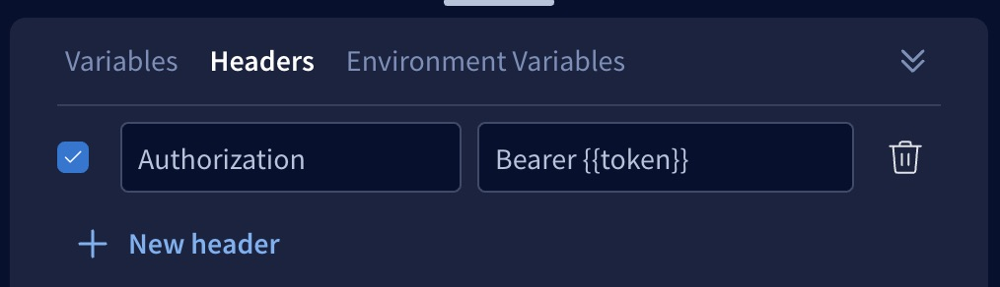

### Cookies

If your server uses cookies to authenticate, you can configure your endpoint to share those cookies with `https://studio.apollographql.com`

To set this up, your [cookie's value must contain `SameSite=None; Secure`](https://www.chromium.org/updates/same-site). Additionally, the following CORS headers must be present in your server's response to Studio:

```bash
Access-Control-Allow-Origin: https://studio.apollographql.com
Access-Control-Allow-Credentials: true
```

Once configured, requests sent from `https://studio.apollographql.com` include the cookies from your domain when you run queries with the Explorer. If you're logged in on your domain, requests from the Explorer will also be logged in. If you log out on your domain and the cookie is removed, requests from the Explorer will be logged out.

### Environment variables

The Explorer's Settings tab includes a section for defining environment variables. Here, you can provide sensitive information that you can then inject into header values, GraphQL variables, or [scripts](#scripting).
This enables you to share operations (including their headers) with other team members _without_ exposing this sensitive data.

#### Defining

You define environment variables in the Explorer's Settings tab, like so:

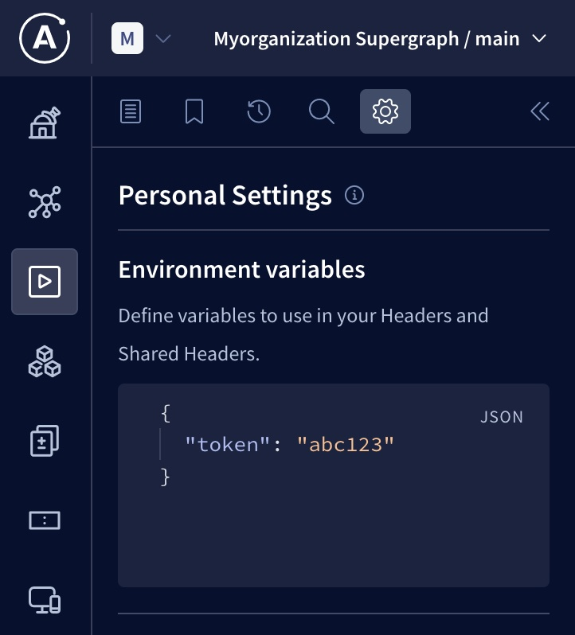

If you share an operation that uses environment variables with your team members, your _values_ for those environment variables are _not_ shared, and other users can provide their own values.

#### Injecting

You can inject your Explorer environment variables into any of the following:

- [HTTP header values](#header-values)
- [GraphQL variable values](#graphql-variables)
- [Custom scripts](#custom-scripts)

##### Header values

Inject an environment variable into an HTTP header value by surrounding the variable's name with double curly braces, as shown:

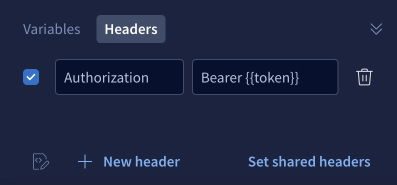

##### GraphQL variables

Inject an environment variable into a GraphQL variable value by surrounding the variable's name with double curly braces, as shown:

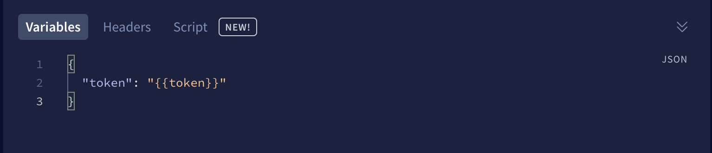

##### Custom scripts

If you create a [custom script](#scripting) that runs before an operation executes, that script can access an environment variable's value like so:

```js
const secretToken = explorer.environment.get('token');
```

## Scripting

Similar to tools like Postman, the Explorer can run custom scripts before executing each GraphQL operation. These JavaScript-based scripts often populate the values of [environment variables](#environment-variables) that are then injected into HTTP header values or GraphQL variables. This can be especially useful for managing authentication flows like OAuth, for example by refreshing an expired access token.

### Script types

You can define two different types of scripts:

- [**Preflight scripts.**](#preflight-scripts) You can define a _single_ preflight script _per variant_ of a graph. This script runs before _every Explorer operation_ that's executed against the associated variant (unless a user individually [disables the script](#disabling-preflight-scripts)).
    - Preflight scripts are especially helpful for enabling organization-wide Explorer authentication against your graph.
- [**Operation scripts.**](#operation-scripts) If you use [operation collections](./operation-collections/), you can define a separate script for each saved operation in a collection. This script runs before the corresponding operation is executed (as long as a user individually [enables the script](#enabling-operation-scripts)).
    - Operation scripts are especially helpful for debugging the behavior of individual operations when they're provided various values.

> If an Explorer operation runs _both_ types of scripts, the preflight script runs _before_ the operation script.

### Important considerations for Explorer scripts

- Scripts are stored in the Apollo cloud **in plaintext**.
  - **Do not include secret credentials in scripts!** Instead, team members can provide their individual credentials to the Explorer via [environment variables](#environment-variables).
- If a team member has view access to a particular graph variant or operation collection, that team member can _also_ view any scripts associated with that variant/collection.
- Preflight scripts are _enabled_ by default, and individual team members can [disable them](#disabling-preflight-scripts).
- Operation scripts are _disabled_ by default, and individual team members can [enable them](#enabling-operation-scripts).

### Preflight scripts

#### Creating preflight scripts

> For [protected variants](../graphs/studio-features/#protected-variants-enterprise-only), only organization members with the **Graph Admin** role can create or edit a variant's preflight script.
>
> For _non_-protected variants, members with the **Contributor** role can also modify the preflight script.

To create a preflight script:

1. [Open Apollo Studio](https://studio.apollographql.com/) and then open the Explorer for the graph and variant you want to create a script for.

2. Open the Explorer's Settings tab and scroll down to the **Preflight script** section:

   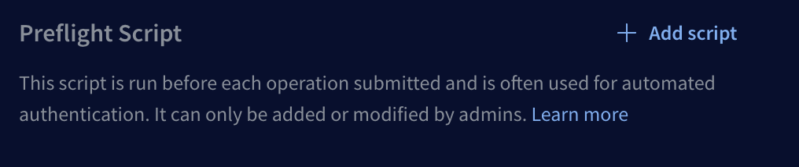

3. Click **Add script**. The following dialog appears:

   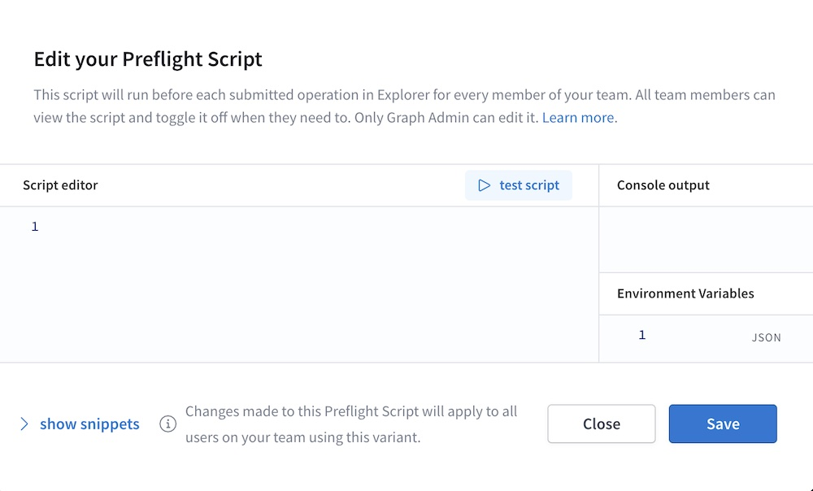

4. Click **Show snippets** to display a list of common helpful actions you can perform from your preflight script (such as sending HTTP requests and interacting with Explorer environment variables).

5. Develop your script in the **Script editor** panel. As you develop, you can click **Test script** to test its execution. Console messages are printed in the **Console output** panel.

6. When your script is ready, click **Save**. Studio stores your script.

You're done! After you save your script, it's automatically loaded for any team member that uses the Explorer with the associated variant.

#### Disabling preflight scripts

By default, a variant's preflight script runs automatically before every GraphQL operation that's executed in the Explorer. Team members can individually disable the script from the **Personal Settings > Scripts** section of the Explorer's Settings tab:

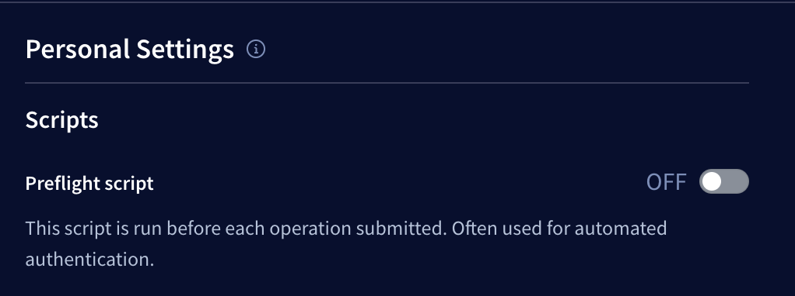

To do so, toggle the switch to **OFF**.


### Operation scripts

#### Creating operation scripts

> You can only create operation scripts for operations that are saved in an [operation collection](./operation-collections/).
>
> Only organization members with edit access to a particular operation collection can create or edit operation scripts for that collection.

1. From the Explorer, open an operation from the Operation Collections menu:

   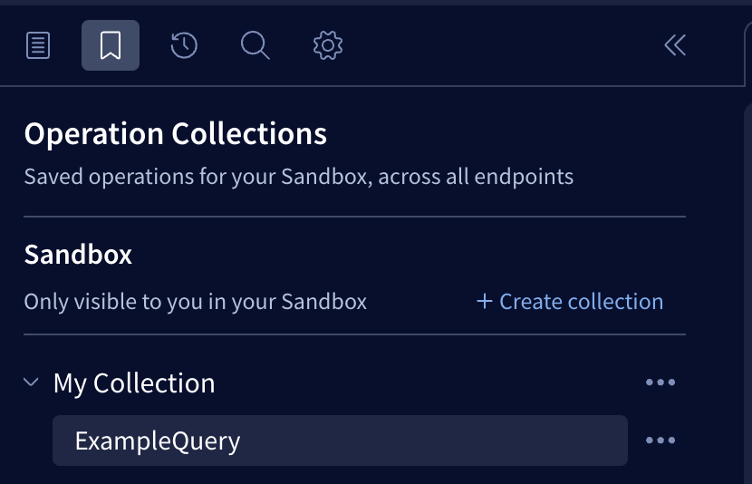

2. From the Explorer's bottom panel, select the Script tab and click **+ Add Script**:

   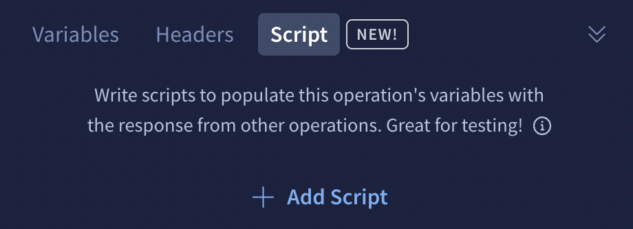

    The following modal appears:

    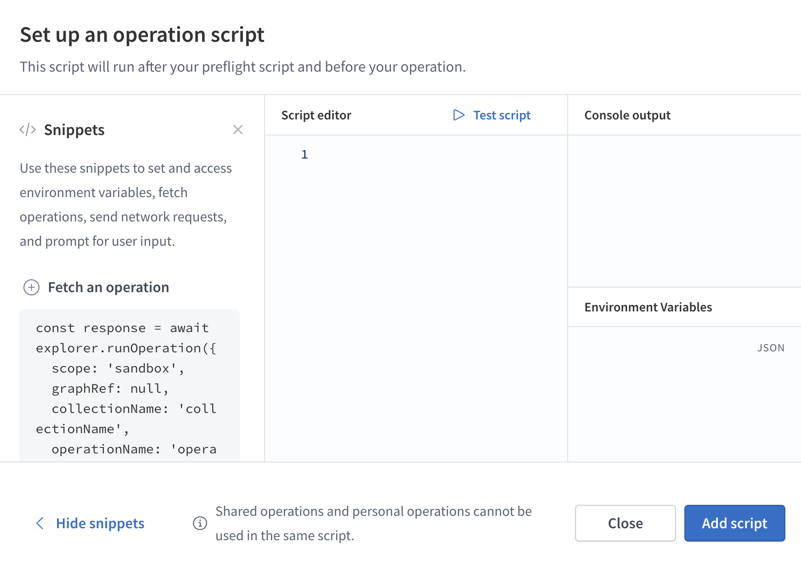

3. Create, test, and save your script.
    
    - For details on script creation, see [Creating preflight scripts](#creating-preflight-scripts).

#### Enabling operation scripts

By default, operation scripts are **disabled** for each individual user. Users can enable operation scripts from the Explorer's Settings tab:

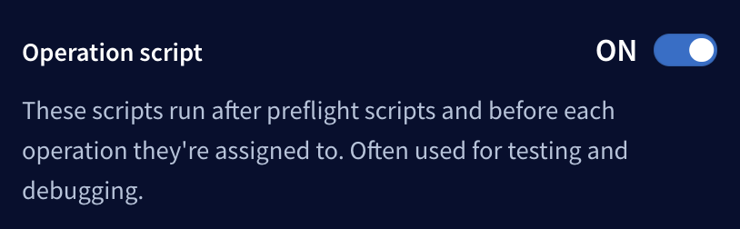

### Chaining operations

A script can use the [`explorer.runOperation`](#explorerrunoperation) function to execute _another_ operation that's saved in a collection. That operation might in turn have its _own_ script, which can _also_ call `explorer.runOperation`.

You can use this mechanism to chain together a sequence of operations for more advanced authentication flows.

### Scripting API reference

These symbols are available within the scope of both preflight scripts and operation scripts. Snippets for these symbols are available via the **Show snippets** link in the scripting dialog.

<table class="field-table api-ref">
  <thead>
    <tr>
      <th>Name /<br/>Type</th>
      <th>Description</th>
    </tr>
  </thead>

<tbody>

<tr>
<td>

##### `explorer.environment.get`

`(key: string) => Readonly`

</td>
<td>

Function that returns the current value of the environment variable with the specified `key`.

</td>
</tr>

<tr>
<td>

##### `explorer.environment.set`

`(key: string, value: JSONValue) => void`

</td>
<td>

Function that sets a new value for the environment variable with the specified `key`.

</td>
</tr>

<tr>
<td>

##### `explorer.fetch`

`(href: string, options?: { method?: string, body?: string | null, headers?: Record<string, string>, credentials: 'include' | 'omit' | 'same-origin' }) => Promise<{ code: number, body: string, json: () => any }>`

</td>
<td>

Function for making HTTP requests to external services from within a script.

Network requests are initiated from an origin of `https://preflight-request.apollographql.com`. Make sure the appropriate CORS headers are sent for those requests.

</td>
</tr>

<tr>
<td>

##### `explorer.runOperation`

`(options: { scope?: 'personal' | 'shared' | 'sandbox'; graphRef?: string | null; collectionName: string; operationName: string; headers?: Record<string, string>; variables?: JSONObject; }) => Promise<{ result: ExecutionResult<JSONObject> | undefined; code: number; }>`

</td>
<td>

Function for executing other saved operations. If the target operation has defined its own script, it will run before its operation.

- If `scope` is `sandbox`, `graphRef` defaults to `null`.
- If `graphRef` is `null`, `scope` defaults to 'sandbox'.

</td>
</tr>

<tr>
<td>

##### `explorer.prompt`

`(msg: string, defaultResponse?: string) => Promise<string | null>`

</td>
<td>

Function that prompts the user for input and returns the value in a promise. If the user cancels the prompt, the promise resolves to `null`.

The prompt supports Markdown rendering of the `msg` parameter.

</td>
</tr>

<tr>
<td>


##### `explorer.oauth2Request`

`(authUrl: string, queryParams?: Record<string, string>) => Promise<Record<string, string> | null>`

</td>
<td>

Function that prompts the user to authenticate using your OAuth 2.0 provider's URL (specified by `authUrl`). Provide any required query parameters to the auth endpoint via the `queryParams` parameter.

This function returns a promise containing the query parameters from your OAuth provider's response. If the user cancels the prompt, the promise resolves to `null`.

For OAuth 2.0 authentication to work with the Explorer, your OAuth 2.0 provider must recognize `https://studio.apollographql.com/explorer-oauth2` as a valid redirect URL. You can configure this in your OAuth 2.0 provider settings when you set up a new client or application.

</td>
</tr>

<tr>
<td>

##### `explorer.request.body`

`{ query: string; variables: { [key in string]?: JSONValue } | null; operationName: string | undefined; }`

</td>
<td>

The body of the `POST` request that's sent to the configured GraphQL endpoint for the current operation.

</td>
</tr>

<tr>
<td>

##### `explorer.CryptoJS`

</td>
<td>

This exposes the `crypto-js` package for use within your script. For available functions, [see the documentation](https://www.npmjs.com/package/crypto-js).

</td>

</tr>
</tbody>
</table>
