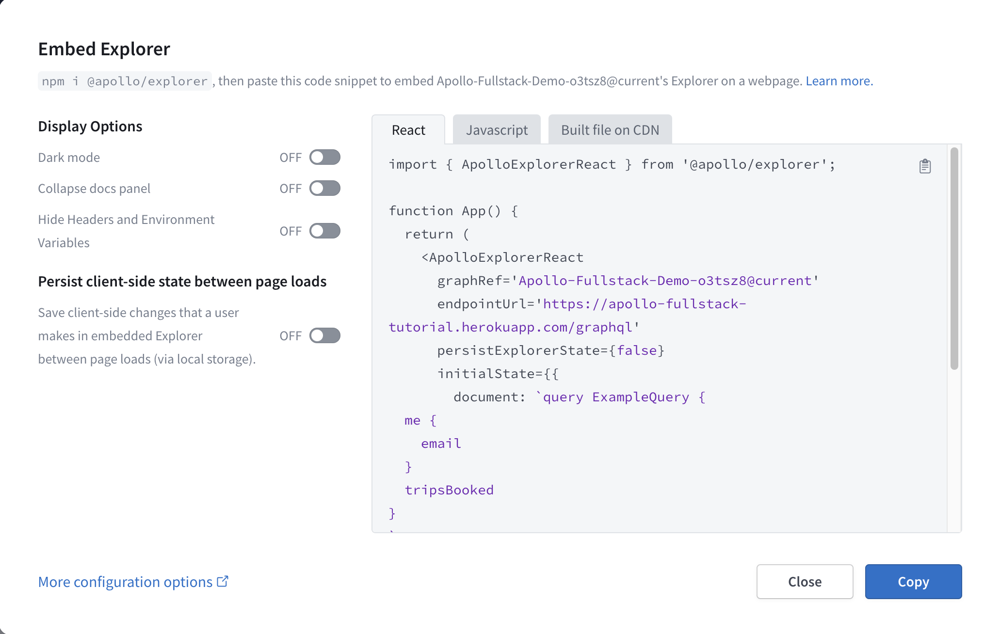
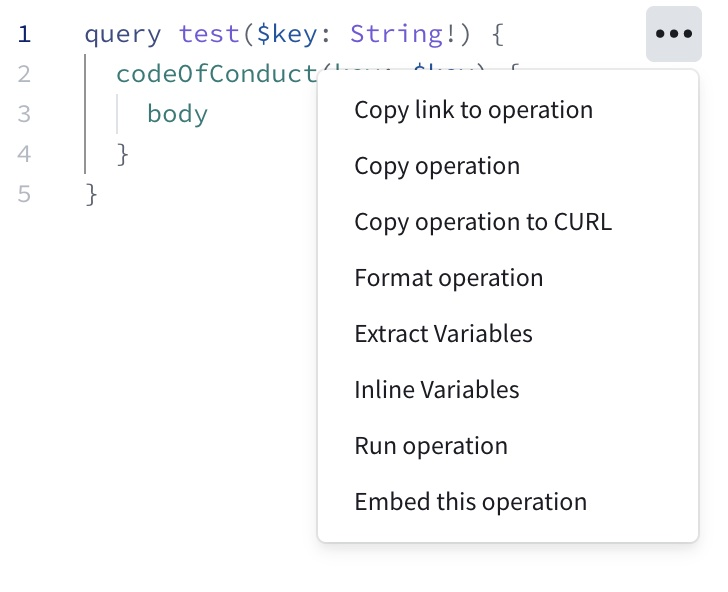
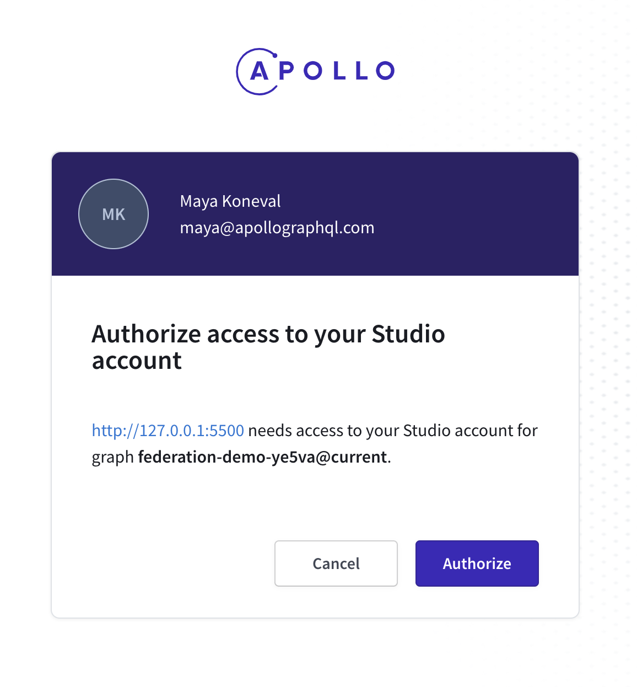

You can embed the [Apollo Studio Explorer](./) in a webpage that you can then provide to your graph's consumers. This enables those consumers to test out operations from your own website.

For example, here's an embedded Explorer for an Apollo example graph. Try it out!

<EmbeddableExplorer />

## Embedding on the Apollo Server landing page
In Apollo Server [v3.8.0](https://github.com/apollographql/apollo-server/blob/main/CHANGELOG.md#v380) and later, you can use a built-in plugin to embed the Explorer directly on your server's landing page.

You use the `ApolloServerPluginLandingPageLocalDefault` plugin to configure the landing page in your local development environment, and you use `ApolloServerPluginLandingPageProductionDefault` for production environments:

```js
import {
  ApolloServerPluginLandingPageLocalDefault,
  ApolloServerPluginLandingPageProductionDefault 
} from '@apollo/server/plugin/landingPage/default';

let plugins = [];
if (process.env.NODE_ENV === 'production') {
  plugins = [ApolloServerPluginLandingPageProductionDefault({ embed: true, graphRef: 'myGraph@prod' })]
} else {
  plugins = [ApolloServerPluginLandingPageLocalDefault({ embed: true })]
}

const server = new ApolloServer({
  typeDefs,
  resolvers,
  plugins
});
```

For more information, see the [landing page plugin API reference](/apollo-server/api/plugin/landing-pages/#default-behavior).

## Embedding on an arbitrary webpage

1. <a href="https://studio.apollographql.com/" target="_blank">
     Go to Apollo Studio
   </a> and open the variant you want to use with the embedded Explorer.

2. Go to the variant's Explorer page.

3. Under the Explorer's Settings tab, find **Embed Explorer** and click **Copy code snippet**.

   The following dialog appears:

   

4. Use the options on the left side of the dialog to customize the embedded Explorer's appearance and behavior to your liking.

5. Still in the dialog, use the tabs above the code snippet to select the snippet for your use case:

    - Use **React** for React apps where you can `npm install` the `@apollo/explorer` package. You will need to install the optional dependency `use-deep-compare-effect` to use the React package.
    - Use **JavaScript** for non-React JavaScript apps where you can `npm install` the `@apollo/explorer` package.
    - Use **Built file on CDN** to use Apollo's CDN-hosted embedded Explorer.

6. Click **Copy** to copy the snippet, then paste it into your code.

> For descriptions of options shown in the dialog (along with advanced options that _aren't_ shown), [see below](#options).

### Setting a default operation

You can prepopulate your embedded Explorer with an operation from one of your existing Explorer tabs. If you do, the embedded Explorer includes all of the following automatically on load:

- The operation you selected
- Any variable names and values defined in the operation's associated tab that are _used_ by the operation
- All header names and values defined in the operation's associated tab

To prepopulate a default operation, use one of the following methods:

#### Option 1

Open the **•••** menu next to an operation and click **Embed this operation**:



#### Option 2

Open the share dropdown in the Explorer and select **Share as embed**:


### Authorization

**If you're embedding a [public variant](../graphs/studio-features/#public-variants),** anyone with access to the embedded Explorer can view your schema and make queries against your variant.

**If you're embedding a private variant,** the embedded Explorer first asks users to authenticate by signing in to Studio. Authenticated users are then asked to authorize their Studio account to be used on the embedding webpage:



After authorizing, users can access the embedded Explorer, which includes schema navigation and visible operation collections.


## Options

The `EmbeddedExplorer` object takes an options object with the following structure (individual options are described below):

```js
{
  graphRef: 'acephei@current',
  endpointUrl: 'https://acephei-gateway.herokuapp.com',
  persistExplorerState: false,
  initialState: {
    document: `query ExampleQuery {
  me {
    id
  }
}
`,
    variables: { 'Variable1': 'ExampleValue' },
    headers: { 'Header1': 'ExampleValue' },
    displayOptions: {
      showHeadersAndEnvVars: true,
      docsPanelState: 'open',
      theme: 'light',
    },
  },
  handleRequest: (endpointUrl, options) => {
    return fetch(endpointUrl, {
      ...options,
      headers: {
          ...options.headers,
          authorization: `token ${token}`
      },
    })
  },
}
```

### Top-level options

These are the top-level fields you can include in the options object you pass to `new EmbeddedExplorer`:

<table class="field-table api-ref">

<thead>
  <tr>
    <th>
      Name /<br />
      Type
    </th>
    <th>Description</th>
  </tr>
</thead>

<tbody>
<tr class="required">
<td>

##### `graphRef`

`string`

</td>
<td>

**Required.** The graph ref for the variant you want to use the embedded Explorer with. Has the format `graph-id@variant-name`. This value is automatically populated in the Explorer's embed snippet.

The Explorer fetches this variant's schema from Apollo Studio to populate its Documentation panel and enable code completion.

If you omit this option, the Explorer _does_ still load, but it doesn't know which schema to fetch. This prevents the Explorer from providing critical features like documentation and code completion.

</td>
</tr>

<tr class="required">
<td>

##### `endpointUrl`

`string`

</td>
<td>

The endpoint URL of the variant you want to use the embedded Explorer with. This value is automatically populated in the Explorer's embed snippet.

**Required**, _unless_ you specify your own fetcher with the [`handleRequest`](#handlerequest) option.

</td>
</tr>

<tr>
<td>

##### `autoInviteOptions`

`{
    accountId: string;
    inviteToken: string;
 }`

</td>
<td>

If the graph you are embedding is a [private variant](../graphs/studio-features/#public-variants), we will by default only allow folks in your org to see the embedded Explorer. You can specify that you want anyone who visits your embedded Explorer to be automatically invited to your org with this config object. When you are grabbing the embed code from the Explorer settings in Studio, you have the option to select the role you want folks to be invited as, and the `inviteToken` and `accountId` will automatically populate.

If the graph you are embedding belongs to an SSO organization, folks will be able to log in with their SSO account and are automatically invited as the role you specify in the Org Settings page in Studio. Passing this in the embed config for a graph that belongs to an SSO account will not change any behavior. New users to your organization will always be invited as the role you specify in the Org Settings page in Studio.

</td>
</tr>

<tr>
<td>

##### `persistExplorerState`

`true | false`

</td>
<td>

If `true`, the embedded Explorer uses `localStorage` to persist its state (including operations, tabs, variables, and headers) between user sessions. This state is automatically populated in the Explorer on page load.

If `false`, the embedded Explorer loads with an example query based on your schema (unless you provide [`document`](#document)).

The default value is `false`.

</td>
</tr>

<tr>
<td>

##### `handleRequest`

`(url, options) => Promise`

</td>
<td>

By default, the embedded Explorer uses the `fetch` API to send requests to your `endpointUrl`. You can instead pass a _custom_ fetcher that's used to run all operations.

You might want to do this if you need to include specific headers in every request made from your embedded Explorer.

</td>
</tr>

<tr>
<td>

##### `includeCookies`

`boolean`

</td>
<td>

By default, the embedded Explorer uses your variant's **Include cookies** setting, which you configure from the _non_-embedded Explorer in Studio.

You can set `includeCookies` to `true` if you instead want the Explorer to pass `{ credentials: 'include' }` for its requests.

If you pass the `handleRequest` option, this option is ignored.

Read more about the `fetch` API and credentials [here](https://developer.mozilla.org/en-US/docs/Web/API/fetch#credentials).

This config option is **deprecated** in favor of configuring the **Include cookies** setting for your variant in the _non_-embedded Explorer.
</td>
</tr>

<tr>
<td>

##### `initialState`

`Object`

</td>
<td>

An object containing additional options related to the state of the embedded Explorer on page load.

For supported subfields, see [`initialState` options](#initialstate-options).

</td>
</tr>

</tbody>
</table>

### `initialState` options

These are the fields you can include in the `initialState` option you pass to `new EmbeddedExplorer`:

<table class="field-table api-ref">
  <thead>
    <tr>
      <th>Name /<br/>Type</th>
      <th>Description</th>
    </tr>
  </thead>

<tbody>
<tr>
<td>

##### `document`

`string`

</td>
<td>

A URI-encoded operation to populate in the Explorer's editor on load.

If you omit this, the Explorer initially loads an example query based on your schema.

If [`persistExplorerState`](#persistexplorerstate) is `true` _and_ you provide this option, the Explorer loads any of the user's tabs from `localStorage`, and it _also_ opens a _new_ tab with this operation.

Example:

```jsx
intialState: {
  document: `
  query ExampleQuery {
    books {
      title
    }
  }
`;
}
```

</td>
</tr>

<tr>
<td>

##### `variables`

`string`

</td>
<td>

A URI-encoded, serialized object containing initial variable values to populate in the Explorer on load.

If provided, these variables should apply to the initial query you provide for [`document`](#document).

Example:

```jsx
intialState: {
  variables: {
    userID: "abc123"
  },
}
```

</td>
</tr>

<tr>
<td>

##### `headers`

`string`

</td>
<td>

A URI-encoded, serialized object containing initial HTTP header values to populate in the Explorer on load.

Example:

```jsx
initialState: {
  headers: {
    authorization: 'Bearer abc123';
  }
}
```

</td>
</tr>

<tr>
<td>

##### `collectionId` / `operationId`

`string`

</td>
<td>

The ID of a collection, paired with an operation ID to populate in the Explorer on load. You can find these values in your Studio Explorer by clicking the **...** menu next to an operation you want to embed and selecting **View operation details**.

Example:

```jsx
initialState: {
  collectionId: 'abc1234',
  operationId: 'xyz1234'
}
```

</td>
</tr>

</tbody>
</table>

### `displayOptions` options

These are the fields you can include in the `initialState.displayOptions` option you pass to `new EmbeddedExplorer`:

<table class="field-table api-ref">
  <thead>
    <tr>
      <th>Name /<br/>Type</th>
      <th>Description</th>
    </tr>
  </thead>

<tbody>
<tr>
<td>

##### `docsPanelState`

`"open" | "closed"`

</td>
<td>

If `open`, the Explorer's Documentation panel (the left column) is initially expanded. If `closed`, the panel is initially collapsed.

The default value is `open`.

</td>
</tr>

<tr>
<td>

##### `showHeadersAndEnvVars`

`true | false`

</td>
<td>

If `true`, the embedded Explorer includes the panels for [setting request headers and environment variables](./connecting-authenticating/). If `false`, those panels are not present.

The default value is `true`.

</td>
</tr>

<tr>
<td>

##### `theme`

`"dark" | "light"`

</td>
<td>

If `dark`, the Explorer's dark theme is used. If `light`, the light theme is used.

The default value is `dark`.

</td>
</tr>
</tbody>
</table>
