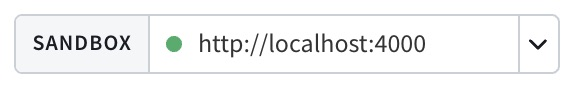
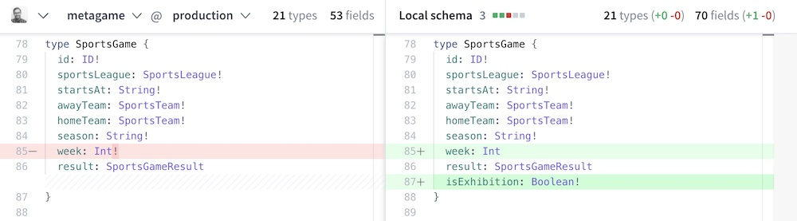
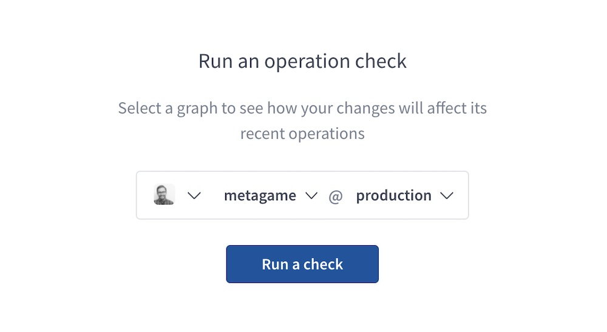
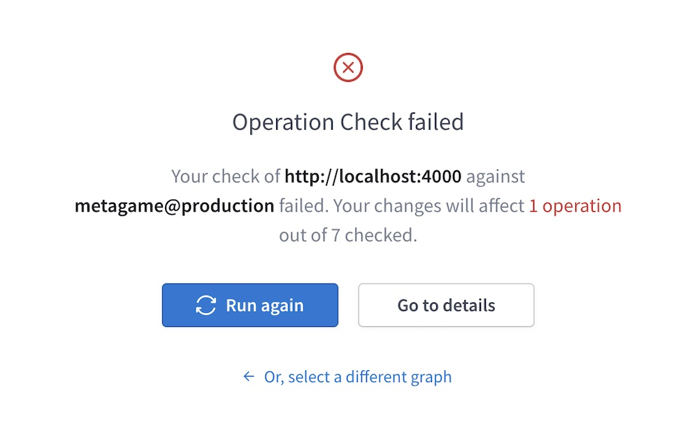
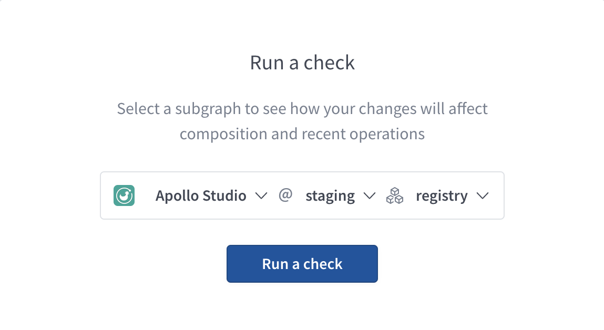
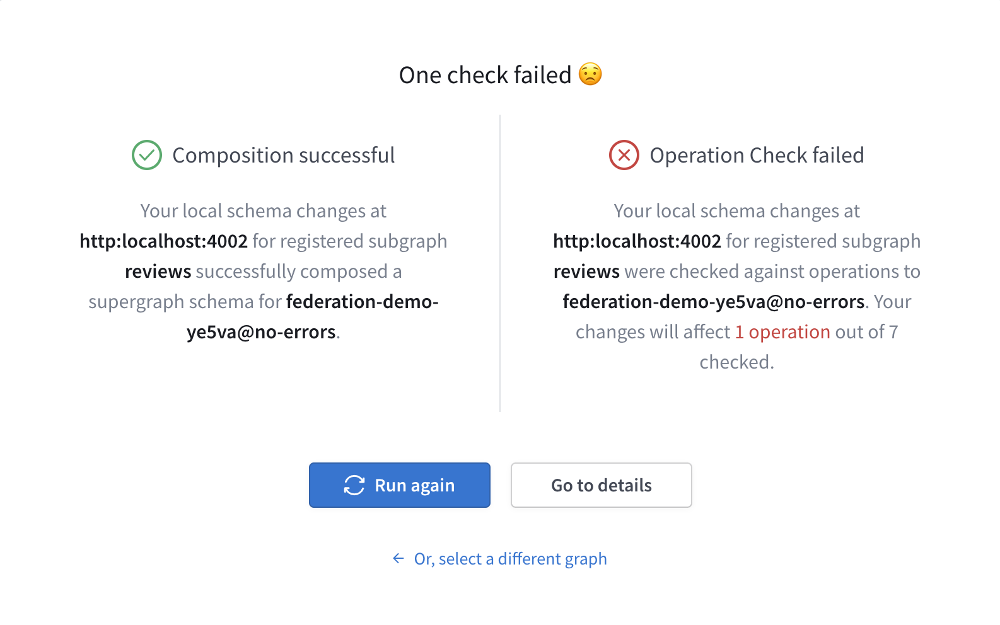
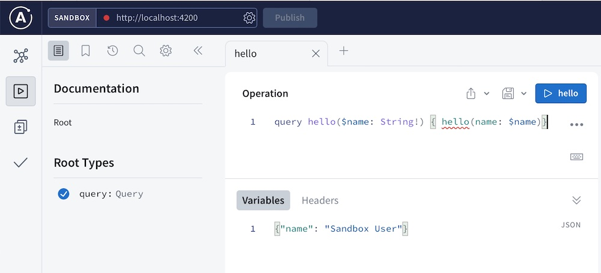
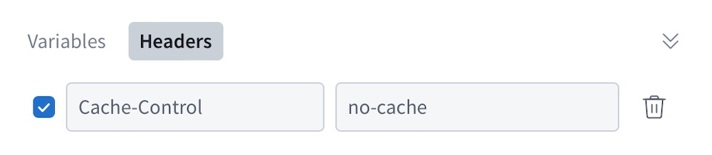
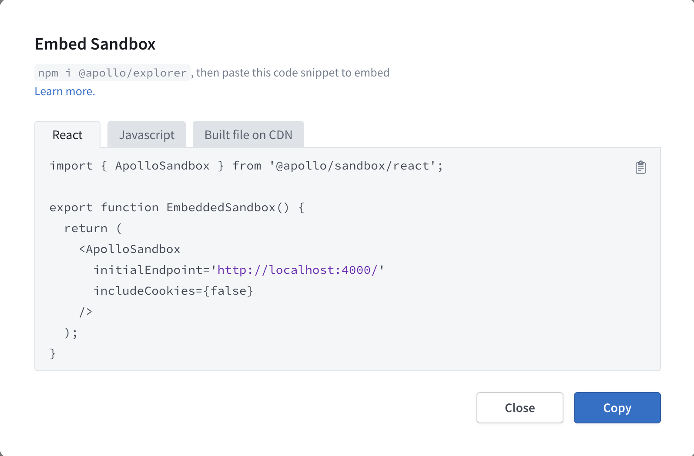

**Apollo Sandbox** is a special mode of Apollo Studio that helps with local development. Sandbox loads a running GraphQL server's schema via introspection, instead of fetching published schemas from the Apollo registry.

Sandbox provides access to the following Apollo Studio features:

- [The Explorer](./)
- Schema reference
- [Schema checks](../delivery/schema-checks/) and diffs against registered graphs (for logged-in users)

You can use Sandbox offline and without an Apollo account. You also [embed Sandbox](#embedding-sandbox) on your own website.

<Button
  size="lg"
  colorScheme="indigo"
  as="a"
  target="_blank"
  rel="noopener noreferrer"
  href="https://studio.apollographql.com/sandbox/"
>
  Launch Sandbox
</Button>

## Overview video

<YouTube youTubeId="0jzqqHZU00Q" />

## Connecting to a GraphQL server

When you open Sandbox, it automatically attempts to connect to a GraphQL server running at `http://localhost:4000`. You can use the box at the top of the Explorer to change this URL to any local or remote GraphQL endpoint that's accessible by your browser:



You can also change the default endpoint by providing a [URL parameter](#url-parameters).

> To try out Sandbox with an example GraphQL API, you can set the URL to:
>
> ```
> https://flyby-locations-sub.herokuapp.com/
> ```

## Schema diffs

If you log in to Apollo Studio from Sandbox, you can diff your Sandbox schema against any subgraph or monolith graph you have access to in the Apollo registry.

From [Sandbox](https://studio.apollographql.com/sandbox/), open the **Schema Diff** page from the left navigation panel. Then use the dropdown menus to select any accessible organization, graph, and variant to compare against:



> If you're using Sandbox with a subgraph, this diff shows the schema as originally defined, _not_ the generated subgraph schema that includes federation-specific fields (such as `Query._entities`). You can view the generated subgraph schema from the SDL page in Sandbox.

In addition to viewing the diff on this page, you can click **Run a Check** in the upper-right to run [schema checks](#schema-checks) against the currently selected variant.

## Schema checks

If you log in to Apollo Studio from Sandbox, you can run [schema checks](../delivery/schema-checks/) between your Sandbox schema and any graph you have access to in the Apollo registry.

> Organization members with the [**Consumer** role](../org/members/#organization-wide-member-roles) cannot run schema checks.

From [Sandbox](https://studio.apollographql.com/sandbox/), open the **Checks** page from the left navigation panel:



Select any accessible organization, graph, and variant to check against and click **Run a check**. When the check completes, Sandbox displays a result summary:



To view the result's _full_ details in Studio, click **Go to details**.

### Subgraph checks

You can run subgraph checks on supergraphs. If you're using Sandbox with a subgraph, you can use the subgraph dropdown to select which subgraph you want to check your changes against.



When you click **Run a check**, Sandbox first performs a composition check using your local subgraph schema and the published schemas of your other subgraphs. If composition succeeds, Sandbox then performs operation checks as usual and displays the results of all checks. If composition fails, Sandbox does not perform operation checks and displays the composition error.



## Offline Sandbox

You can use Sandbox _without_ an internet connection if you're querying a graph running on `localhost`. To do so, [open Sandbox in your browser](https://studio.apollographql.com/sandbox/) at least once while connected to the internet. You can then use that browser to open Sandbox while offline.

### Reconnecting

Sandbox automatically reconnects whenever your internet connection is restored. When it does, it might display a notification that your Apollo Studio application version is stale by at least 24 hours. You can click the notification to update _all_ of your browser's open Apollo Studio tabs to the latest version.

> This notification indicates only that the Apollo Studio _UI_ is out of date. Your Studio _data_ is always kept up to date.

## Operation collections in Sandbox

See [this section](./operation-collections/#sandbox-collections).

## URL parameters

You can provide URL parameters to Sandbox to customize its initial state on page load. This can help users get started with Sandbox more quickly when opening Sandbox from a link.

The following URL parameters are supported:

| Parameter   | Description                                                                                                                  |
|-------------|------------------------------------------------------------------------------------------------------------------------------|
| `endpoint`  | The URL of the GraphQL endpoint that Sandbox introspects and sends requests to. The default value is `http://localhost:4000` |
| `document`  | A GraphQL operation to populate in the Explorer's editor on load.                                                            |
| `variables` | A serialized JSON object containing initial variable values to populate in the Explorer on load.                             |
| `headers`   | A serialized JSON object containing initial HTTP header values to populate in the Explorer on load.                          |

For example, the following URL sets all supported parameters:

```
https://studio.apollographql.com/sandbox/explorer?endpoint=http://localhost:4200&document=query hello($name: String!) { hello(name: $name)}&variables={"name": "Sandbox User"}&headers={"Cache-Control": "no-cache"}
```

> Note that for readability, the above URL is not URL-encoded. Most browsers automatically encode the URL for you, but it's a best practice to URL-encode parameter values before providing them to a user.

The example URL above opens Sandbox with the following initial state:





## Embedding Sandbox

You can embed Sandbox on your own website. This can be useful for interacting with a GraphQL endpoint in your development environment or an endpoint with CORS restrictions.

### Setup

1. <a href="https://studio.apollographql.com/sandbox" target="_blank">
     Open Sandbox.
   </a>

2. Under the Explorer's Settings tab, find **Embed Sandbox** and click **Copy code snippet**.

   The following dialog appears:

   

3. Within the dialog, use the tabs to select the code snippet for your use case:

    * Use **React** for React apps where you can `npm install` the `@apollo/sandbox` package.
    * Use **JavaScript** for non-React JavaScript apps where you can `npm install` the `@apollo/sandbox` package.
    * Use **Built file on CDN** to use Apollo's CDN-hosted embedded Sandbox.

4. Click **Copy** to copy the snippet, then paste it into your html code.

### Options

The `EmbeddedSandbox` object takes an options object with the following structure (individual options are described below):

```js
{
  initialEndpoint: 'http://localhost:4000',
  handleRequest: (endpointUrl, options) => {
    return fetch(endpointUrl, {
      ...options,
      headers: {
          ...options.headers,
          authorization: `token ${token}`
      },
    })
  },
  hideCookieToggle: true,
}
```

These are the optional options you can include in the object you pass to `new EmbeddedSandbox`:

<table class="field-table api-ref">

<thead>
  <tr>
    <th>
      Name /<br />
      Type
    </th>
    <th>Description</th>
  </tr>
</thead>

<tbody>
<tr>
<td>

##### `initialEndpoint`

`string`

</td>
<td>

The URL of the GraphQL endpoint that Sandbox introspects on initial load. Sandbox populates its pages using the schema obtained from this endpoint.

The default value is `http://localhost:4000`.

**You should only pass non-production endpoints to Sandbox**. Sandbox is powered by schema introspection, and we recommend [disabling introspection in production](https://www.apollographql.com/blog/graphql/security/why-you-should-disable-graphql-introspection-in-production/).
To provide a "Sandbox-like" experience for production endpoints, we recommend using either a [public variant](../graphs/studio-features/#public-variants) or the [embedded Explorer](./embed-explorer).

</td>
</tr>

<tr>
<td>

##### `handleRequest`

`(url, options) => Promise`

</td>
<td>

By default, the embedded Sandbox uses the `fetch` API to send requests from your webpage to your specified GraphQL endpoint. If you provide a custom `handleRequest` function, Sandbox uses it instead of `fetch` for all operations.

You might want to do this if you need to include specific headers in every request made from your embedded Sandbox.

</td>
</tr>

<tr>
<td>

##### `hideCookieToggle`

`boolean`

</td>
<td>

By default, the embedded Sandbox does not show the **Include cookies** toggle in its connection settings.

Set `hideCookieToggle` to `false` to enable users of your embedded Sandbox instance to toggle the **Include cookes** setting.
</td>
</tr>

<tr>
<td>

##### `endpointIsEditable`

`boolean`

</td>
<td>

By default, the embedded Sandbox has a URL input box that is editable by users.

Set `endpointIsEditable` to `false` to prevent users of your embedded Sandbox instance from changing the endpoint URL.
</td>
</tr>

<tr>
<td>

##### `includeCookies`

`boolean`

</td>
<td>

You can set `includeCookies` to `true` if you instead want the Sandbox to pass `{ credentials: 'include' }` for its requests.

If you pass the `handleRequest` option, this option is ignored.

Read more about the `fetch` API and credentials [here](https://developer.mozilla.org/en-US/docs/Web/API/fetch#credentials).

This config option is **deprecated** in favor of using the Sandbox connection settings cookie toggle and setting the default value via `initialState.includeCookies`.
</td>
</tr>

<tr>
<td>

##### `initialState`

`Object`

</td>
<td>

An object containing additional options related to the state of the embedded Sandbox on page load.

For supported subfields, see [`initialState` options](#initialstate-options).

</td>
</tr>

</tbody>
</table>

### `initialState` options

These are the fields you can include in the `initialState` option you pass to `new EmbeddedSandbox`:

<table class="field-table api-ref">
  <thead>
    <tr>
      <th>Name /<br/>Type</th>
      <th>Description</th>
    </tr>
  </thead>

<tbody>

<tr>
<td>

##### `includeCookies`

`boolean`

</td>
<td>


Set this value to `true` if you want the Sandbox to pass `{ credentials: 'include' }` for its requests by default.

If you set `hideCookieToggle` to `false`, users can override this default setting with the **Include cookies** toggle. (By default, the embedded Sandbox does _not_ show the **Include cookies** toggle in its connection settings.)

If you also pass the `handleRequest` option, this option is ignored.

Read more about the `fetch` API and credentials [here](https://developer.mozilla.org/en-US/docs/Web/API/fetch#credentials).

</td>
</tr>

<tr>
<td>

##### `document`

`string`

</td>
<td>

A URI-encoded operation to populate in the Sandbox's editor on load.

If you omit this, the Sandbox initially loads an example query based on your schema.

Example:

```jsx
intialState: {
  document: `
  query ExampleQuery {
    books {
      title
    }
  }
`;
}
```

</td>
</tr>

<tr>
<td>

##### `variables`

`string`

</td>
<td>

A URI-encoded, serialized object containing initial variable values to populate in the Sandbox on load.

If provided, these variables should apply to the initial query you provide for [`document`](#document).

Example:

```jsx
intialState: {
  variables: {
    userID: "abc123"
  },
}
```

</td>
</tr>

<tr>
<td>

##### `headers`

`string`

</td>
<td>

A URI-encoded, serialized object containing initial HTTP header values to populate in the Sandbox on load.

Example:

```jsx
initialState: {
  headers: {
    authorization: "Bearer abc123";
  }
}
```

</td>
</tr>

<tr>
<td>

##### `collectionId` & `operationId`

`string`

</td>
<td>

The ID of a collection, paired with an operation ID to populate in the Sandbox on load. You can find these values from a registered graph in Studio by clicking the **...** menu next to an operation in the Explorer of that graph and selecting **View operation details**.

Example:

```jsx
initialState: {
  collectionId: 'abc1234',
  operationId: 'xyz1234'
}
```

</td>
</tr>

<tr>
<td>

##### `pollForSchemaUpdates`

`boolean`

</td>
<td>

If `true`, the embedded Sandbox periodically polls your `initialEndpoint` for schema updates.

The default value is `true`.

Example:

```jsx
initialState: {
  pollForSchemaUpdates: false
}
```

</td>
</tr>

<tr>
<td>

##### `sharedHeaders`

`Record<string, string>`

</td>
<td>

Headers that are applied by default to every operation executed by the embedded Sandbox. Users can disable the application of these headers, but they can't modify their values.

The embedded Sandbox _always_ includes these headers in its introspection queries to your `initialEndpoint`.

Example:

```jsx
initialState: {
  sharedHeaders: {
    authorization: "Bearer abc123";
  }
}
```

</td>
</tr>

</tbody>
</table>
