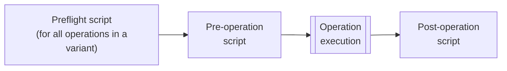
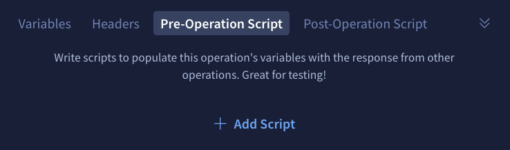
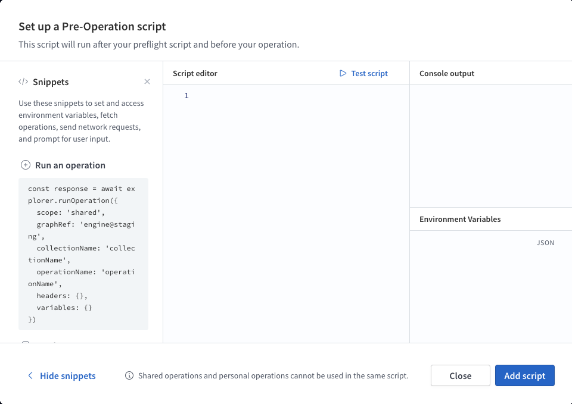
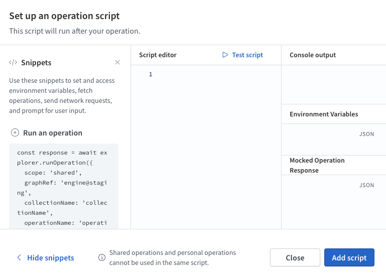
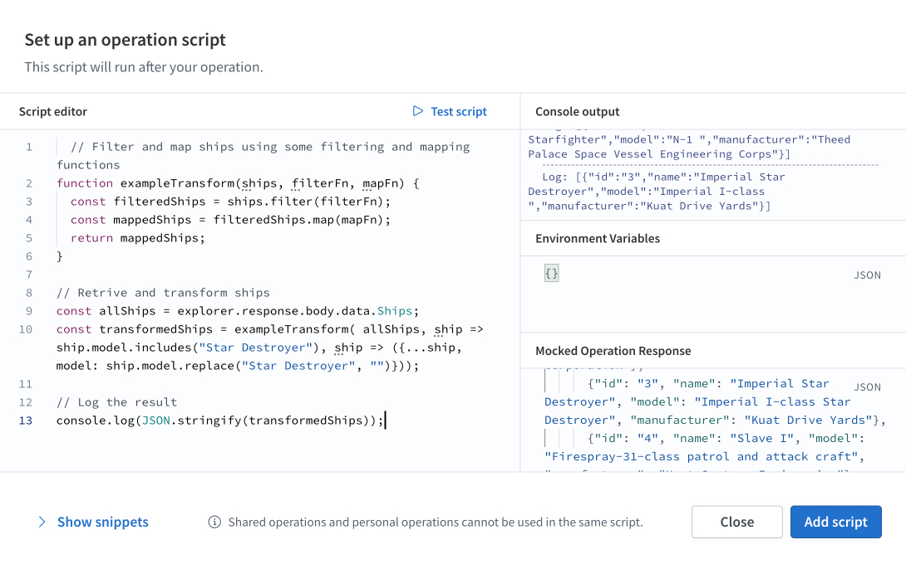

The GraphOS Explorer can run custom scripts when executing each GraphQL operation, similar to tools like Postman. These JavaScript-based scripts can get and set the values of [environment variables](./connecting-authenticating/#environment-variables) that the Explorer can then inject into HTTP header values or GraphQL variables.

Preflight scripts are useful for managing authentication flows like OAuth, for example, by refreshing an expired access token. Postflight scripts are useful for validating workflows that depend on response data.

## Script types

The Explorer lets you define two different types of scripts:

- [**Preflight scripts**](#preflight-scripts): You can define a single preflight script per variant of a graph. This script runs **before every Explorer operation that's executed against the associated variant**.
  - Preflight scripts are helpful for enabling organization-wide Explorer authentication to your graph.
- [**Operation scripts**](#operation-scripts): If you use [operation collections](./operation-collections/), you can define one pre- and one post-operation script for each saved operation in a collection.
  - Pre-operation scripts run before the operation executes. **They act as additional, per-operation preflight scripts.**
  - Post-operation scripts run after the operation executes. **They act as per-operation postflight scripts.**
  - Operation scripts are helpful for testing or debugging the behavior of individual operations or [operation chains](#chaining-operations).

### Script execution order

If you define and use all possible scripts for an operation, the order is as follows:



## Important considerations for Explorer scripts

- Scripts are stored in the Apollo cloud **in plaintext**.

  <Caution>

  **Do not include secret credentials in scripts.** Instead, team members can provide their individual credentials to the Explorer via [environment variables](./connecting-authenticating/#environment-variables).

  </Caution>

- If a team member has view access to a particular graph variant or operation collection, that team member can also view any scripts associated with that variant or operation collection.
- Preflight scripts are **on** by default. Individual team members can [turn them off](#turn-off-preflight-scripts) for their own Explorer usage.
- Operations scripts are **off** by default. Individual team members can [turn them on](#turn-on-operation-scripts) for their own Explorer usage.

## Preflight scripts

### Add preflight scripts

<Note>

For [protected variants](../graphs/studio-features/#protected-variants-enterprise-only), only organization members with the **Graph Admin** role can create or edit a variant's preflight script.

For non-protected variants, members with the **Contributor** role can also modify the preflight script.

</Note>

To create a preflight script:

1. [Open GraphOS Studio](https://studio.apollographql.com/?referrer=docs-content) and then open the Explorer for the graph and variant you want to create a script for.

2. Open the Explorer's Settings tab and scroll down to the **Preflight Script** section:

   

3. Click **+ Add script**. The following dialog appears:

   

4. Click **Show snippets** to display a list of common helpful actions you can perform from your preflight script. Examples include sending HTTP requests and interacting with Explorer environment variables.

5. Develop your script in the **Script editor** panel. As you develop, you can click **Test script** to test its execution. Console messages are printed in the **Console output** panel.

6. When your script is ready, click **Save**. Studio stores your script.

That's it! After you save your script, it's automatically loaded for any team member that uses the Explorer with the associated variant.

### Turn off preflight scripts

By default, a variant's preflight script runs automatically before every GraphQL operation that's executed in the Explorer. Team members can turn off the script for their individual Explorer usage from the **Personal Settings > Scripts** section of the Explorer's Settings tab:


To do so, toggle the **Preflight script** switch to **OFF**.

## Operation scripts

### Add operation scripts

<Note>

You can only create operation scripts for operations that are saved in an [operation collection](./operation-collections/).

Only organization members [with edit access](../org/members/#role-permissions) to a particular operation collection can create or edit operation scripts for that collection.

</Note>

1. From the Explorer, open an operation from the Operation Collections menu:

   

2. From the Explorer's bottom panel, select the **Pre-Operation Script** or **Post-Operation Script** tab and click **+ Add Script**:

   

   The following modal appears:

   

3. Create, test, and save your script.

   - For details on script creation, see steps 4 and 5 of [Add preflight scripts](#add-preflight-scripts).
   - Click **Test script** to test your script before saving it.

After you save an operation script, make sure to [turn it on](#turn-on-operation-scripts) so that it runs before or after its designated operation execution in the Explorer.

### Mocking responses for post-operation scripts

The operation script modal has a **Mocked Operation Response** area so you can test post-operation scripts before saving them. Scripts can access any JSON GraphQL response you add in the **Mocked Operation Response** via the [`explorer.response.body`](#explorerresponsebody) variable.



### Turn on operation scripts

By default, operation scripts are **off** for each individual team member. Team members can turn on operation scripts for their individual Explorer usage from the **Personal Settings > Scripts** section of the Explorer's Settings tab:


To do so, toggle the **Operation script** switch to **ON**.

## Chaining operations

A script can use the [`explorer.runOperation`](#explorerrunoperation) function to execute another operation that's saved in a collection. That operation might have its own script, which can also call `explorer.runOperation`.

You can use this mechanism to chain together a sequence of operations for more advanced workflows.

## Scripting API reference

These symbols are available within the scope of both preflight scripts and operation scripts. Snippets for these symbols are available via the **Show snippets** link in the scripting modal.

<table class="field-table api-ref">
  <thead>
    <tr>
      <th>Name /<br/>Type</th>
      <th>Description</th>
    </tr>
  </thead>

<tbody>

<tr>
<td>

##### `explorer.environment.get`

`(key: string) => Readonly`

</td>
<td>

Function that returns the current value of the environment variable with the specified `key`.

</td>
</tr>

<tr>
<td>

##### `explorer.environment.set`

`(key: string, value: JSONValue) => void`

</td>
<td>

Function that sets a new value for the environment variable with the specified `key`.

</td>
</tr>

<tr>
<td>

##### `explorer.fetch`

`(href: string, options?: { method?: string, body?: string | null, headers?: Record<string, string>, credentials: 'include' | 'omit' | 'same-origin' }) => Promise<{ code: number, body: string, json: () => any }>`

</td>
<td>

Function for making HTTP requests to external services from within a script.

Network requests are initiated from an origin of `https://preflight-request.apollographql.com`. Make sure the appropriate CORS headers are sent for those requests.

</td>
</tr>

<tr>
<td>

##### `explorer.runOperation`

`(options: { scope?: 'personal' | 'shared' | 'sandbox'; graphRef?: string | null; collectionName: string; operationName: string; headers?: Record<string, string>; variables?: JSONObject; }) => Promise<{ result: ExecutionResult<JSONObject> | undefined; code: number; }>`

</td>
<td>

Function for executing other saved operations. If the target operation has defined its own script, it will run before its operation.

- If `scope` is `sandbox`, `graphRef` defaults to `null`.
- If `graphRef` is `null`, `scope` defaults to 'sandbox'.

</td>
</tr>

<tr>
<td>

##### `explorer.prompt`

`(msg: string, defaultResponse?: string) => Promise<string | null>`

</td>
<td>

Function that prompts the user for input and returns the value in a promise. If the user cancels the prompt, the promise resolves to `null`.

The prompt supports Markdown rendering of the `msg` parameter.

</td>
</tr>

<tr>
<td>

##### `explorer.oauth2Request`

`(authUrl: string, queryParams?: Record<string, string>) => Promise<Record<string, string> | null>`

</td>
<td>

Function that prompts the user to authenticate using your OAuth 2.0 provider's URL (specified by `authUrl`). Provide any required query parameters to the auth endpoint via the `queryParams` parameter.

This function returns a promise containing the query parameters from your OAuth provider's response. If the user cancels the prompt, the promise resolves to `null`.

For OAuth 2.0 authentication to work with the Explorer, your OAuth 2.0 provider must recognize `https://studio.apollographql.com/explorer-oauth2` as a valid redirect URL. You can configure this in your OAuth 2.0 provider settings when you set up a new client or application.

</td>
</tr>

<tr>
<td>

##### `explorer.request.body`

`{ query: string; variables: { [key in string]?: JSONValue } | null; operationName: string | undefined; }`

</td>
<td>

The body of the `POST` request that's sent to the configured GraphQL endpoint for the current operation.

</td>
</tr>

<tr>
<td>

##### `explorer.response.body`

`ExecutionResult<JSONObject> | null`

</td>
<td>

The JSON representation of the GraphQL operation response. Used in [post-operation scripts](#mocking-responses-for-post-operation-scripts).

</td>
</tr>

<tr>
<td>

##### `explorer.CryptoJS`

</td>
<td>

This exposes the `crypto-js` package for use within your script. For available functions, [see the documentation](https://www.npmjs.com/package/crypto-js).

</td>

</tr>
</tbody>
</table>

## Examples

### Get an environment variable

Scripts can access an environment variable [set in the Explorer's settings](./connecting-authenticating#defining) like so:

```js
const secretToken = explorer.environment.get("token");
```

### Set an environment variable

The following example runs an operation and sets an environment variable for use in future operations:

```js
const response = await explorer.runOperation({
  scope: "shared",
  graphRef: "SpaceX-pxxbxen@current",
  collectionName: "Mission Control",
  operationName: "Ships",
});

const firstShipID = response.result.data.ships[0].id;

explorer.environment.set("shipID", firstShipID);
```

### Authenticate using an authorization provider URL

The following example uses the [`explorer.oauth2Request`](#exploreroauth2request) function to authenticate using an OAuth 2.0 provider's URL. View the [function's reference](#exploreroauth2request) for more details.

```js
const responseQueryParams = await explorer.oauth2Request(
  'http://yourauthprovider.com/authorize',
  {  
    client_id: "",
    state: "",
    scope: "openid",
    response_type: "code",
    code_challenge_method: "S256",
    code_challenge: "",
    code_verifier: "",
  })
```

See the following example for how you can use the response from a [`explorer.oauth2Request`](#exploreroauth2request) request to set an authorization environment variable.

### Set an authorization environment variable

The following example uses the [`explorer.environment.set`](#explorerenvironmentset) function to set a date-based authorization token relying on the response of an Okta authorization request:

```js
let futureDate = explorer.environment.get('futureDate');
const now = Date.now();
if (!futureDate || now >= futureDate ) {

  const authUrl = 'https://<customerdomain>.okta.com/oauth2/<customerid>/v1/authorize';
  const qp = {  
    client_id: <clientid>,
    state: "abc",
    scope: "openid",
    response_type: "token",
    code_challenge_method: "S256",
    nonce: "nonce"
  };

  const result = await explorer.oauth2Request(authUrl, qp);
  const token = result.access_token;

  explorer.environment.set('Authorization', {token});

  const nowDate = new Date();
  futureDate = new Date(nowDate.getTime() + (1 * 55 * 1000));
  explorer.environment.set('futureDate', futureDate.getTime());
  
}
```

### Transform and log response data

You can use a post-operation script to filter, map, or otherwise transform response data and log it. This can be helpful when a request returns numerous results in the response.

For example, imagine you have a query called `Ships`:

```graphql disableCopy=true
query Ships {
  id
  name
  model
  manufacturer
}
```

The corresponding response might look like this:

```json disableCopy=true
{
  "data": {
    "Ships": [
      {
        "id": "1",
        "name": "Millennium Falcon",
        "model": "YT-1300 Light Freighter",
        "manufacturer": "Corellian Engineering Corporation"
      },
      {
        "id": "2",
        "name": "X-wing Starfighter",
        "model": "T-65 X-wing",
        "manufacturer": "Incom Corporation"
      }
      // ... (thousands of ships)
    ]
  }
}
```

You can use a post-operation script to access, transform, and log the returned results:

```js disableCopy=true
  // Filter and map ships using some filtering and mapping functions
function exampleTransform(ships, filterFn, mapFn) {
  const filteredShips = ships.filter(filterFn);
  const mappedShips = filteredShips.map(mapFn);
  return mappedShips;
}

// Retrive and transform ships
const allShips = explorer.response.body.data.Ships;
const transformedShips = exampleTransform( allShips, filterFn, mapFn);

// Log the result
console.log(transformedShips);
```



<Note>

You can view the output from `console.log`s in the **Console output** while writing and testing scripts. To see and interact with logged items when running an operation in Explorer, open your browser's devtools.

</Note>