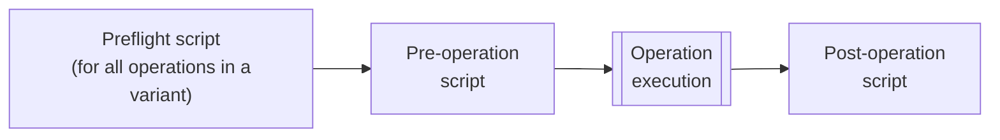

Similar to tools like Postman, the Explorer can run custom scripts when executing each GraphQL operation. These JavaScript-based scripts can populate the values of [environment variables](#environment-variables) that the Explorer then injects into HTTP header values or GraphQL variables. This can be useful for:

- Managing authentication flows like OAuth, for example, by refreshing an expired access token
- Validating response data and workflows that depend on response data

## Script types

You can define two different types of scripts:

- [**Preflight scripts**](#preflight-scripts): You can define a single preflight script _per variant_ of a graph. This script runs before _every Explorer operation_ that's executed against the associated variant.
  - Preflight scripts are especially helpful for enabling organization-wide Explorer authentication against your graph.
- [**Operation scripts**](#operation-scripts): If you use [operation collections](./operation-collections/), you can define one pre- and one post-operation script for each saved operation in a collection.
  - Operation scripts are especially helpful for testing or debugging the behavior of individual operations or [operation chains](#chaining-operations).
  - Pre-operation scripts run before the operation executes.
  - Post-operation scripts run after the operation executes.

If a user has defined and turned on all possible scripts for a particular operation, the order is as follows:



## Important considerations for Explorer scripts

- Scripts are stored in the Apollo cloud **in plaintext**.
  <Caution>

  **Do not include secret credentials in scripts.** Instead, team members can provide their individual credentials to the Explorer via [environment variables](#environment-variables).

  </Caution>

- If a team member has view access to a particular graph variant or operation collection, that team member can _also_ view any scripts associated with that variant or operation collection.
- Preflight scripts are on by default. Individual team members can [turn them off](#turning-off-preflight-scripts) for their own Explorer usage.
- Operations scripts are off by default. Individual team members can [turn them on](#turning-on-operation-scripts) for their own Explorer usage.

## Preflight scripts

### Creating preflight scripts

> For [protected variants](../graphs/studio-features/#protected-variants-enterprise-only), only organization members with the **Graph Admin** role can create or edit a variant's preflight script.
>
> For _non_-protected variants, members with the **Contributor** role can also modify the preflight script.

To create a preflight script:

1. [Open GraphOS Studio](https://studio.apollographql.com/?referrer=docs-content) and then open the Explorer for the graph and variant you want to create a script for.

2. Open the Explorer's Settings tab and scroll down to the **Preflight Script** section:

   

3. Click **+ Add script**. The following dialog appears:

   

4. Click **Show snippets** to display a list of common helpful actions you can perform from your preflight script (such as sending HTTP requests and interacting with Explorer environment variables).

5. Develop your script in the **Script editor** panel. As you develop, you can click **Test script** to test its execution. Console messages are printed in the **Console output** panel.

6. When your script is ready, click **Save**. Studio stores your script.

You're done! After you save your script, it's automatically loaded for any team member that uses the Explorer with the associated variant.

### Turning off preflight scripts

By default, a variant's preflight script runs automatically before every GraphQL operation that's executed in the Explorer. Team members can individually turn off the script from the **Personal Settings > Scripts** section of the Explorer's Settings tab:


To do so, toggle the switch to **OFF**.

## Operation scripts

### Creating operation scripts

> You can only create operation scripts for operations that are saved in an [operation collection](./operation-collections/).
>
> Only organization members with edit access to a particular operation collection can create or edit operation scripts for that collection.

1. From the Explorer, open an operation from the Operation Collections menu:

   

2. From the Explorer's bottom panel, select the **Pre-Operation Script** or **Post-Operation Script** tab and click **+ Add Script**:

   

   The following modal appears:

   

3. Create, test, and save your script.

   - For details on script creation, see [Creating preflight scripts](#creating-preflight-scripts).

   - The operation script modal has a **Mocked Operation Response** area so you can test post-operation scripts. Scripts can access any JSON GraphQL response you add in the **Mocked Operation Response** via the [`explorer.response.body`](#explorerresponsebody) variable.

   

   - Click **Test script** to test your script before saving it.

### Turning on operation scripts

By default, operation scripts are **off** for each individual user. Users can turn on operation scripts from the Explorer's Settings tab:


## Chaining operations

A script can use the [`explorer.runOperation`](#explorerrunoperation) function to execute _another_ operation that's saved in a collection. That operation might in turn have its _own_ script, which can _also_ call `explorer.runOperation`.

You can use this mechanism to chain together a sequence of operations for more advanced authentication flows.

## Scripting API reference

These symbols are available within the scope of both preflight scripts and operation scripts. Snippets for these symbols are available via the **Show snippets** link in the scripting dialog.

<table class="field-table api-ref">
  <thead>
    <tr>
      <th>Name /<br/>Type</th>
      <th>Description</th>
    </tr>
  </thead>

<tbody>

<tr>
<td>

##### `explorer.environment.get`

`(key: string) => Readonly`

</td>
<td>

Function that returns the current value of the environment variable with the specified `key`.

</td>
</tr>

<tr>
<td>

##### `explorer.environment.set`

`(key: string, value: JSONValue) => void`

</td>
<td>

Function that sets a new value for the environment variable with the specified `key`.

</td>
</tr>

<tr>
<td>

##### `explorer.fetch`

`(href: string, options?: { method?: string, body?: string | null, headers?: Record<string, string>, credentials: 'include' | 'omit' | 'same-origin' }) => Promise<{ code: number, body: string, json: () => any }>`

</td>
<td>

Function for making HTTP requests to external services from within a script.

Network requests are initiated from an origin of `https://preflight-request.apollographql.com`. Make sure the appropriate CORS headers are sent for those requests.

</td>
</tr>

<tr>
<td>

##### `explorer.runOperation`

`(options: { scope?: 'personal' | 'shared' | 'sandbox'; graphRef?: string | null; collectionName: string; operationName: string; headers?: Record<string, string>; variables?: JSONObject; }) => Promise<{ result: ExecutionResult<JSONObject> | undefined; code: number; }>`

</td>
<td>

Function for executing other saved operations. If the target operation has defined its own script, it will run before its operation.

- If `scope` is `sandbox`, `graphRef` defaults to `null`.
- If `graphRef` is `null`, `scope` defaults to 'sandbox'.

</td>
</tr>

<tr>
<td>

##### `explorer.prompt`

`(msg: string, defaultResponse?: string) => Promise<string | null>`

</td>
<td>

Function that prompts the user for input and returns the value in a promise. If the user cancels the prompt, the promise resolves to `null`.

The prompt supports Markdown rendering of the `msg` parameter.

</td>
</tr>

<tr>
<td>

##### `explorer.oauth2Request`

`(authUrl: string, queryParams?: Record<string, string>) => Promise<Record<string, string> | null>`

</td>
<td>

Function that prompts the user to authenticate using your OAuth 2.0 provider's URL (specified by `authUrl`). Provide any required query parameters to the auth endpoint via the `queryParams` parameter.

This function returns a promise containing the query parameters from your OAuth provider's response. If the user cancels the prompt, the promise resolves to `null`.

For OAuth 2.0 authentication to work with the Explorer, your OAuth 2.0 provider must recognize `https://studio.apollographql.com/explorer-oauth2` as a valid redirect URL. You can configure this in your OAuth 2.0 provider settings when you set up a new client or application.

</td>
</tr>

<tr>
<td>

##### `explorer.request.body`

`{ query: string; variables: { [key in string]?: JSONValue } | null; operationName: string | undefined; }`

</td>
<td>

The body of the `POST` request that's sent to the configured GraphQL endpoint for the current operation.

</td>
</tr>

<tr>
<td>

##### `explorer.response.body`

`JSONValue | null`

</td>
<td>

The JSON representation of the GraphQL operation response. Useful for testing [post-operation scripts](#creating-operation-scripts).

</td>
</tr>

<tr>
<td>

##### `explorer.CryptoJS`

</td>
<td>

This exposes the `crypto-js` package for use within your script. For available functions, [see the documentation](https://www.npmjs.com/package/crypto-js).

</td>

</tr>
</tbody>
</table>

## Examples

### Operation Scripts

Here is a small example that runs an operation and sets an environment variable for use on future operations:

```js
const response = await explorer.runOperation({
  scope: "shared",
  graphRef: "SpaceX-pxxbxen@current",
  collectionName: "Mission Control",
  operationName: "Ships",
});

const firstShipID = response.result.data.ships[0].id;

explorer.environment.set("shipID", firstShipID);
```
