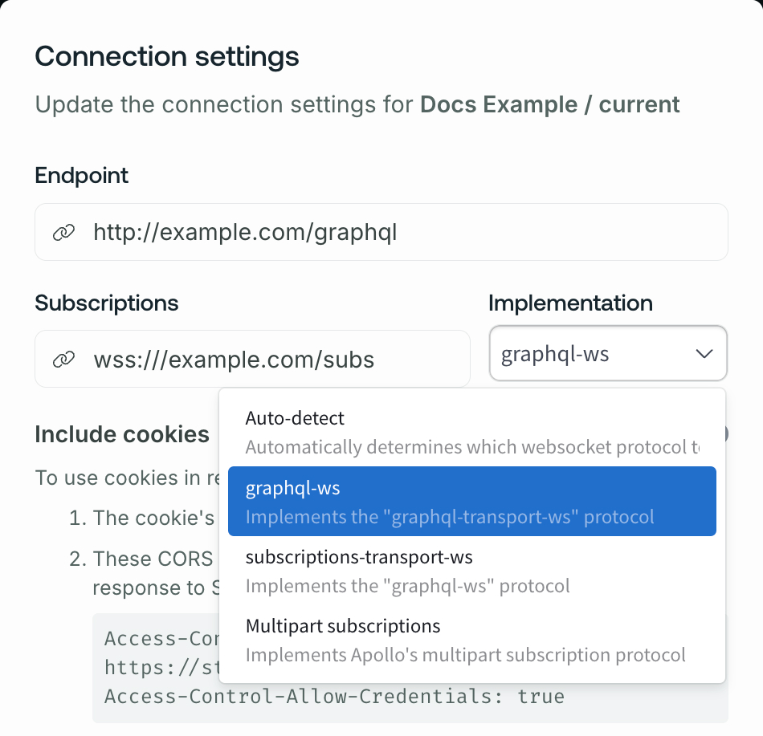
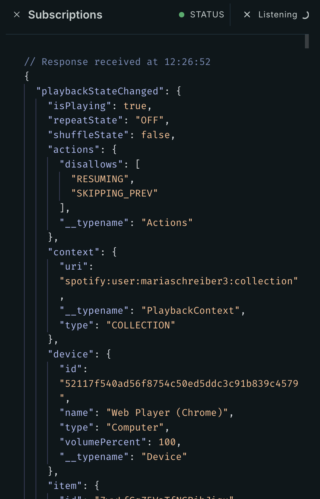

The GraphOS Studio Explorer provides support for executing GraphQL subscription operations using a variety of protocols (including WebSocket and HTTP). You can configure the Explorer to use whichever protocol your GraphQL endpoint requires.

## Setup

To execute a GraphQL subscription operation in the GraphOS Studio Explorer, first open the Explorer's **Connection settings** to specify your subscriptions endpoint and **implementation**:

<Note>

Remember that the path and protocol of your subscriptions URL might differ from those of your primary endpoint.

</Note>

<ExpansionPanel title="Which 'implementation' do I choose?">

- If you're subscribing to a subgraph or a standalone GraphQL server, choose whichever WebSocket subprotocol the server uses.

  - If you aren't sure which subprotocol the server uses, choose **Autodetect** and the Explorer will attempt to determine the correct subprotocol.

- If you're subscribing to the router, choose **Multipart subscriptions**. This is the HTTP-based protocol that the router uses.
  - [Learn more about subscriptions with the router.](/router/executing-operations/subscription-support)

</ExpansionPanel>

## Executing a subscription

You define a subscription operation in the Explorer's Operation panel, just as you do for a query or mutation.
When you run the subscription, a **Subscriptions** panel appears in the bottom right that updates as new data arrives:

- The most recently received payload is displayed at the top of the panel.
- The dot next to `STATUS` indicates whether the Explorer is connected to your subscriptions endpoint (green if connected, red if disconnected).
- Click the `X` next to `Listening` to stop listening for updates. The updates you've already received remain in the panel.
- Click the `X` next to `Subscriptions` to close the panel entirely.

## Troubleshooting connection issues

If you can't connect to your subscriptions endpoint, double-check all the following in the Explorer's **Connection settings**:

- The protocol of your endpoint URL (`ws`/`wss` for WebSocket, `http`/`https` for HTTP)
- The path of your endpoint URL
- Your selected subscriptions **implementation** (see [Setup](#setup))
