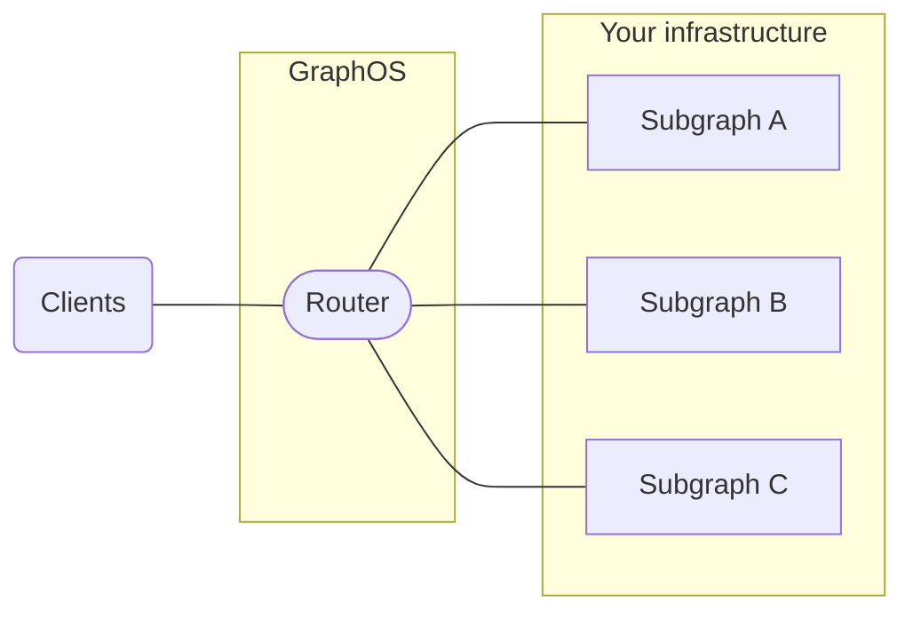

One of the most powerful features of a supergraph is that it can combine _multiple_ GraphQL APIs into a _single_ graph:



With this architecture, different teams in your organization can each maintain their own subgraph. This helps teams work in parallel, because they aren't all contributing to the same single codebase.

## Starting from scratch

The easiest way to get started with a new subgraph is to use the [Rover CLI's template command](/rover/commands/template). `rover template` generates the skeleton of a new subgraph so you can immediately begin implementing resolvers. Here are the templates available today:

| Name                    | Language   | ID                                 | Repo                                                                                    |
|-------------------------|------------|------------------------------------|-----------------------------------------------------------------------------------------|
| Go (gqlgen)             | Go         | subgraph-go-gqlgen                 | https://github.com/apollographql/subgraph-template-go-gqlgen-boilerplate                |
| Spring GraphQL          | Java       | subgraph-java-spring-graphql       | https://github.com/apollographql/subgraph-template-java-spring-graphql-boilerplate      |
| Apollo Server (JS)      | JavaScript | subgraph-javascript-apollo-server  | https://github.com/apollographql/subgraph-template-javascript-apollo-server-boilerplate |
| GraphQL Kotlin          | Kotlin     | subgraph-graphql-kotlin            | https://github.com/apollographql/subgraph-template-graphql-kotlin-boilerplate           |
| Strawberry with FastAPI | Python     | subgraph-python-strawberry-fastapi | https://github.com/strawberry-graphql/subgraph-template-strawberry-fastapi              |
| Ariadne with FastAPI    | Python     | subgraph-python-ariadne-fastapi    | https://github.com/patrick91/subgraph-template-ariadne-fastapi                          |
| async-graphql with Axum | Rust       | subgraph-rust-async-graphql        | https://github.com/apollographql/subgraph-template-rust-async-graphql                   |
| Apollo Server (TS)      | TypeScript | subgraph-typescript-apollo-server  | https://github.com/apollographql/subgraph-template-typescript-apollo-server-boilerplate |

You start by generating boilerplate using `rover template use` with the ID of the template you want. For example, this command will create a new directory called `my-subgraph` that contains the boilerplate code for a subgraph written in TypeScript using the Apollo Server library:

```bash
rover subgraph use subgraph-typescript-apollo-server my-subgraph
```

Once the boilerplate is generated, you can start filling in your business logic. The generated code includes example resolvers for `Query`, `Mutation`, as well as entities to use as your starting point. All templates also come with example GitHub Actions workflows to make [publishing your schema in CI/CD](../../schemas/publishing#publishing-with-continuous-delivery) take only a couple steps.

## Adding an existing graph

As long as your graph was implemented using a [library which supports federation](/federation/building-supergraphs/supported-subgraphs), you can add your graph to a supergraph using these steps:

1. Enable federation support via your implementing library.
2. [Check your schema](/federation/managed-federation/federated-schema-checks) and handle any conflicts
3. Set up your CI/CD to check and [publish schema](../../schemas/publishing) changes

Once the schema is published—your graph is now a subgraph in your supergraph, and you can start using other federation features!
