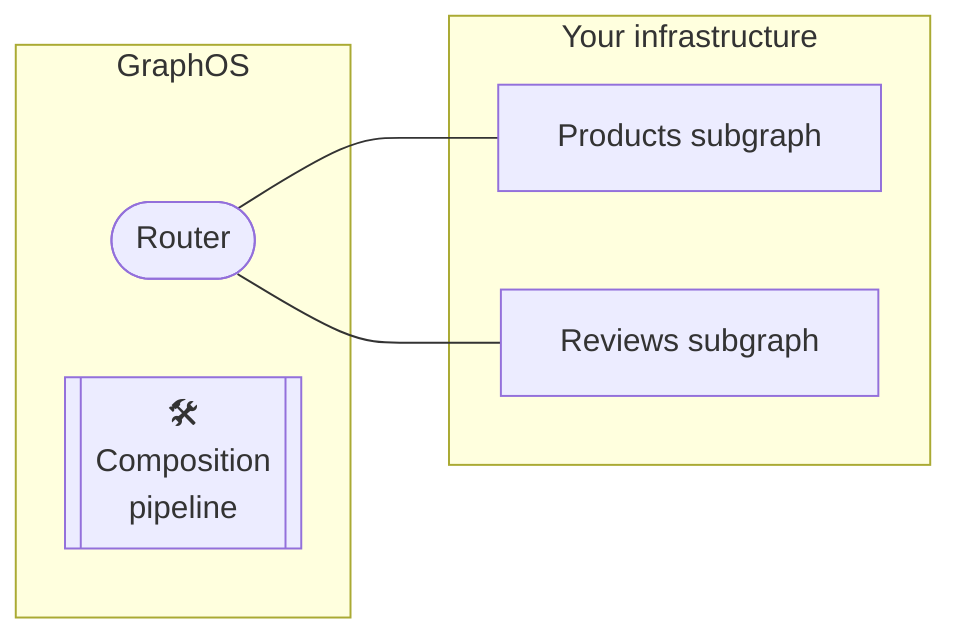
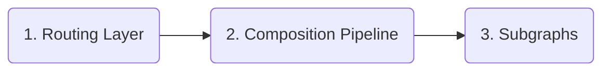

Your supergraph consists of multiple components that are each versioned independently:

- **The routing layer** is powered by a particular version of the [Apollo Router](/router/).
    - This is true for all supergraph types ([cloud](./overview/#cloud-supergraphs) and [self-hosted](./overview/#self-hosted-supergraphs)).
- **The GraphOS composition pipeline** uses a particular version of Apollo Federation to compose your router's supergraph schema.
    - If you use the [Rover CLI](/rover/) to compose your supergraph schema, this is true for Rover as well.
- **Your subgraphs** each use a [subgraph-compatible library](/federation/building-supergraphs/supported-subgraphs) with its own corresponding version.

_All_ of these components target support for a particular version of [Apollo Federation](/federation/), the underlying architecture of every supergraph.

**To avoid runtime or composition errors,** your supergraph's components should _always_ maintain the following relationship between their federation versions:

> (**Router** fed. version) ≥ (**Composition** fed. version) ≥ (**Subgraph** fed. version)

To maintain this relationship, always update these components in order from **left to right**:

## 1. Update your routing layer

1. Update your routing layer.
     - If you have a [self-hosted supergraph](./overview/#self-hosted-supergraphs), you update the version of every Apollo Router instance that's hosted in your own infrastructure.

    - If you have a [serverless cloud supergraph](./overview/#cloud-supergraphs), GraphOS _automatically_ updates your routing layer to its latest supported version.
    
      You can see which Apollo Router version you're running from the **Cloud Routing** section of your variant's Settings page in Studio:

      

## 2. Update your composition pipeline

2. Update your graph's **Supergraph Pipeline Track** from Apollo Studio.
    - For details on how, see [this section](#updating-pipeline-track).

### Composing with the Rover CLI

- The [Rover CLI](/rover/) enables you to run the Apollo Router for local development via [the `rover dev` command](./local-development/). It _also_ enables you to perform supergraph composition via [the `rover supergraph compose` command](/rover/commands/supergraphs#composing-a-supergraph-schema). 

    These commands both run against a particular Federation 2 version, and they will both fail if they're provided schemas that include directives from a _later_ version.

2. Update the [Rover CLI](/rover/) in every environment that uses it (especially CI/CD).

## 3. Update your subgraphs

3. Update individual subgraph libraries.
    - You don't _need_ to update your subgraph libraries 
    - Each subgraph is a GraphQL service you host in your own infrastructure using a [subgraph-compatible library](/federation/building-supergraphs/supported-subgraphs).

## Why is this order necessary?

GraphOS supergraphs use the [Apollo Federation 2](/federation/) architecture. Federation 2 is _itself_ a versioned technology (2.2, 2.3, etc.), and each version introduces changes and additions to the set of supported [subgraph directives](/federation/federated-types/federated-directives/).

- Each version of the Apollo Router is compiled against a particular version of Federation 2 (for details, [see this table](/router/federation-version-support)). Any given router version is backward compatible with _previous_ versions of Federation. However, it _isn't_ compatible with _more recent_ versions.

    Therefore, it's important to update your routing layer _first_, before any _other_ supergraph component begins using a later Federation 2 version. Otherwise, you might cause your router to break by providing it a supergraph schema that it doesn't support.

- Your graph's **Supergraph Pipeline Track** setting in Apollo Studio determines which version of Federation 2 is used to compose your supergraph schema. This composition process will fail if one of your subgraph schemas uses a directive that was introduced in a Federation version later than your chosen pipeline track.

- Finally, subgraphs are where you _actually apply_ Federation 2 directives. You need to update your subgraph library to a version that recognizes all directives that you use in your schema.

    You perform this update _last_ to make sure that every other component of your supergraph is prepared to interact with any newly introduced directives.
