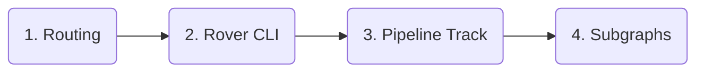

## Order of updates

Whenever you update the versions of your graph's various components, it's important to do so in the following order:

1. Update your routing layer.
    - If you have a [serverless cloud supergraph](./overview/#cloud-supergraphs), GraphOS _automatically_ updates your routing layer to its latest supported version.
    - If you have a [self-hosted supergraph](./overview/#self-hosted-supergraphs), you update the version of every Apollo Router instance that's hosted in your own infrastructure.
2. Update the [Rover CLI](/rover/) in every environment that uses it (especially CI/CD).
3. Update your graph's **Supergraph Pipeline Track** from Apollo Studio.
    - For details on how, see [this section](#updating-pipeline-track).
4. Update individual subgraph libraries for all environments.
    - Each subgraph is a GraphQL service you host in your own infrastructure using a [subgraph-compatible library](/federation/building-supergraphs/supported-subgraphs).

### Why is this order necessary?

GraphOS supergraphs use the [Apollo Federation 2](/federation/) architecture. Federation 2 is _itself_ a versioned technology (2.2, 2.3, etc.), and each version introduces changes and additions to the set of supported [subgraph directives](/federation/federated-types/federated-directives/).

- Each version of the Apollo Router is compiled against a particular version of Federation 2 (for details, [see this table](/router/federation-version-support)). Any given router version is backward compatible with _previous_ versions of Federation, but it isn't _forward_ compatible with _later_ versions.

    Therefore, it's important to update your routing layer _first_, before any _other_ supergraph component begins using a later Federation 2 version. Otherwise, you might cause your router to break by providing it a supergraph schema that it doesn't support.

- The [Rover CLI](/rover/) enables you to run the Apollo Router for local development via [the `rover dev` command](./local-development/). It _also_ enables you to perform supergraph composition via [the `rover supergraph compose` command](/rover/commands/supergraphs#composing-a-supergraph-schema). 

    These commands both run against a particular Federation 2 version, and they will both fail if they're provided schemas that include directives from a _later_ version.

- Your graph's **Supergraph Pipeline Track** setting in Apollo Studio determines which version of Federation 2 is used to compose your supergraph schema. This composition process will fail if one of your subgraph schemas uses a directive that was introduced in a Federation version later than your chosen pipeline track.

- Finally, subgraphs are where you _actually apply_ Federation 2 directives. You need to update your subgraph library to a version that recognizes all directives that you use in your schema.

    You perform this update _last_ to make sure that every other component of your supergraph is prepared to interact with any newly introduced directives.

## Updating your pipeline track

TODO
