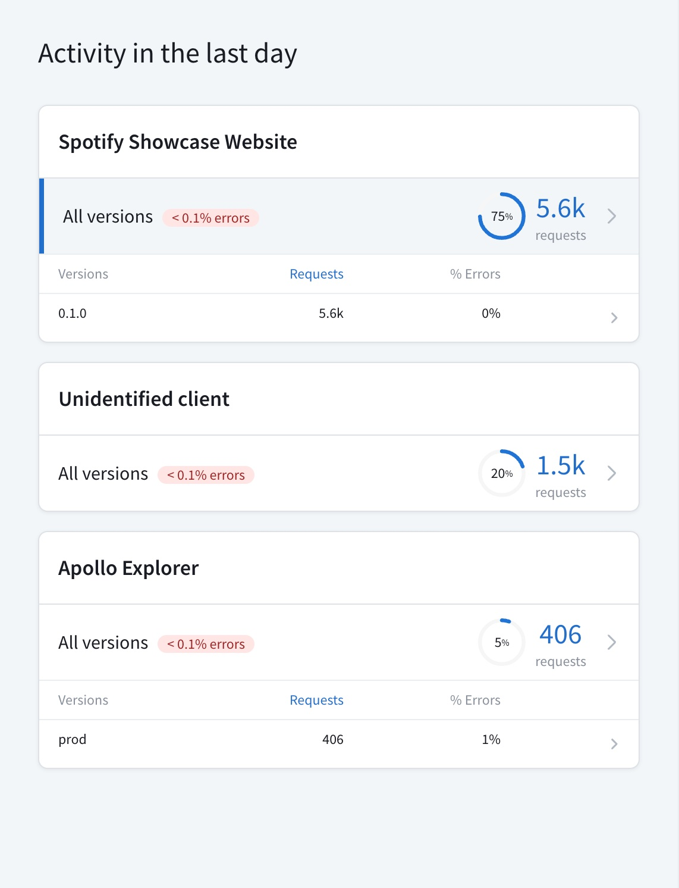
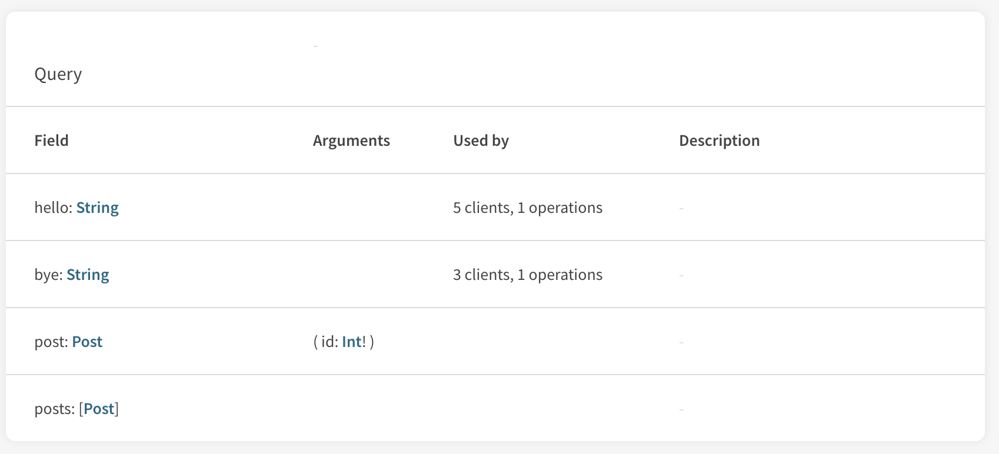
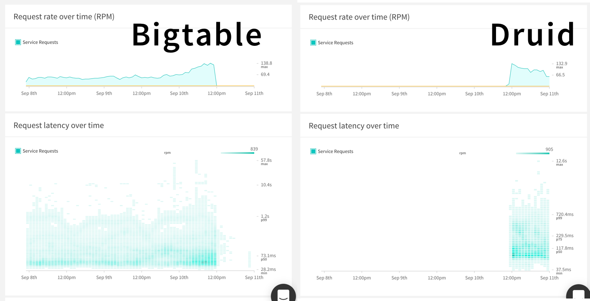

Apollo Studio enables you to view operation metrics for each of your application's different clients (such as `web` and `iOS`) and client _versions_ (such as `1.0` and `1.1`), helping you understand how each one interacts with your supergraph.

You view these segmented metrics from your supergraph variant's **Clients** page:



This feature (called **client awareness**) is especially useful as your number of clients grows, and as you consider when to deprecate or discontinue support for older client versions. [See other common use cases.](#common-use-cases)

## Setup

Your supergraph's router checks for the presence of the following HTTP headers in every incoming operation request:

- `apollographql-client-name`
- `apollographql-client-version`

If one or both of these headers are present, your router automatically extracts their values and includes them in the metrics data that it sends to GraphOS.

**If you're using Apollo Client**, you can populate these headers automatically for every operation request by providing the `name` and `version` options to the `ApolloClient` constructor, like so:

```js {8-9}
import { ApolloClient } from 'apollo-client';
import { HttpLink } from 'apollo-link-http';

const client = new ApolloClient({
  link: new HttpLink({
    uri: 'http://localhost:4000/graphql'
  }),
  name: 'web',
  version: '1.0'
});
```

**If you're using another GraphQL client,** consult its documentation to learn how to add custom HTTP headers to every outgoing request.

## Common use cases

### Diagnose client-specific issues

By filtering your graph's metrics by client and client version, you can identify when a high failure rate for an operation is tied to a particular version. This helps you isolate the underlying cause of the failure and push an update for the affected client.

### Deprecate, change, and remove fields safely

Modifying or removing an existing field in your schema is often a **breaking change** for the clients that use that field. Client awareness gives you a breakdown of which clients use which fields in your schema, enabling you to determine the impact of such a change:



### Backend cutover

Changes to your schema often accompany changes to your backend, such as the addition of a new resolver, or even an entirely new data source. When you deploy a new version of your client that executes operations against these new resources, it's important to monitor operations to detect issues. Viewing metrics specific to the new client version helps you identify and resolve these issues quickly.

The following shows a cutover from one back-end service to another:


