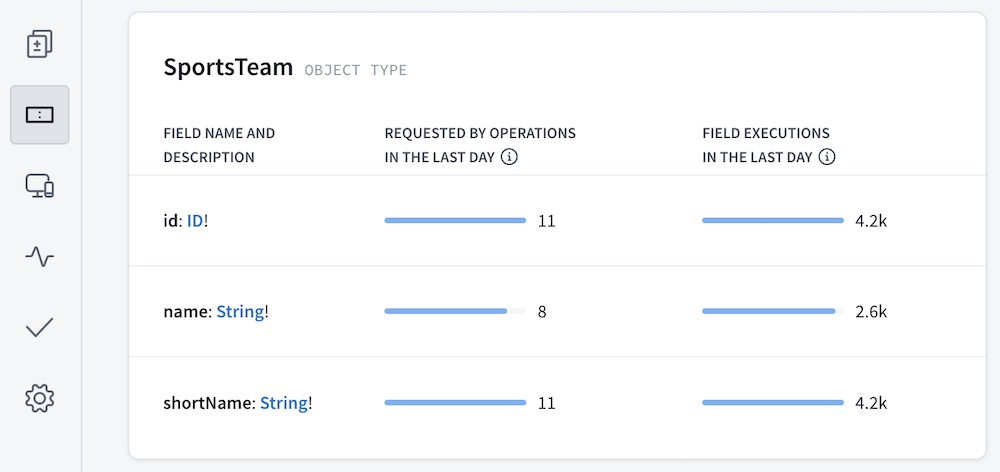

> For details on setting up field metrics reporting to GraphOS Studio, see [Reporting field usage](./sending-operation-metrics#reporting-field-usage).

In [GraphOS Studio](https://studio.apollographql.com/?referrer=docs-content), your graph's **Fields** page can display a table of basic usage metrics for each field in your schema:



You can click the name of any field in the table to open its **Field Insights** page. This page displays in-depth details about which clients and operations contribute to the field's usage, along with performance metrics:


## Field executions vs. requesting operations

The table on the Fields page displays some combination of the following metrics for each field, depending on which data you report to GraphOS:

| Metric                 | Description                                                                                                                          |
| ---------------------- | ------------------------------------------------------------------------------------------------------------------------------------ |
| Field executions       | How many times your servers have executed the resolver for the field over a given time period.                                       |
| Requested by operations | How many operations sent by clients over a given time period have included the field, according to metrics provided by your servers. |

For each of these columns to appear on the Fields page, your GraphQL servers must [report the associated metrics to GraphOS](./sending-operation-metrics#reporting-field-usage). If some but not _all_ of your GraphQL servers report this data, the Fields page presents an incomplete picture of your graph's field usage.

Let's look at these two metrics for fields of an example type:


As you can see, the daily **field executions** and **requesting operations** for a single field can differ significantly! There are many possible reasons for this, described below.

### Objects in lists

Let's say a client executes the following query one time:

```graphql
query GetBooks {
  books {
    title
  }
}
```

If `Query.books` returns a list of ten `Book` objects, then `Book.title` is resolved _ten times_. This query therefore contributes _ten_ **field executions** and just _one_ **requesting operation** to `Book.title`.

### Multiple references to a field

Let's say a client executes the following query one time:

```graphql
query GetTwoBooks {
  firstBook: book(id: "123") {
    title
  }
  secondBook: book(id: "345") {
    title
  }
}
```

This operation includes two references to the fields `Query.book` and `Book.title`. Therefore, the resolvers for these fields each execute twice (assuming `Query.book` doesn't return `null`). However, these multiple references are all part of a _single_ operation.

Therefore, this query contributes two **field executions** and just _one_ **requesting operation** to each of `Query.book` and `Book.title`.

### Fields that return interfaces

Let's say our GraphQL server's schema defines the following interface and object types:

```graphql
interface Media {
  title: String!
}

type Book implements Media {
  title: String!
  author: String!
}

type Query {
  favoriteMedia: Media!
}
```

Now, let's say a client executes the following query:

```graphql
query GetFavoriteMedia {
  favoriteMedia {
    title
  }
}
```

If `Query.favoriteMedia` returns a `Book` object here, then `Book.title` is resolved one time. _However_, the original query _does not reference_ `Book.title`. Instead, it references **`Media.title`**, because `Query.favoriteMedia` has a return type of `Media`.

Therefore, this query contributes one **field execution** and zero **requesting operations** to `Book.title`. It also contributes one **requesting operation** to `Media.title`. Note that interface fields always have zero **field executions**.

### Requested fields that aren't resolved

Let's say a client executes the following query one time:

```graphql
query GetLoggedInUser {
  loggedInUser {
    name
  }
}
```

Now, let's say `Query.loggedInUser` returns `null` because no user is logged in. In this case, the resolver for `User.name` never executes, because its parent retuns `null`. Therefore, this query contributes _zero_ **field executions** and _one_ **requesting operation** to `User.name`.

A requested field might not be resolved for any of these reasons:

- The field is nested under a field that returns `null`, as shown above.
- The field is nested under a field that returns a list, but the list is empty.
- The field is part of a fragment that doesn't apply to a particular object.
- The resolver is skipped due to a `@skip` or `@include` directive.

### `@key` and `@requires` fields in a federated graph

> This case applies only to graphs that use [Apollo Federation](/federation).

Let's say our federated graph includes these two subgraph schemas:

<CodeColumns>

```graphql
# Products subgraph

type Product @key(fields: "id") {
  id: ID!
  name: String!
}
```

```graphql
# Reviews subgraph

extend type Product @key(fields: "id") {
  id: ID! @external
}

type Review {
  id: ID!
  score: Int!
  product: Product!
}

type Query {
  reviews: [Review!]!
}
```

</CodeColumns>

Now, let's say a client executes the following query against the gateway:

```graphql
query GetAllReviews {
  reviews {
    score
    product {
      name
    }
  }
}
```

This query's execution starts in the Reviews subgraph, but it needs to obtain each `Product`'s `name` from the Products subgraph. As part of this process, the Products subgraph must [resolve references](/federation/entities/#2-define-a-reference-resolver) to `Product`s that are provided by the Reviews subgraph.

To help resolve these references, the Reviews subgraph _must_ return each `Product`'s `id` field, even though that field isn't included in the original query. This is because `id` is a `@key` field for `Product`.

Therefore, this query contributes one **field execution** and zero **requesting operations** to `Product.id`. Similar logic applies to fields that use the [`@requires` directive](/federation/entities-advanced#contributing-computed-entity-fields).