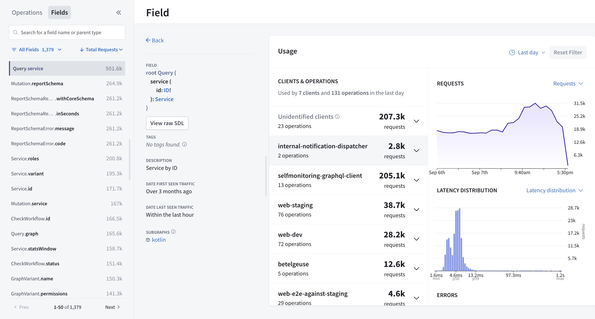
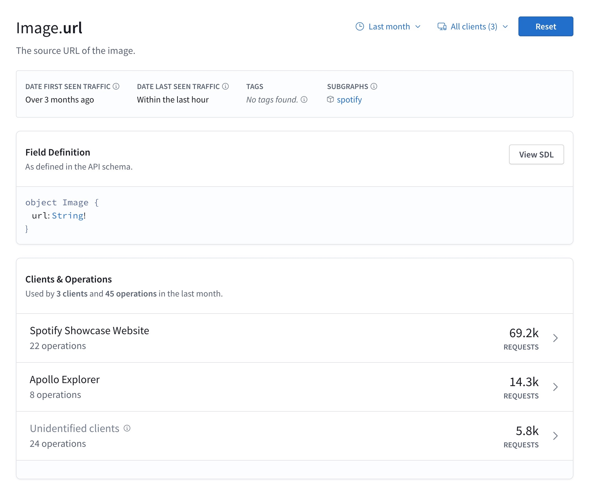
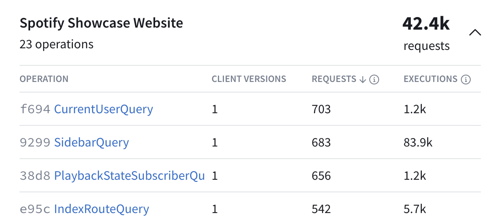

<Note>

The retention period for field usage metrics depends on your [plan](../org/plans).
Refer to the [pricing page](https://www.apollographql.com/pricing#data-retention) for details.

</Note>

You can analyze the [field metrics sent by your graph](./sending-operation-metrics/#reporting-field-usage) to GraphOS from any variant's **Insights** page in [GraphOS Studio](https://studio.apollographql.com/?referrer=docs-content):



The Insights page presents operation and field metrics. It has two main sections:

- The collapsible left sidebar, where you can search, filter, and sort operations and fields
- The main insights view, which displays [overall operations metrics](./operations#operation-metrics) by default, or field information and usage metrics for a single field once you select it from the left sidebar

This guide focuses on field metrics and information. Refer to [Operation metrics in GraphOS](./operations) for more information on the other metrics on this page, including [resolver-level traces](./operations#resolver-level-traces).

<EnterpriseFeature>

All plans have access to field usage insights for standard object fields.

<br/>

Organizations with an enterprise plan can view insights on input object fields and enum values in addition to object fields. To access these metrics you must use the Apollo Router to [report metrics](./sending-operation-metrics) and configure [extended reference reporting](/router/configuration/overview/#extended-reference-reporting) in your router.

</EnterpriseFeature>

## Field details

When you click a field name, you open detailed information for that field in the main insights view. This includes when the field first and last received traffic, any applied [tags](../graphs/federated-graphs/#schema-tagging), and the subgraphs that provide the field.

Below that, you can view the field definitions within your subgraph schema.



Next, you see which clients and operations contribute to the field's usage. Each row in the **Clients & Operations** table shows a client that requested the field, the number of operations that used the field the client made, and the total number of requests the client made. Selecting a client shows more details about the operations that requested and executed the field.

Below Clients & Operations, you can view visualizations for the field's request rate, latency distribution, and error metrics.

### Field requests and executions

Each row in the **Clients & Operations** table displays some combination of the following metrics for each field, depending on which data you report to GraphOS:

| Metric              | Description                                                                                                                         |
| ------------------- | ----------------------------------------------------------------------------------------------------------------------------------- |
| Client versions     | How many different client versions have sent the operation                                                                          |
| Requests            | How many operations sent by clients over a given time period included the field, according to [metrics provided by your servers](./sending-operation-metrics#reporting-field-usage-metrics) |
| Executions          | How many times your servers have executed the resolver for the field over a given time period                                       |

<Note>

Execution metrics are only available for object fields, not input object fields or enum values.

</Note>

For each of these columns to appear on the **Insights** page, your GraphQL servers must [report the associated metrics to GraphOS](./sending-operation-metrics#reporting-field-usage). If some but not all your GraphQL servers report this data, the Insights page presents an incomplete picture of your graph's field usage.

Take a look at the **Requests** and **Executions** for an example field:



As you can see, they can differ significantly. There are many possible reasons for this, described below.

#### Objects in lists

Let's say a client executes the following query one time:

```graphql
query GetBooks {
  books {
    title
  }
}
```

If `Query.books` returns a list of ten `Book` objects, then `Book.title` is resolved ten times. This query, therefore contributes just one request but ten executions to the `Book.title` field.

#### Multiple references to a field

Let's say a client executes the following query one time:

```graphql
query GetTwoBooks {
  firstBook: book(id: "123") {
    title
  }
  secondBook: book(id: "345") {
    title
  }
}
```

This operation includes two references to the fields `Query.book` and `Book.title`. Therefore, the resolvers for these fields each execute twice (assuming `Query.book` doesn't return `null`). However, these multiple references are all part of a single operation.

Therefore, this query contributes just one request but two executions for each of the `Query.book` and `Book.title` fields.

#### Fields that return interfaces

Let's say our GraphQL server's schema defines the following interface and object types:

```graphql
interface Media {
  title: String!
}

type Book implements Media {
  title: String!
  author: String!
}

type Query {
  favoriteMedia: Media!
}
```

Now, let's say a client executes the following query:

```graphql
query GetFavoriteMedia {
  favoriteMedia {
    title
  }
}
```

If `Query.favoriteMedia` returns a `Book` object here, then `Book.title` is resolved one time. However, the original query does not reference `Book.title`. Instead, it references `Media.title`, because `Query.favoriteMedia` has a return type of `Media`.

Therefore, this query contributes zero requests and one execution for `Book.title`. It also contributes one request for `Media.title`. Note that interface fields always have zero executions.

#### Requested fields that aren't resolved

Let's say a client executes the following query one time:

```graphql
query GetLoggedInUser {
  loggedInUser {
    name
  }
}
```

Now, let's say `Query.loggedInUser` returns `null` because no user is logged in. In this case, the resolver for `User.name` never executes, because its parent returns `null`. Therefore, this query contributes one request and zero executions for `User.name`.

A requested field might not be resolved for any of these reasons:

- The field is nested under a field that returns `null`, as shown above.
- The field is nested under a field that returns a list, but the list is empty.
- The field is part of a fragment that doesn't apply to a particular object.
- The resolver is skipped due to a `@skip` or `@include` directive.

#### `@key` and `@requires` fields in a federated graph

<Note>

This case applies only to graphs that use [Apollo Federation](/federation).

</Note>

Let's say our federated graph includes these two subgraph schemas:

<CodeColumns>

```graphql title="Products subgraph"
type Product @key(fields: "id") {
  id: ID!
  name: String!
}
```

```graphql title="Reviews subgraph"
extend type Product @key(fields: "id") {
  id: ID! @external
}

type Review {
  id: ID!
  score: Int!
  product: Product!
}

type Query {
  reviews: [Review!]!
}
```

</CodeColumns>

Now, let's say a client executes the following query:

```graphql
query GetAllReviews {
  reviews {
    score
    product {
      name
    }
  }
}
```

This query's execution starts in the Reviews subgraph, but it needs to obtain each `Product`'s `name` from the Products subgraph. As part of this process, the Products subgraph must [resolve references](/federation/entities/#2-define-a-reference-resolver) to `Product`s provided by the Reviews subgraph.

To help resolve these references, the Reviews subgraph must return each `Product`'s `id` field, even though that field isn't included in the original query. This is because `id` is a `@key` field for `Product`.

Therefore, this query contributes zero requests and one execution for `Product.id`. Similar logic applies to fields that use the [`@requires` directive](/federation/entities-advanced#contributing-computed-entity-fields).