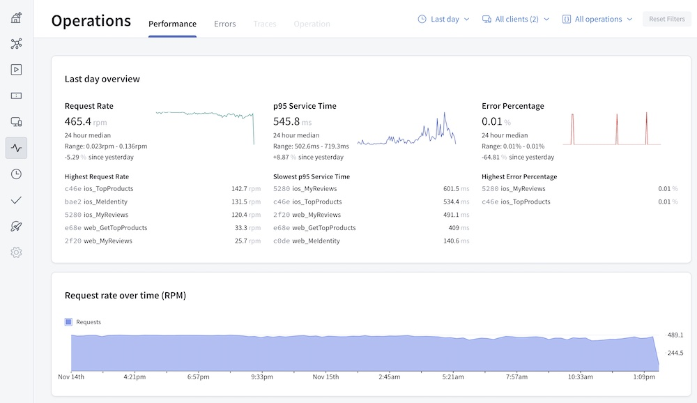

Once you've configured your graph to send [operation](./sending-operation-metrics/) and [field metrics](./field-usage#reporting-field-usage) to GraphOS, you can view them in GraphOS Studio.

> **Note**: Do you have to report both to make use of the insights page?

## Viewing metrics

You can visualize operation metrics in [GraphOS Studio](https://studio.apollographql.com/?referrer=docs-content), from any variant's **Insights** page:

The **Insights** page offers:

- An operations overview
- Detailed operations performance metrics
- Field usage metrics
- Error metrics
- [Resolver-level traces](#resolver-level-traces), if you've configured them

Check out the operation and field metrics pages to learn more.
