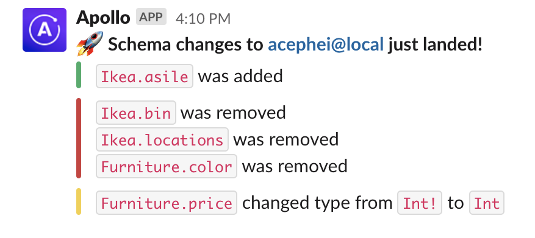

Configure GraphOS to notify your team whenever any changes are made to your graph's registered schema. Receive notifications via Slack, custom webhook, or both.



## Setup

<Note>

If you want to receive notifications via both Slack and webhook, repeat these setup steps for both.

</Note>

<CreateNotification notificationType="Schema Change" />

## Configure a new channel

### Slack

<ConfigureSlackNotification />

### Webhook

<EnterpriseFeature>

Sending notifications via webhook is only available with a [GraphOS Enterprise plan](https://www.apollographql.com/pricing#integrations?referrer=docs-content).

</EnterpriseFeature>

<ConfigureWebhookNotification />

## Webhook format

Custom webhook notification details are provided as a JSON object in the request body.

The JSON object conforms to the structure of the `ResponseShape` interface:

```javascript
interface Change {
  description: string;
}

interface ResponseShape {
  eventType: 'SCHEMA_PUBLISH'
  eventID: string;
  changes: Change[];
  schemaURL: string;
  schemaURLExpiresAt: string;
  graphID: string;
  variantID: string;
  timestamp: string;
}
```

#### Field descriptions

<table className="field-table">
<thead>
<tr>
<th style={{ minWidth: 200 }}>Field</th>
<th>Description</th>
</tr>
</thead>
<tbody>

<tr>
<td>

##### `eventType`

</td>
<td>

The schema change event; currently, always `SCHEMA_PUBLISH`

</td>
</tr>

<tr>
<td>

##### `eventId`

</td>
<td>

A unique event ID

</td>
</tr>

<tr>
<td>

##### `changes`

</td>
<td>

The set of schema changes that occurred

</td>
</tr>

<tr>
<td>

##### `schemaURL`

</td>
<td>

  A short-lived (24-hour) URL that enables you to fetch the published
  schema without authenticating (such as with an API key). The URL expires
  at the time indicated by `schemaURLExpiresAt`.

</td>
</tr>

<tr>
<td>

##### `schemaURLExpiresAt`

</td>
<td>

An ISO 8601 Date string indicating when the `schemaURL` expires

</td>
</tr>

<tr>
<td>

##### `graphID`

</td>
<td>

A unique graph ID

</td>
</tr>


<tr>
<td>


##### `variantID`


</td>
<td>

  An unique ID in the graph ref format `graphID@variantName`

</td>
</tr>

<tr>
<td>

##### `timestamp`

</td>
<td>

An ISO 8601 Date string indicating when the event occurred

</td>
</tr>

</tbody>
</table>
