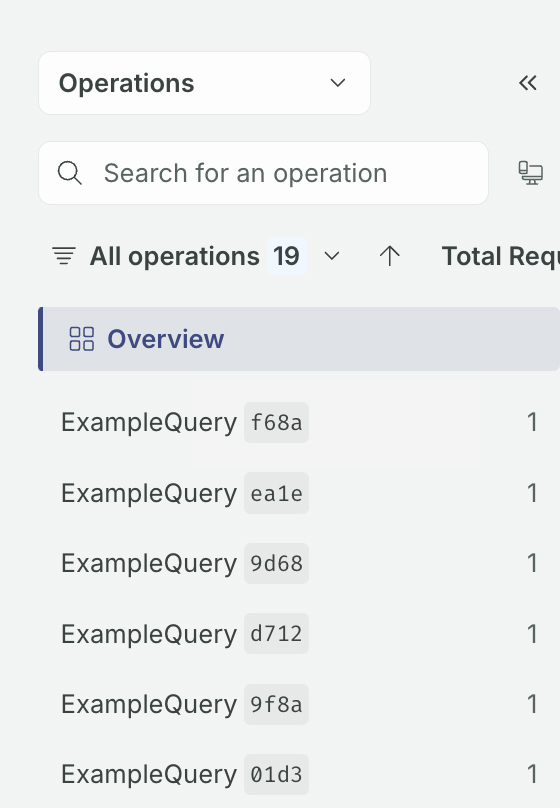

When you're viewing your graph's [operation metrics](./operations), GraphOS Studio groups operations based on the set of fields they include, not based on operation names. That means that operations with the same name but different sets of fields are displayed separately:



Though each operation in the above example is named `MyQuery`, GraphOS treats them as different operations because they request different fields.

To help GraphOS identify functionally identical operations, your router generates an _operation signature_ for each operation it reports to Studio. This signature is a normalized representation for an operation with deterministic field order, whitespace, and values for in-line argument values.

## Why do we need an operation signature?

Consider the following operations:

```graphql {10-11,17}
query GetPostDetails($postId: String!) {
  post(id: $postId) {
    author
    content
  }
}

query GetPostDetails($postId: String!) {
  post(id: $postId) {
    content # Different field order
    author
  }
}

query GetPostDetails($postId: String!) {
  post(id: $postId) {
    writer: author # Field alias
    content
  }
}
```

Despite some cosmetic differences (including comments), all these operations execute identically on a particular GraphQL server. Therefore, Studio should group them when displaying performance metrics.

Apollo libraries use a [signature algorithm](#signature-algorithm) to generate the exact same operation signature for all these operations, allowing Studio to group them.

## Signature algorithm

<Note>

This signature algorithm is subject to change. It is provided here for informational purposes, not as a canonical specification.

</Note>

Feel free to [jump to an example](#example-signature) or [view the source](https://github.com/apollographql/apollo-utils/blob/main/packages/usageReporting/src/signature.ts).

The signature algorithm performs the following modifications on an operation to generate its signature:

1. Transform in-line argument values.
2. Remove extraneous characters.
3. Reorder definitions.

### 1. Transform in-line argument values

If an operation includes any in-line argument values, the algorithm transforms those values according to their type:

- `Boolean` and `enum` values are preserved.
- `Int` and `Float` values are replaced with `0`.
- `String`, list, and object values are replaced with their "empty" counterpart (`""`, `[]`, or `{}`).

Argument values provided as GraphQL variable names are preserved.

<Note>

Organizations using the GraphOS Router can enable enhanced operation signature generation.
Enhanced operation signatures include the input object shapes, while still redacting actual values.
See the [router configuration page](/router/configuration/overview#enhanced-operation-signature-normalization) to learn more.

</Note>

### 2. Remove extraneous characters

The algorithm removes most unnecessary characters in the operation definition, including comments and redundant whitespace.

If the operation document includes multiple operations, then operations besides the executed operation are removed.

If the operation document includes fragments that aren't used by the executed operation, then those fragments are removed (other fragments are preserved).

### 3. Reorder definitions

Any preserved fragment definitions appear first, sorted alphanumerically by fragment name. The definition of the executed operation appears after all fragment definitions.

<Note>

Whenever the names of two sorted items are identical, the algorithm preserves the original order of those items relative to each other.

</Note>

#### Fields

For a given object or fragment's fields, field selections are sorted in the following order:

1. Individually listed fields
2. Named fragment spreads
3. In-line fragments

Within each of these, sorting is alphanumeric by field name or fragment name.

##### Field aliases

All field aliases are removed. If an operation includes three instances of the same field with different aliases, then that field is listed in the signature three times with its non-aliased name.

<Note>

Organizations using the GraphOS Router can enable enhanced operation signature generation that does not remove field aliases.
See the [router configuration page](/router/configuration/overview#enhanced-operation-signature-normalization) to learn more.

</Note>

#### Directives and arguments

If multiple directives are applied to the same location in the operation document, those directives are sorted alphanumerically.

If a single field accepts multiple arguments, those arguments are sorted alphanumerically by name.

## Example signature

Consider this operation:

```graphql
# Operation definition needs to appear after all fragment definitions
query GetUser {
  user(id: "hello") {
    # Replace string argument value with empty string
    ...NameParts # Spread fragment needs to appear after individual fields
    timezone # Needs to appear alphanumerically after `name`
    aliased: name # Need to remove alias
  }
}

# Excessive characters (including this comment!) need to be removed

fragment NameParts on User {
  firstname
  lastname
}
```

The signature algorithm generates the following signature for this operation:

```graphql
fragment NameParts on User {
  firstname
  lastname
}
query GetUser {
  user(id: "") {
    name
    timezone
    ...NameParts
  }
}
```

## Signatures and sensitive data

The signature algorithm's primary purpose is to group operations that differ only cosmetically in terms of whitespace, field order, aliases, etc. As an additional effect, the algorithm does [remove most in-line argument values](#1-transform-in-line-argument-values), which, in theory, helps maintain data privacy.

However, you should not rely on this. Ideally, your sensitive data should never reach GraphOS Studio in the first place. Whenever possible, [use GraphQL variables](/react/data/operation-best-practices/#use-graphql-variables-to-provide-arguments) instead of in-line values for arguments. This helps you control exactly which values are reported to Apollo. For details, see [GraphOS Studio data privacy and compliance](../data-privacy/).

## Logging signatures at runtime

### GraphOS Router

Since Apollo Router Core [v1.43.1](https://github.com/apollographql/router/releases/tag/v1.43.1), the router adds operation signatures to request contexts at the `apollo_operation_signature` key. You can also use the router's native logging features to log context values as [trace attributes](/router/configuration/telemetry/instrumentation/selectors) or you can read the context via [Rhai scripts](/router/customizations/rhai#manipulating-headers-and-the-request-context) or [coprocessors](/router/customizations/coprocessor). 

With router [v1.49.0](https://github.com/apollographql/router/releases/tag/v1.49.0) and later, you can enable enhanced operation signature generation that includes include input object types and field aliases.
See the [router configuration page](/router/configuration/overview#enhanced-operation-signature-normalization) to learn more.

### Apollo Server

To view operation signature hashes in your own logging tools, you can create an [Apollo Server plugin](/apollo-server/integrations/plugins/) that accesses hash values from the shared `context`. The relevant values are available in the `queryHash` and `operationName` properties:

<MultiCodeBlock>

```ts title="index.ts"
const logOperationSignaturePlugin = {
  async requestDidStart() {
    return {
      async didResolveOperation(ctx) {
        //highlight-start
        console.log({
          queryHash: ctx.queryHash,
          operationName: ctx.operationName
        });
        //highlight-end
      }
    };
  }
};

const server = new ApolloServer({
  schema,
  plugins: [logOperationSignaturePlugin]
});
```
</MultiCodeBlock>
