Once you've configured your graph to send [operation metrics to GraphOS](./sending-operation-metrics/), you can view them in [GraphOS Studio](https://studio.apollographql.com/?referrer=docs-content) from any variant's **Insights** page:


This page combines operation and field metrics and has two main sections:

- The collapsible left sidebar, where you can [search, filter, and sort operations](#operation-metrics) and fields (refer to [Field usage](./fields-usage) for more information on field metrics)
- The main insights view, which displays an [**Operations Overview**](#operations-overview) and [operation metrics](#operation-metrics), like the [request rate](#request-rate)

When you click an operation name from the left sidebar or overview, this view shows [detailed information](#operation-details) about the individual operation.


You can always return to the overall view by clicking **Overview** on the left sidebar.

## Operations overview

The **Operations Overview** is top and center because it summarizes your supergraph's recent usage and performance. It includes the median, range, and percentage change for:

- The **rate of requests** sent to your router
- Your supergraph's **p95 service time**
- Your supergraph's **error percentage**

Beneath each of those metrics, you can also see the individual operations with:

- The highest request rates
- The slowest p95 service time
- The highest error percentage

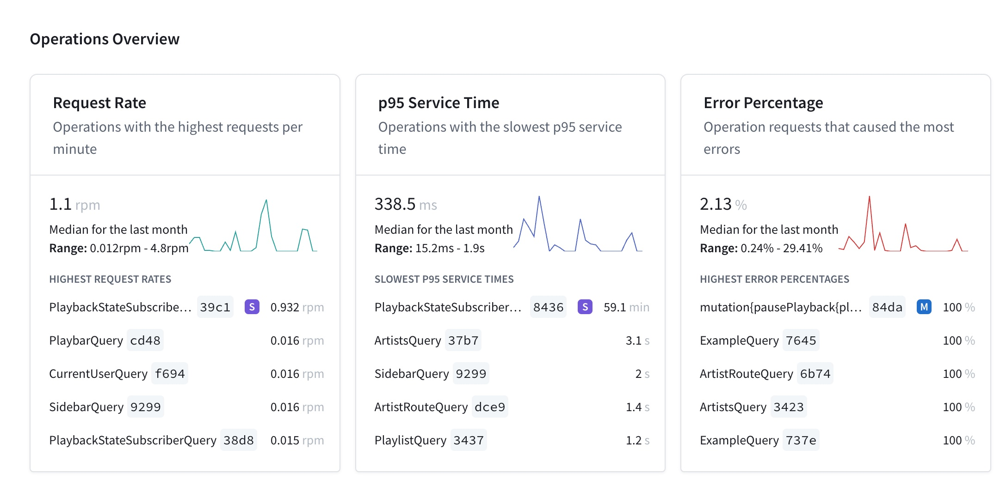

> The blue **M** icon beside an operation name indicates it's a mutation.
> The purple **S** icon beside an operation name indicates it's a subscription.

You can click an operation name to view more [detailed information](#operation-details) or scroll down to see overall [operation metrics](#operation-metrics).

You can adjust the overview's timeframe and filter by client in the top right corner or reset the defaults.

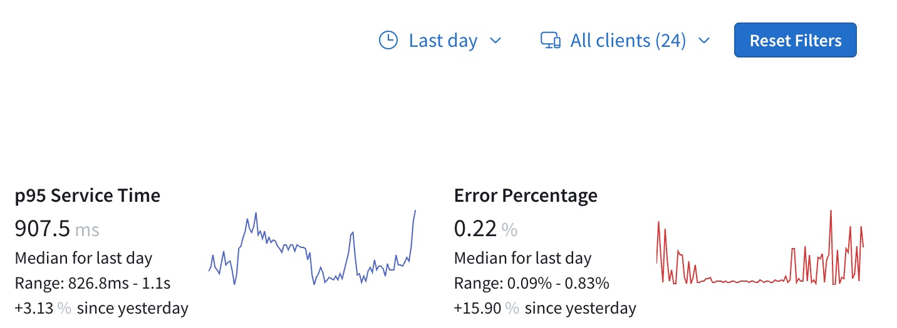

## Operation navigation

By default, the left sidebar shows a paginated list of all operations, but you can use it to hone in on certain ones.
Specifically, you can:

- Search for a particular operation by its name or fields' names
- Filter operations by their type (queries, mutations, subscriptions) or whether they are unregistered or unnamed

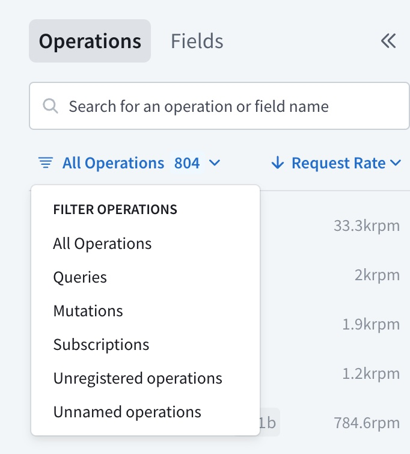

- Sort operations (descending or ascending) by:

  - Total requests (count)
  - Request rate in requests per minute (rpm)
  - Total error (count)
  - Error rate
  - Error percentage (%)
  - Cache hit percentage (%)
  - p50 Cache TTL in seconds, minutes (s, min)
  - p50, p90, p95, and p99 service time in milliseconds, seconds, or minutes (ms, s, min)
  - Total duration in milliseconds, seconds, minutes, or hours (ms, s, min, hr)
  - Signature size in bytes (B, KB)

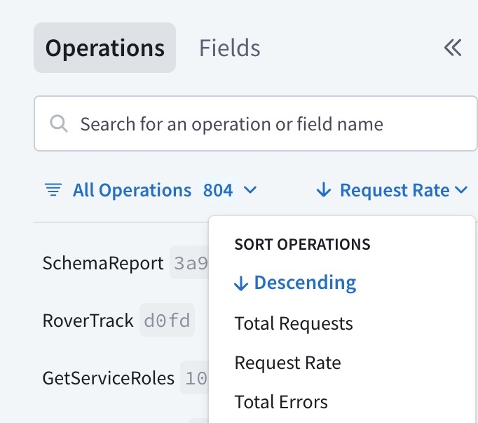

As with the operations overview, you can click an operation name to view more [detailed information](#operation-details).

## Operation metrics

Directly below the [**Operations Overview**](#operations-overview), you can find the following overall operation metric charts:

- Time series charts showing the [**request rate**](#request-rate) and [**subscription notification rate**](#subscription-notification-rate) in requests per minute (req/min)
- [**Request latency**](#request-latency) and [**subscription notification latency**](#subscription-notification-rate) heatmaps, generally in milliseconds, seconds, and/or minutes (ms, s, min)
- [**Request latency distribution**](#request-latency-distribution) and [**Subscription notification latency distribution**](#subscription-notification-latency-distribution) histograms

The operations included in the **request** metric charts are queries, mutations, and subscription registrations. Request charts don't include data on **subscription notifications**, which are shown separately in subscription notification charts.

> A [specific operation's detail page](#operation-details) shows subscription registration metrics instead of general request metrics.

### Request rate

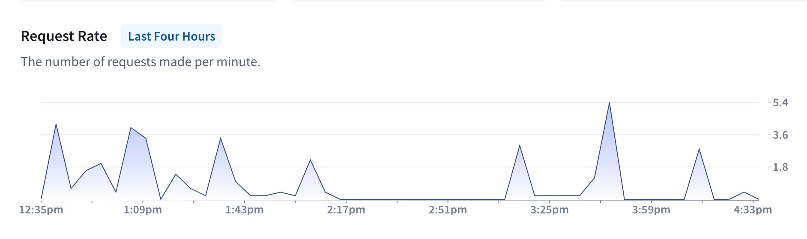

The request rate chart enables you to keep an eye on your supergraph's traffic over time. Abrupt spikes or drops in request rates can highlight potential performance bottlenecks or shifts in user behavior.

Request rate metrics can also help with capacity planning. By tracking request rate trends, you can make informed decisions regarding infrastructure scaling. You can also rely on these graphs for anomaly detection, including identifying issues like DDoS attacks, application errors, or resource constraints.

### Subscription notification rate

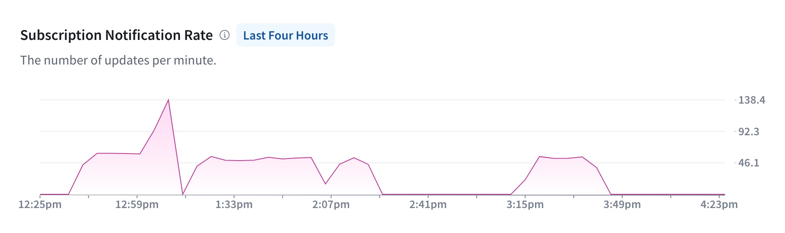

The subscription notification rate is the total number of updates ("notifications") sent to clients as the result of all [subscriptions](/apollo-server/data/subscriptions/) over a specified time. A sudden spike in subscription notification rate could indicate a surge in real-time activity and help you anticipate the need for scaling your infrastructure.

### Request latency

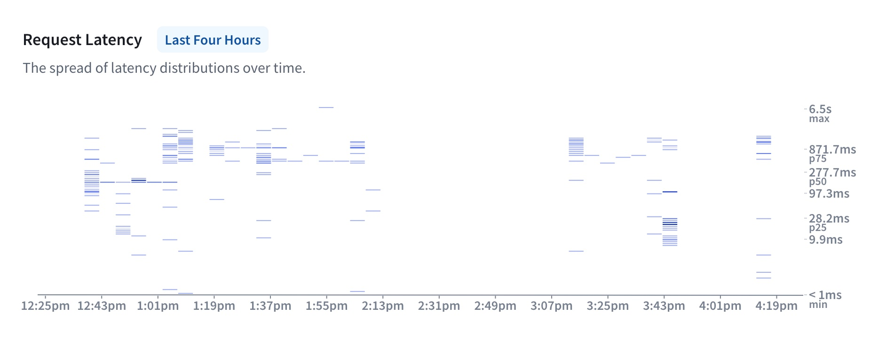

Request latency measures the time it takes for a GraphQL operation to be processed and to return a response to the client. Slow operations can lead to sluggish applications and frustrated users.

Request latency metrics provide crucial insights into the performance of various components of your services, such as resolvers, data sources, and third-party services. This data can help you identify areas where optimization is needed.

### Subscription notification latency

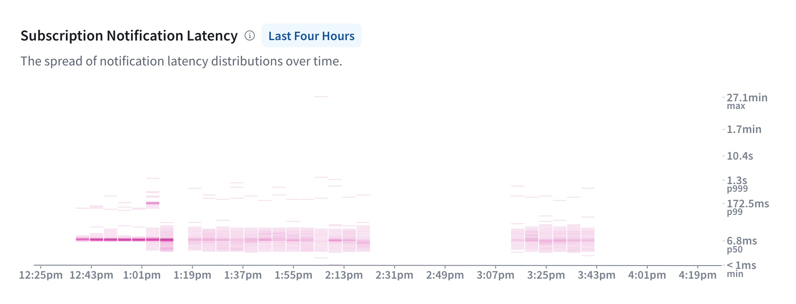

Subscription notification latency measures the time it takes for your graph to send updates to clients due to a change in your graph's data.

For example, imagine a chat app using subscriptions like this:

- **Step 0**. A subscription is defined in your graph's schema. It might look something like this:

  ```graphql
  type Subscription {
    newMessage(chatId: ID!): Message
  }
  ```

  This subscription is called `newMessage` and takes a `chatId` as an argument. It is used to subscribe to new messages in a specific chat.

- **Step 1**. A client application initiates a WebSocket connection to the graph. The WebSocket connection allows for real-time communication between the client and the graph.

- **Step 2**. When a user joins a chat or opens a messaging window, the client sends a subscription registration request to the graph. For example:

  ```graphql
  subscription {
    newMessage(chatId: "123") {
      text
      sender
      timestamp
    }
  }
  ```

  This subscription registration tells the graph to send new messages for the chat with `chatId` "123" to the client in real-time. The client specifies which fields of the `Message` type it wants to receive.

- **Step 3**. When a user sends a new message within the specified chat, the client initiates a GraphQL mutation to create the message. A mutation resolver handles the request, including inserting data and returning a response.

- **Step 4**. The graph publishes the new message data to the subscribed clients. It sends the new message data as a response to the client's subscription over the WebSocket connection.

- **Step 5**. The client application receives the new message data and updates the chat interface in real-time. The user sees the incoming message instantly without needing to refresh or manually request updates.

The subscription notification latency is the time between steps 4 and 5, from when your graph sends the update—often via your [router](/router)—to when the client receives it.

Low latency is crucial for real-time applications to deliver data promptly. High latency can indicate network issues. It can also indicate slow resolver performance or inefficient data fetching for federated subscriptions.

#### Federated subscription notification latency

**Federated subscriptions** are subscriptions that rely on data from multiple subgraphs. Federated subscriptions have an additional step after step 3: the Apollo Router must fetch data from any other necessary subgraphs before publishing an aggregated response to clients.

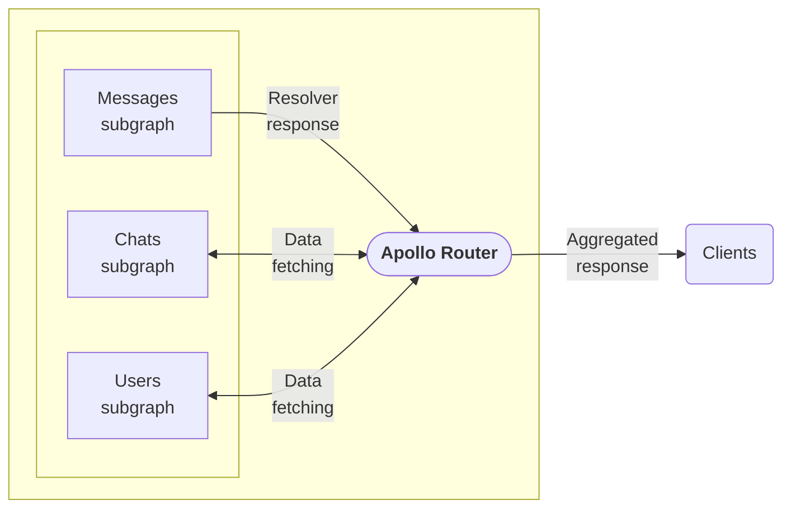

For federated subscriptions, latency is measured from when the router receives a response from one subgraph's resolver until the client receives an aggregated response, _including the time it takes the router to fetch data from subsequent subgraphs and aggregate it into a single response_.

Since fetching data from subsequent subgraphs requires those subgraphs' resolvers to complete, high latency in federated subscription notifications can indicate slow resolver performance.

### Request latency distribution

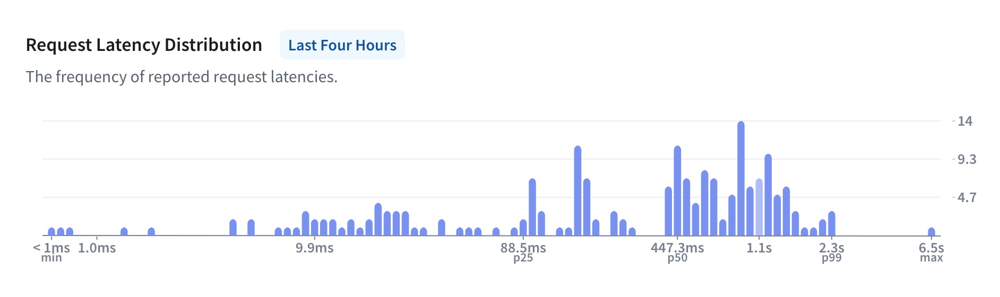

The request latency distribution graph illustrates the frequency and volume of your request latencies. This graph can help you identify central tendencies, variability, and patterns in your request latency.

### Subscription notification latency distribution

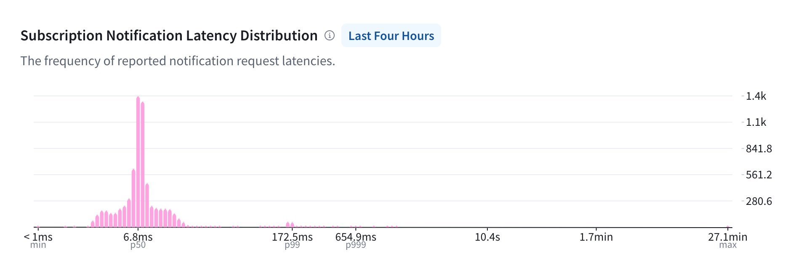

The subscription notification latency distribution graph offers the same data and insights as the request latency distribution histogram but includes only subscription notification latency rather than all requests' latency.

### Deferred fields in operation metrics

You can use the [`@defer`](../operations/defer/) directive to defer returning data for certain fields in your schema. Using `@defer` doesn't affect latency metrics since they only take into account the initial response containing non-deferred fields. You can view deferred fields' execution times in [resolver-level traces](#resolver-execution-time).

## Operation details

When you click an operation name, you open detailed information for that operation in the main insights view. You can use the toggles below the operation name to view the operation's **usage**, **error** metrics, or [**traces**](#resolver-level-traces).


The main **Usage** view includes **Client Usage** information and the operation's [**operation signature**](./operation-signatures) and [**query plan**](/federation/query-plans/) as a chart or text, which you can view by clicking **View Operation**.

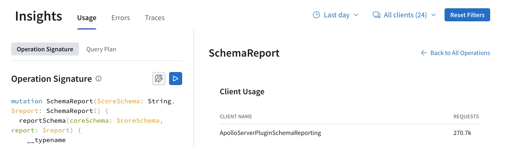

Below the client usage information, you can see the same [operation metrics](#operation-merics) as on the [operations overview](#operations-overview) page, but including only data for the particular operation you're viewing.

### Subscription metrics

If you view a specific subscription's detail page, you see charts containing only data about that subscription.These include all the [subscription notification metrics](#operation-metrics) shown in the operations overview. A subscription's detail page shows subscription registration metrics instead of the request metrics on the operations overview.

### Resolver-level traces

If you [enable trace reporting](#enabling-traces) in your subgraphs, GraphOS Studio can display resolver-level trace information about each operation.


The **Traces** tab for an operation provides a breakdown of timing and error information for each field resolved as part of that operation. Traces help you identify opportunities to improve your supergraph's overall performance by optimizing whichever resolvers currently act as a bottleneck.

#### Resolver execution time

Below the sample trace and latency distribution chart, you can view the time each resolver involved in an operation takes to complete. The execution time for [deferred fetches](../operations/defer/) only includes the time it takes for the deferred field's resolver to complete, not the time the response to the client with those fields was deferred.

#### Enabling traces

To enable federated trace reporting in your subgraphs, consult the documentation for the GraphQL server library your subgraph uses.

> **Not all subgraph-compatible libraries support federated trace reporting.**
>
> To confirm the support status for your library, check its **FEDERATED TRACING** entry in [Federation-compatible subgraph implementations](/federation/building-supergraphs/supported-subgraphs).

If your subgraphs use [Apollo Server with the `@apollo/subgraph` library](/apollo-server/using-federation/apollo-subgraph-setup/), federated trace reporting is enabled by default. You can customize Apollo Server's trace reporting behavior with the [inline trace plugin](/apollo-server/api/plugin/inline-trace).
