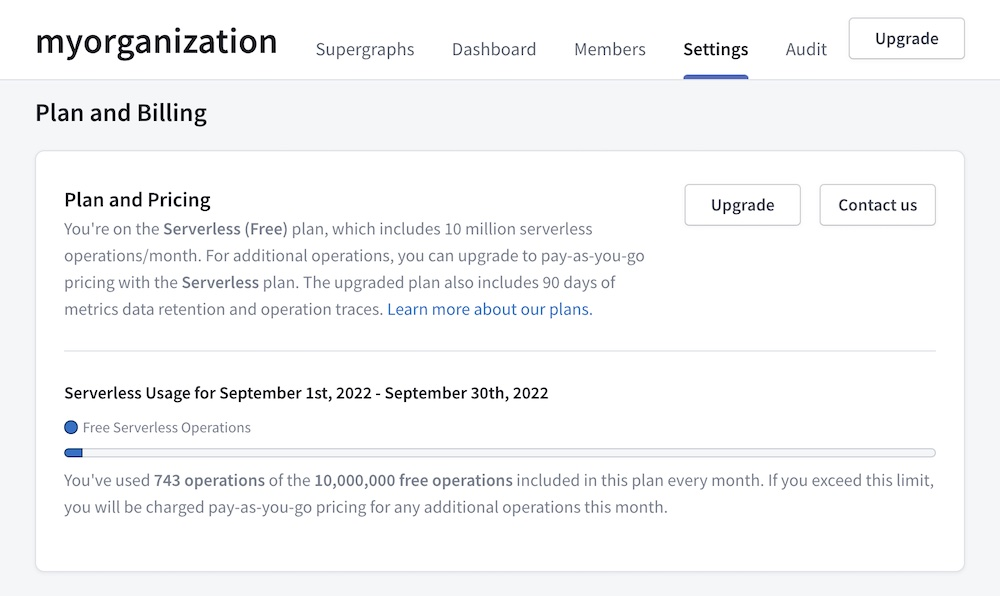
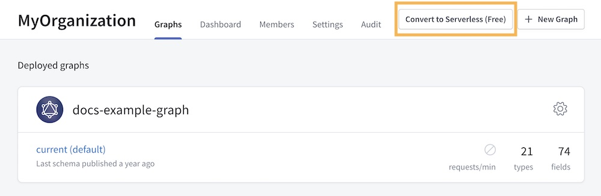

Every Apollo organization has an associated [plan](https://apollographql.com/pricing) that determines which GraphOS features the organization has access to, along with how it's billed.

> Every newly created organization starts on the **Serverless (Free)** plan, which is free.

You can check your organization's current plan in Apollo Studio. From your organization's page, go to the **Settings** tab and scroll down to the **Plan and Billing** section:

## Current plans

Apollo offers the following plans to new organizations:

> **These are _brief summaries_ of each plan.** For complete plan details, see the [pricing page](https://apollographql.com/pricing).

| Plan | Description |
|------|-------------|
| **Serverless (Free)** | Provides access to serverless [cloud supergraphs](../graphs/#cloud-supergraphs), along with many other GraphOS features. Sets a fixed limit on monthly serverless operations. This plan is free. |
| **Serverless** | Removes the operation limit included in the **Serverless (Free)** plan, and is billed based on usage _above_ that limit. Also expands metrics data retention. |
| **Enterprise** | These plans feature advanced security and schema delivery features, access control, audit logs, and more. They include negotiable usage rates. They do _not_ currently support cloud supergraphs. |

> The Enterprise plan gives you access to all GraphOS enterprise features, our Graph Champions community, and a dedicated support channel for your team to talk with Apollo supergraph experts. We will work with you to customize a query volume limit and support package that's right for you.
>
> If you're interested in an Enterprise plan, please [get in touch with us!](https://www.apollographql.com/contact-sales/)

## Legacy plans

If you have a non-Enterprise Apollo organization that was created before **4 October 2022**, it's on one of the following legacy plans.

> These plans do _not_ support serverless cloud supergraphs, and they might not support other new GraphOS features moving forward.
>
> If your organization is on one of these plans, we strongly recommend [upgrading to a current plan](#upgrading-to-a-current-plan).

| Plan | Description |
|------|-------------|
| **Free** | Our legacy free plan, not to be confused with the current **Serverless (Free)** plan. Provides basic GraphOS features, with _very_ limited data retention and maximum query volume. |
| **Team** | Our legacy plan for small and medium teams, which is billed based on the number of team members (i.e., seat-based). Raises the retention and query volume limits from the **Free** plan, but does not _remove_ them. |

### Upgrading to a current plan

To create cloud supergraphs, your Apollo organization needs to be on either the **Serverless (Free)** plan or the **Serverless** plan.

**If your organization is on the legacy Free plan,** you can convert your organization to the current **Serverless (Free)** plan by clicking **Convert to Serverless (Free)** in the top-right corner of your organization's page in Studio:

**If you're on the legacy Teams plan**, you currently need to create a _new_ organization to be able to create cloud supergraphs.
