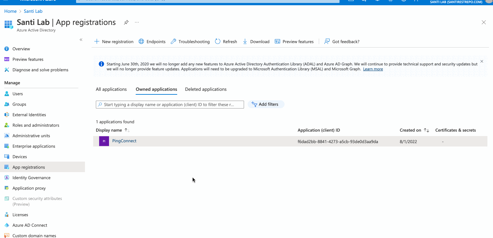
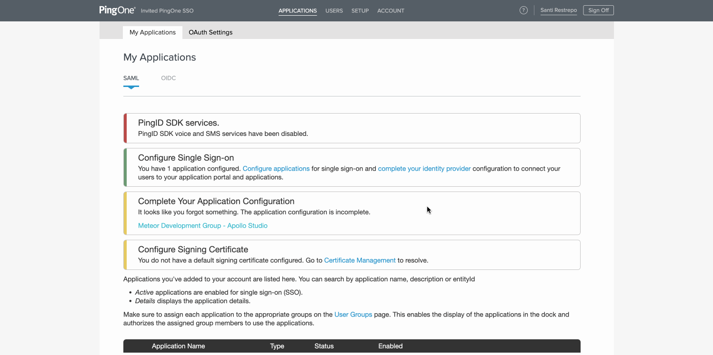

> ⚠️ Single sign-on (SSO) is available only for [Enterprise plans](https://www.apollographql.com/pricing/).

This guide walks through configuring Azure Active Directory (Azure AD) as your Apollo organization's identity provider (IdP) for single sign-on (SSO).

> These steps use PingOne's email invite method, because in some cases Apollo's default entity ID (`PingConnect`) might already be used by another application in your organization.

## 1. Create an Azure AD app registration

1. Go to your [Azure Portal](http://portal.azure.com/) and then navigate to **Azure Active Directory**.
2. In the left pane, select **App Registrations**. Then in the top ribbon click **+ New Registration**.
3. On the **Register an application** page, provide the following information:
   - Provide a friendly name for the PingOne client (such as `Apollo GraphOS` or `PingOneConnect`).
   - Under **Supported account types**, select which Microsoft account types will have access.
   - Leave **Redirect URI** empty. You'll provide this information later.  
    
    

    Then click **Register**.

## 2. Retrieve your endpoint URL and client ID

1. From the **Overview** section of your newly created app registration, copy and paste your **Application (client) ID** into a local text file.
2. Still in the **Overview** section, select **Endpoints** from the top menu.
3. Copy and paste the **OpenID Connect metadata document** URL into the same local text file:
  
     

## 3. Create a client secret 

1. From the **Certificates & secrets** section of your app registration, click **+ New client secret** and create a new secret. 

2. Copy and paste the secret's **Value** field to the same text file you created earlier:

     

## 4. Configure API permissions

1. From the **API permissions** section of your app registration, check whether `User.Read` is listed by default. If isn't, add it manually:
   1. Select **+ Add a permission > Microsoft Graph > Application permissions**.
   2. Search for `Group`, expand, and select **Group.Read.All**.
   3. **Save** your changes.
   4. If `User.Read` was not auto created, repeat this process for `User.Read`.

2. Also from the **API Permissions** section, select **Grant admin consent** next to the **+ Add a permission** button. Doing this ensures that your users don't need to grant consent during SSO.

     

3. From the **Manifest** section of your app registration, find the `groupMembershipClaims` property. Change its value from `null` to either `All` or `SecurityGroup`.
    - This ensures that the group membership claim is included in the access token during SSO.
4. **Save** your changes.

    

## 5. Integrate PingOne with Azure AD

1. After you receive your PingOne SSO invitation email, click the enrollment link to create a new account or sign in with an existing account.
2. On the landing page, click **Setup** on the top ribbon.
3. Select **Connect to an Identity Repository > Microsoft Azure AD** and click **Next**.
4. From the **Configure Your Microsoft Azure Connection** modal:
   1. Copy and paste the endpoint URL, client ID, and client secret values saved earlier from Azure AD.  
   2. Select **Verify**. PingOne will verify that it can query the endpoint(s) you've specified.
   3. For **Scope**, select the OAuth scopes to include in authentication requests.
   4. Click **Next**.

     

5. In Step 2 of the wizard, copy the **PingOne Redirect URI** and paste it on the Azure AD app registration.
   * Redirect URIs can be configured from the **Overview** section of your app registration under the **Essentials** menu in Azure AD.
   * Select **Redirect URIs > Add a platform > Web** and enter the Redirect URI you copied from PingOne. Select **Configure** to save changes.
   * Back on the PingOne configuration wizard, select **Next** after copying and pasting the URI.

     

6. In Step 3 of the wizard, configure the **Map Attributes** section by mapping the incoming attributes or claims from Azure AD to PingOne. You can leave this with the default Attribute Mapping.

7. In Step 4 of the wizard, choose whether or not to synchronize your user groups from Azure AD to your PingOne user groups.
   - The permissions **User.Read** and **Group.Read.All** are required for synchronization to be successful.
   - Any PingOne user groups that do not exist in your Azure provider will be replaced by the Azure groups.
   - Each of your Azure group members are automatically added to the corresponding PingOne groups when the user initially signs on (SSO) to PingOne. This is PingOne's just-in-time user provisioning.

8. Click **Save** to finish connecting Azure AD to PingOne.

## 6. Configure the OIDC Application

After you successfully configure the identity bridge between Azure AD and PingOne, you need to configure and enable Apollo as an OIDC application. The configuration for this application should already be initialized, and you can access it via the **Complete your Application Configuration** reminder under **Applications** in the PingOne admin console.

1. Select **Meteor Development Group - Apollo Studio** under **Complete your Application Configuration**.

    > ⚠️ If the **Add OIDC Application** wizard doesn’t automatically pop-up, select the **SAML** tab and then select the **OIDC** tab.

    

2. In Step 1 of the **Add OIDC Application** wizard, configure the application name, description, category, and icon (optional).
3. Click **Next** for Steps 2-5 (these are configured by default). 
4. In Step 6 of the wizard (**Attribute Mapping**), you _must_ map `email` to `email` and `sub` to `preferred_username`. You can optionally map more attributes for given name, family name, and others. 
5. In Step 7 of the wizard (**Group Access**), select whichever groups should receive SSO access to Apollo.
6. Click **Done** to complete the configuration.

## 7. Notify Apollo

After you complete the steps above, reach out to your Apollo contact. They will complete your SSO setup.
