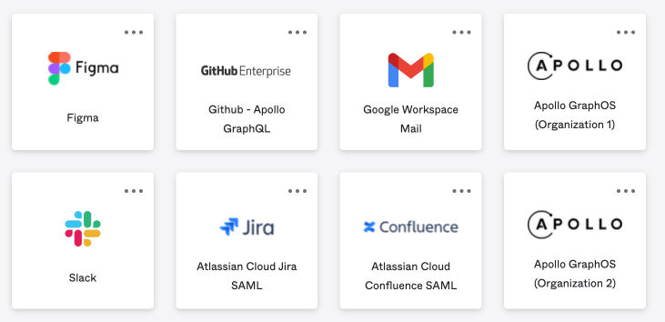

<PremiumFeature>

Single sign-on (SSO) is available only for [Dedicated and Enterprise plans](https://www.apollographql.com/pricing#security).
This feature is not available as part of an [Enterprise trial](../plans/#enterprise-trials).

</PremiumFeature>

<PreviewFeature>

This feature is in invite-only [preview](/resources/product-launch-stages#preview). Please get in touch with your Apollo contact if you'd like to request access.

</PreviewFeature>

Different GraphOS organizations can share the same identity provider (IdP) and SSO so members can switch between organizations in GraphOS Studio without reauthenticating.

## Prerequisites

To share SSO configurations, organizations must first individually configure [self-serve SSO](./setup).

## Switching between organizations

You can switch between any organizations you have access to by clicking the organization name in the top left of GraphOS Studio.
For an organization to appear in your organization list, you must first log into that organization.

## Logging in to a multi-org SSO organization

To authenticate access to an organization with a shared SSO configuration, you must first log in to it using one of these identity provider (IdP) initiated methods:

- Via IdP application portal (recommended)
- Via IdP-generated link
- Via Apollo-generated link

<Note>

While multi-organization SSO is in [preview](resources/product-launch-stages/#preview), all members of an organization with multi-org SSO configured must log in from their IdP. If they try to log in on `studio.apollographql.com/login`, they will receive an error message directing them to log in via IdP.

</Note>

### Log in via IdP application portal

<Tip>

Apollo recommends application portals as the most direct way for organization members to authenticate access.

</Tip>

Many IdPs provide a user-facing page where you can see which applications you are assigned to. Different GraphOS organizations appear as separate applications, and you can log in to each one by clicking the organization tile.

For example, the screenshot above shows separate application tiles for **Apollo GraphOS (Organization 1)** and **Apollo GraphOS (Organization 2)**.

### Log in via an IdP-generated link

Many IdPs provide a method to generate login links—sometimes called "magic links." These can be provided directly to team members or stored in an internal wiki or document for easy access. Login link creation often requires admin permissions in an IdP. Consult your IdP's documentation for instructions.

### Log in via an Apollo-generated link

Apollo can also generate login links on request. Please get in touch with your Apollo contact to request a magic link. Be sure to include the organization(s) you want the link(s) for.

## Preview limitations

While this feature is in [preview](/resources/product-launch-stages#preview), members can only log in with IdP-initiated SSO.
When in [GA](/resources/product-launch-stages#general-availability), it will also support service-provider-initiated (SP-initiated) SSO.
