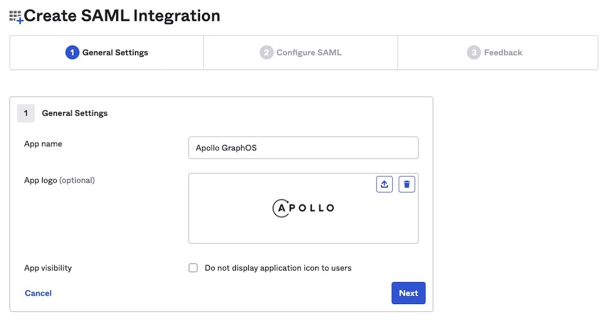

> ⚠️ Single sign-on (SSO) is available only for [Enterprise plans](https://www.apollographql.com/pricing/).

This guide walks through configuring Okta as your Apollo organization's identity provider (IdP) for single sign-on (SSO). These steps require an Okta account with administrator privileges.

## 1. Create an app integration

1. From your Okta Administrator Dashboard, navigate to the **Applications** view.  
2. Click **Create App Integration**. The following dialog appears:

    

3. Select **SAML 2.0** as your sign-in method.  
4. Click **Next**. The **Create SAML Integration** dialog appears.

    
## 2. Create a new SAML integration

The **Create SAML Integration** dialog includes multiple steps:

1. In the **General Settings** step, provide the following values:

    - **App name**: `Apollo GraphOS`  
    - **App logo**: [Apollo logo](../../img/sso/apollo-sk-logo.jpg) (optional)
    
    

    Then click **Next**.
    
2. In the **Configure SAML** step, provide the following values:

    - **Single sign on URL**: `https://sso.connect.pingidentity.com/sso/sp/ACS.saml2`  
        * Also check **Use this for Recipient URL and Destination URL**.  
    - **Audience URI (SP Entity ID)**: `PingConnect`  
    
        > ⚠️ If `PingConnect` already exists, use `fd76e619-6c0a-461c-912d-418278929d60`

    - **Default RelayState**: `https://pingone.com/1.0/fd76e619-6c0a-461c-912d-418278929d60`  

    

3. Still in the **Configure SAML** step, scroll down to **Attribute Statements**. Set values for the following attributes:

    - **sub**: `user.email`
      - The **sub** attribute should uniquely identify any particular user to GraphOS. In most cases, `user.email` provides this unique mapping.
    - **email**: `user.email`
    - **given_name**: `user.firstName`
    - **family_name**: `user.lastName`

       

    Then click **Next**.

4. In the **Feedback** step, provide the following values:
    - Select **I'm an Okta customer adding an internal app**. 

    

    Then click **Finish**.      

## 3. Send SAML metadata to Apollo

1. From your new SAML integration's details page, scroll down and click **View SAML setup instructions** on the right side:

         

2. In the dialog that appears, copy and paste the contents of the **IDP metadata** textbox into a text file:

     

3. Send the text file to your Apollo contact. They will complete your SSO setup.
