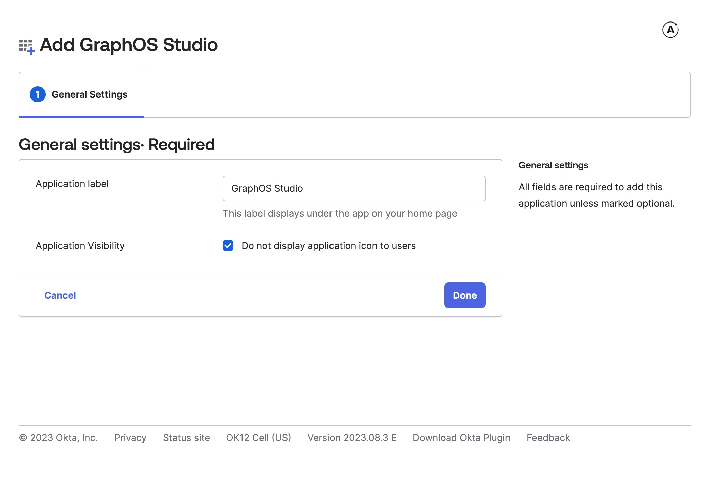
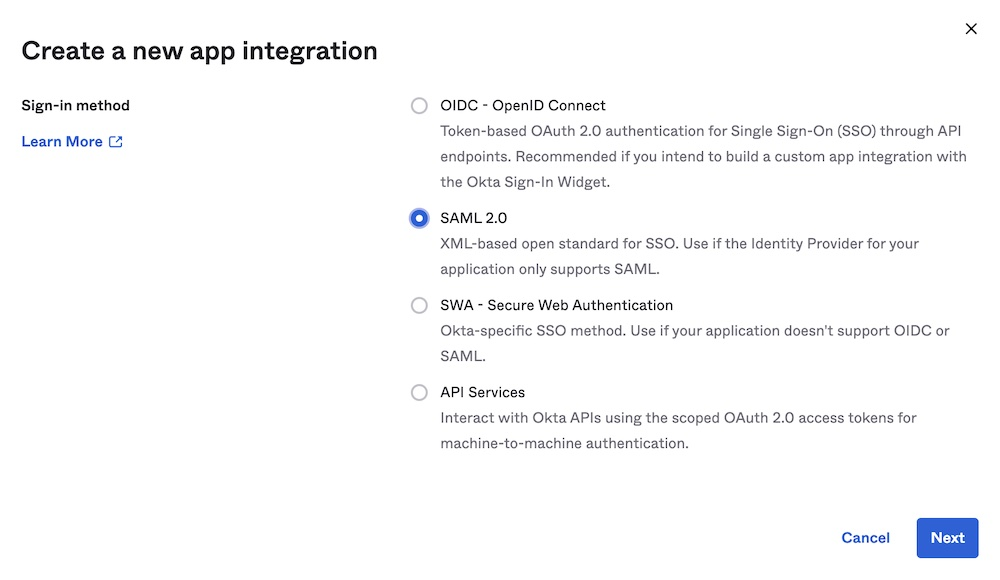
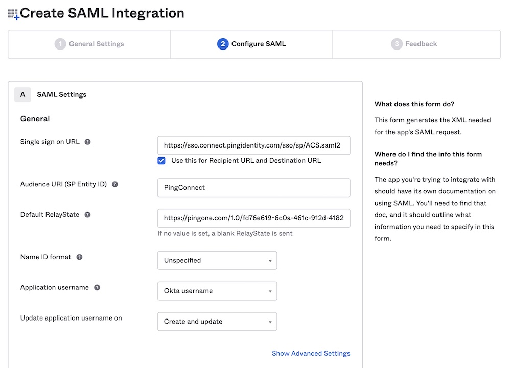
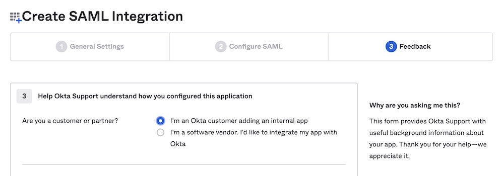

> ⚠️ **Single sign-on (SSO) is available only for [Enterprise plans](https://www.apollographql.com/pricing/).** Unlike most Enterprise features, this feature is _not_ available as part of an [Enterprise trial](../plans/#enterprise-trials).

This guide walks through configuring Okta as your Apollo organization's identity provider (IdP) for single sign-on (SSO).
You can [use Okta's official GraphOS Studio integration](#use-graphos-studio-integration) (recommended) or [create a custom SAML integration](#create-a-custom-integration).
Both methods require an Okta account with administrator privileges.

Once you've set up your integration, you need to [assign users to it in Okta](#assign-users-in-okta) so they can access GraphOS via the **Sign in with SSO** button on the [GraphOS Studio login page](https://studio.apollographql.com/login).

## Using the GraphOS Studio Okta integration

The Okta/GraphOS Studio SAML integration currently supports the following features:

- Service provider-initiated (SP-initiated) SSO
- Just-In-Time (JIT) Provisioning

An SP-initiated flow occurs when an end user signs in to an external application directly from that application's sign-in website. For example, https://studio.apollographql.com/login is the sign-in location for GraphOS Studio.
You can use Okta's [Bookmark App integration](#3-add-graphos-studio-as-a-bookmark-application) to simulate an Identity Provider-initiated (IdP-initiated) flow to allow users to sign in from Okta.

### 1. Configure integration

1. From your Okta Administrator Dashboard, open the **Applications** view from the left menu. Click **Browse App Catalog**.

    

2. Search for "GraphOS Studio" and select it. Then, click **+Add integration**.

    

3. In the **General Settings** tab that opens, select **Do not display application icon to users**. (You'll [set up a Bookmark App](#3-add-graphos-studio-as-a-bookmark-app) instead.) You can optionally change the **Application label** or keep the default "GraphOS Studio." Click **Next**.

    

4. In the **Sign-On Options** tab that opens, select **SAML 2.0** and enter `https://pingone.com/1.0/fd76e619-6c0a-461c-912d-418278929d6` as the **Default Relay State**.

    

5. Copy the **Metadata URL** under **Metadata details**—you'll send it to Apollo to complete setup.

### 2. Send SAML metadata to Apollo

1. Sign in to [GraphOS Studio](https://studio.apollographql.com?referrer=docs-content) and click **Contact Support** in the upper right corner of the screen.

    

2. Create a support ticket: Select **Membership Management** as the issue and include the **metadata URL** you saved during integration configuration. Click **Submit**.

Apollo will complete your SSO setup and notify you once it's ready.

### 3. Add GraphOS Studio as a Bookmark App

Since the Okta integration only supports an SP-initiated flow, we strongly recommend hiding the application in the Okta catalog for users and instead adding GraphOS Studio as a **[Bookmark App](https://help.okta.com/en/prod/Content/Topics/Apps/Apps_Bookmark_App.htm)**. Bookmark Apps allow your users to correctly launch the application from the Okta catalog.

To do so, follow [Okta's instructions](https://help.okta.com/en/prod/Content/Topics/Apps/Apps_Bookmark_App.htm) the the following Bookmark Application configurations:
- **Application label**: GraphOS Studio
- **URL**: Provided by Apollo Support 

## Using a custom integration

Before the official Okta integration, you needed to create a custom integration to configure SSO. Now that an integration exists, we don't recommend creating a custom one. You can refer to the instructions below in case you need them for a previously-created custom integration.

<ExpansionPanel title="Click to see instructions">

#### 1. Create an app integration

1. From your Okta Administrator Dashboard, navigate to the **Applications** view.  
2. Click **Create App Integration**. The following dialog appears:

    

3. Select **SAML 2.0** as your sign-in method.  
4. Click **Next**. The **Create SAML Integration** dialog appears.
 
#### 2. Create a new SAML integration

The **Create SAML Integration** dialog includes multiple steps:

1. In the **General Settings** step, provide the following values:

    - **App name**: `Apollo GraphOS`  
    - **App logo**: [Apollo logo](../../img/sso/apollo-sk-logo.jpg) (optional)
    
    

    Then click **Next**.
    
2. In the **Configure SAML** step, provide the following values:

    - **Single sign on URL**: `https://sso.connect.pingidentity.com/sso/sp/ACS.saml2`  
        * Also check **Use this for Recipient URL and Destination URL**.  
    - **Audience URI (SP Entity ID)**: `PingConnect`  
    
        > ⚠️ If `PingConnect` already exists, use `fd76e619-6c0a-461c-912d-418278929d60`

    - **Default RelayState**: `https://pingone.com/1.0/fd76e619-6c0a-461c-912d-418278929d60`  

    

3. Still in the **Configure SAML** step, scroll down to **Attribute Statements**. Set values for the following attributes:

    - **sub**: `user.email`
      - The **sub** attribute should uniquely identify any particular user to GraphOS. In most cases, `user.email` provides this unique mapping.
    - **email**: `user.email`
    - **given_name**: `user.firstName`
    - **family_name**: `user.lastName`

       

    Then click **Next**.

4. In the **Feedback** step, provide the following values:
    - Select **I'm an Okta customer adding an internal app**. 

    

    Then click **Finish**.      

#### 3. Send SAML metadata to Apollo

1. From your new SAML integration's details page, scroll down and click **View SAML setup instructions** on the right side:

         

2. In the dialog that appears, copy and paste the contents of the **IDP metadata** textbox into a text file:

     

3. Send the text file to your Apollo contact. They will complete your SSO setup.

</ExpansionPanel>

## Assign users in Okta

Whether you're using the official Okta integration or creating your own, you need to assign users to it so they can access GraphOS. You can assign individual users or groups by following these steps:

1. From your Okta Administrator Dashboard, open the **Applications** view from the left menu and open the GraphOS Studio integration. Then, click the **Assignments** tab.
2. Click the **Assign** drop-down and then **Assign to People** or **Assign to Groups**.
3. Click **Assign** on the right of the person or group you want to have access to your GraphOS Studio Org.
4. Click **Save and Go Back**.

Repeat these steps whenever you want to grant GraphOS Studio access to a new user or group.
Okta displays every user that you've assigned to from the **Assignments** tab.