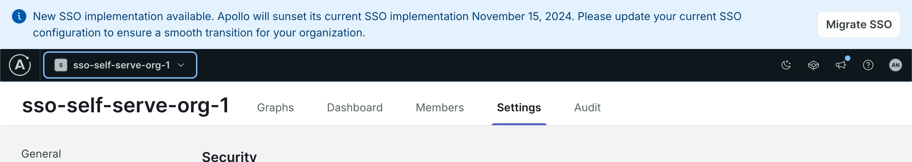

As of August 2024, GraphOS has a new self-service single sign-on (SSO) system. Enterprise organizations that set up their SSO with the legacy implementation must migrate before November 15, 2024.
After that date, the legacy implementation will no longer work, and your organization will lose access to GraphOS.

## What's changing?

In April 2024, Apollo introduced a new SSO system directly integrated into the GraphOS authentication service, eliminating the need for a third-party dependency (PingOne).
With this new implementation, you no longer need to perform the annual certification rotations that PingOne requires.

In August 2024, Apollo introduced a self-service migration mechanism for legacy customers to transition to the new system without needing to contact Apollo support.
Migrating customers are always welcome to reach out to [support@apollographql.com](mailto:support@apollographql.com) in case of questions.

Later in 2024, new customers will have access to the self-service system.

## Who needs to migrate?

If your organization implemented SSO before April 2024, you must migrate.

<Note>

If your organization implemented SSO after April 2024, but before the availability of self-service setup, you _don't_ need to migrate.

</Note>

To confirm if you need to migrate, visit [GraphOS Studio](https://studio.apollographql.com?referrer=docs-content) and check for an SSO migration banner.

If you aren't sure whether you need to migrate, please reach out to your Apollo contact.

## How to migrate

A GraphOS [Org Admin](/graphos/org/members/#organization-wide-member-roles) must create a new SSO configuration.
You can create a new configuration while the legacy configuration continues to provide SSO for your organization.
The GraphOS setup wizard won't let you activate your new configuration until it has confirmed that you're able to sign in with it.

Once the new configuration is verified and active, you should remove any legacy configurations from your identity provider (IdP). For details, see the instructions for your IdP:

#### SAML-based

- [Okta](./saml-okta)
- [Microsoft Entra ID](./saml-microsoft-entra-id) (formerly known as Azure Active Directory)
- [Generic SAML](./saml-integration-guide)

#### OIDC-based

- [Okta](./oidc-okta)
- [Microsoft Entra ID](./oidc-microsoft-entra-id) (formerly known as Azure Active Directory)
- [Generic OIDC](./oidc-integration-guide/)

Don't hesitate to email [support@apollographql.com](mailto:support@apollographql.com) if you have any questions or need assistance.
