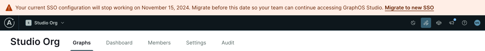

GraphOS has a new self-service single sign-on (SSO) system. Enterprise organizations that set up their SSO with the legacy implementation must migrate before November 15, 2024. After that date, the legacy implementation will no longer work, and your organization will lose access to GraphOS.

## Who needs to migrate?

If your organization implemented SSO before April 2024, you must migrate.
To confirm if you need to migrate, visit [GraphOS Studio](https://studio.apollographql.com?referrer=docs-content) and check for an SSO migration banner.

If you aren't sure whether you need to migrate, please reach out to your Apollo contact.

## What's changing?

The new SSO implementation is now directly integrated into the GraphOS authentication service, eliminating the need for a third-party dependency (PingOne). With this new implementation, you no longer need to perform the annual certification rotations that PingOne requires.

## How to migrate

To migrate, a GraphOS [Org Admin](../members/#organization-wide-member-roles) must create a new SSO configuration and remove the legacy configuration. For details, see the instructions for your identity provider:

- [Self-service Okta (SAML-based)](./okta-integration-guide/)
- Microsoft Entra ID (formerly known as Azure Active Directory)
  - [Self-service SAML-based](./microsoft-entra-id-integration-saml-guide)
  - [Self-service OIDC-based](./microsoft-entra-id-integration-oidc-guide)
- [Self-service Generic SAML](./saml-integration-guide/)
- [Self-service Generic OIDC](./oidc-integration-guide/)

Don't hesitate to reach out to your Apollo contact email [support@apollographql.com](mailto:support@apollographql.com) if you have any questions or need assistance.
