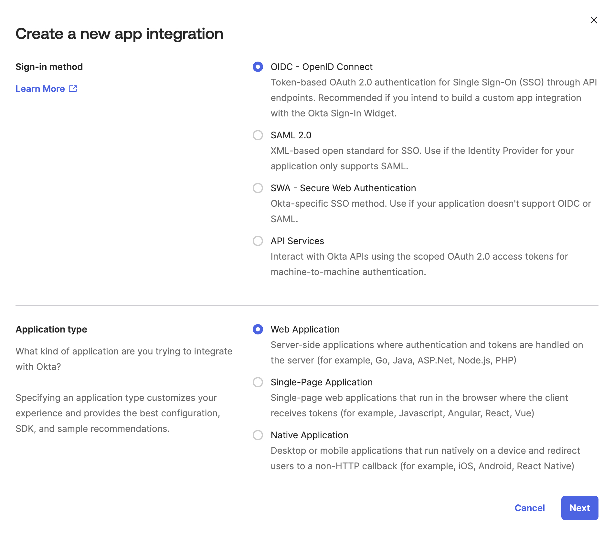

<PremiumFeature>

Self-service single sign-on (SSO) is only available for organizations with Dedicated and Enterprise plans who previously set up SSO with PingOne and need to migrate.
If you're unsure if you need to migrate please see the [Migration Guide](./migration#who-needs-to-migrate).
If you're setting up SSO for the first time, please refer to [these instructions](../okta-integration-guide).

</PremiumFeature>

This guide walks through configuring Okta as your GraphOS organization's identity provider (IdP) for OIDC-based SSO. Once you've set up your integration, you need to assign users to it in Okta so they can access GraphOS Studio via SSO.

<SSOMigrationNotice />

## Prerequisites

Setup requires:

- An Okta user account with administrator privileges
- A GraphOS user account with the [**Org Admin** role](../members/#organization-wide-member-roles)

## Setup

<SSOSetupSteps type="OIDC" idp="Okta app integration" />

<!-- vale Apollo.Headings = NO -->

### Step 1. Enter your SSO details

<SSOShareDetails type="OIDC" />

### Step 2. Create a custom Okta app integration

1. Once you reach **Step 2: Configure Your IdP** in the wizard, open your Okta Administrator Dashboard in a separate browser tab.
2. In your Okta Administrator Dashboard, go to the **Applications** view and click **Create App Integration**.

   <Note>

   To use the latest version of Apollo's SSO, ensure you _create a custom app integration_ in Okta rather than use the GraphOS app in the Okta Application Network.

   </Note>

3. In the dialog that appears, select **OIDC - OpenID Connect** as your sign-in method. For the **Application type**, select **Web Application**. Click **Next**.

   

4. In the **General Settings** section, provide the following values:

   - **App integration name**: `Apollo GraphOS`
   - **Logo**: [Apollo logo](../../../img/sso/apollo-sk-logo.jpg) (optional)

   Leave the other fields (for example, Proof of possesion, Grant type) as the default values.

5. Add the following URIs:

- In the **Sign-in redirect URIs** section, add the Sign-in URL provided in the GraphOS wizard.
- In the **Sign-out redirect URIs** section, add `https://studio.apollographql.com`.
- Leave the **Base URIs** section empty.

6. For **Assignments**, you can select **Skip group assignment for now** or [assign the users](#assign-users-in-okta) you want to have access to GraphOS. Click **Save**. This creates your custom app integration and brings you to its **General** tab.

7. In the **Client Credentials** section of the **General** tab, copy the **Client ID** and paste it into the Client ID input in the GraphOS wizard. Do the same for the secret in the **Client Secrets** section.

8. In Okta, while still on the app's **General tab** scroll to **General Settings** and click **Edit**. and scroll to the **Login** section. Add `https://studio.apollographql.com/sso/login` as the **Initiate login URI**. Click **Save**.

9. In Okta, open the **Sign On** tab. Scroll to the **OpenID Connect ID Token** section and click **Edit**. Change the **Issuer** to be **Okta URL** and click **Save**. Copy the URL into the **Issuer** input in the GraphOS Wizard.

10. In the setup wizard in GraphOS Studio, optionally enter a **Discovery URL**. Click **Next**.

### Step 3. Configure OIDC

1. In Okta, go back to the **General** tab of your custom app integration and confirm that the **Sign-in redirect URIs** contains the URL provided in the wizard.
2. You don't need to make any claims configurations, since by default, custom OIDC apps in Okta include all user attributes on the app profile.
3. Click **Next**.

### Step 4. Verify SSO Configuration

<SSOVerification />

### Step 5. Enable SSO

<!-- vale Apollo.Headings = YES -->

<SSOLegacyUsers idp="Okta" appType="custom app integration" />

## Assign users in Okta

Once your SSO is set up, you need to assign users to it so they can access GraphOS. You can assign individual users or groups by following these steps:

1. From your Okta Administrator Dashboard, open the **Applications** view from the left menu and open the Apollo GraphOS integration. Then, click the **Assignments** tab.

   

2. Click the **Assign** drop-down and then **Assign to People** or **Assign to Groups**.
3. Click **Assign** on the right of the people or group(s) you want to have access to your GraphOS Studio Org. Click **Done**.

Repeat these steps whenever you want to grant GraphOS Studio access to a new user or group.
Okta displays every user and group you've assigned to the integration in the **Assignments** tab.
