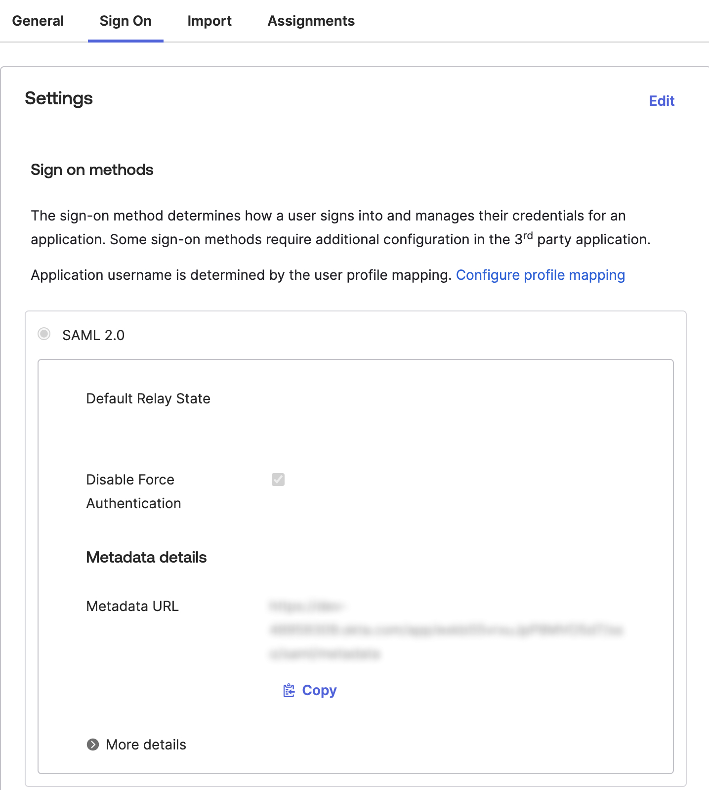
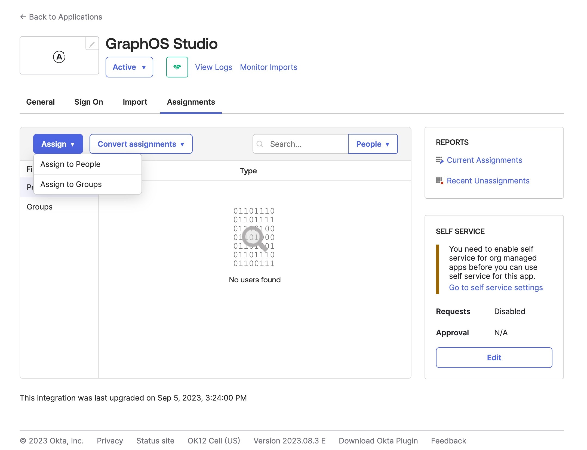

<PremiumFeature>

Self-service single sign-on (SSO) is only available for organizations with Dedicated and Enterprise plans who previously set up SSO with PingOne and need to migrate.
If you're unsure if you need to migrate please see the [Migration Guide](./migration#who-needs-to-migrate).
If you're setting up SSO for the first time, please refer to [these instructions](../okta-integration-guide).

</PremiumFeature>

This guide walks through configuring Okta as your GraphOS organization's identity provider (IdP) for OIDC-based SSO. Once you've set up your integration, you need to assign users to it in Okta so they can access GraphOS Studio via SSO.

<SSOMigrationNotice />

## Prerequisites

Setup requires:

- An Okta user account with administrator privileges
- A GraphOS user account with the [**Org Admin** role](../members/#organization-wide-member-roles)

## Setup

<SSOSetupSteps type="OIDC" idp="Okta app integration" />

<!-- vale Apollo.Headings = NO -->

### Step 1. Enter your SSO details

<SSOShareDetails type="OIDC" />

### Step 2. Create a custom Okta app integration

1. Once you reach **Step 2: Configure Your IdP** in the wizard, open your Okta Administrator Dashboard in a separate browser tab.
2. In your Okta Administrator Dashboard, go to the **Applications** view and click **Create App Integration**.

   <Note>

   To use the latest version of Apollo's SSO, ensure you _create a custom app integration_ in Okta rather than use the GraphOS app in the Okta Application Network.

   </Note>

3. In the dialog that appears, select **OIDC - OpenID Connect** as your sign-in method. Click **Next**.
4. In the **General Settings** step, provide the following values:

   - **App name**: `Apollo GraphOS`
   - **App logo**: [Apollo logo](../../../img/sso/apollo-sk-logo.jpg) (optional)

   Then click **Next**.

5. In the next step, enter the following values in Okta:

   - **Sign-in redirect URI**: **Single sign on URL** provided by the GraphOS wizard
   - **Login intiated by**: `App only`
   - **Initiated login URI**: `https://studio.apollographql.com/sso/login`

6. In the GraphOS wizard, enter the **Client ID**, **Client Secret**, and **Issuer** provided by Okta.
7. In the **Help Okta Support understand how you configured this application** step, select **I'm an Okta customer adding an internal app**. Click **Finish**.
8. In the setup wizard in GraphOS Studio, click **Next**.

### Step 3. Share OIDC metadata with Apollo

1. In your Okta Administrator Dashboard, go to the **Sign On > Settings > OIDC 2.0 > Metadata details** section in the app integration you just created.

   

2. Copy and paste the contents of the **Metadata URL** text box into the setup wizard in GraphOS Studio. Click **Next**.

### Step 4. Verify details

The GraphOS Studio setup wizard populates your SSO metadata based on the URL you entered in the last step. Verify the values are correct.

You can find them in your Okta Administrator Dashboard in the app integration you created for GraphOS.

- Your app integration's **Entity ID** is in the **Sign On** tab. Scroll down to the **OIDC 2.0** section and look for a field labeled **Issuer**. This field contains the Entity ID. It uses a URL format: `http://www.okta.com/<unique-id>`.
- The **SSO URL** is also in the **OIDC 2.0** section in a field labeled **Sign on URL**.

Once you've verified the values or corrected them, click **Next**.

### Step 5. Enable SSO

<!-- vale Apollo.Headings = YES -->

<SSOLegacyUsers idp="Okta" appType="custom app integration" />

## Assign users in Okta

Once your SSO is set up, you need to assign users to it so they can access GraphOS. You can assign individual users or groups by following these steps:

1. From your Okta Administrator Dashboard, open the **Applications** view from the left menu and open the Apollo GraphOS integration. Then, click the **Assignments** tab.

   

2. Click the **Assign** drop-down and then **Assign to People** or **Assign to Groups**.
3. Click **Assign** on the right of the people or group(s) you want to have access to your GraphOS Studio Org. Click **Done**.

Repeat these steps whenever you want to grant GraphOS Studio access to a new user or group.
Okta displays every user and group you've assigned to the integration in the **Assignments** tab.
