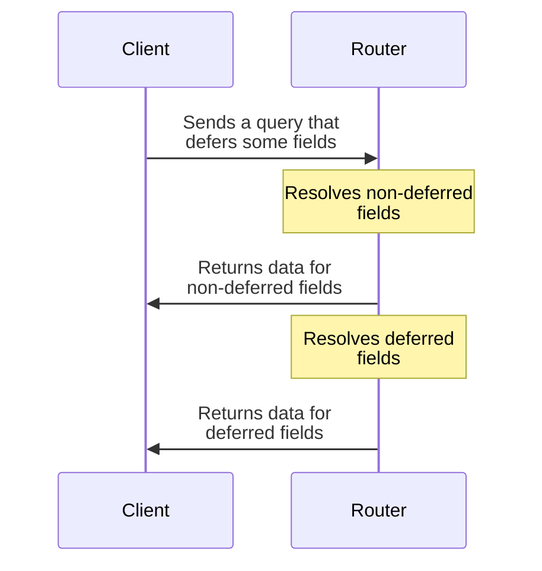
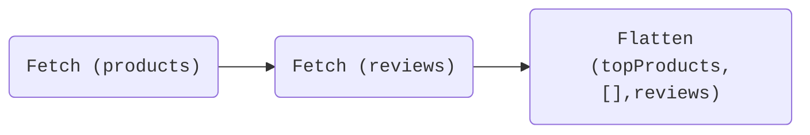
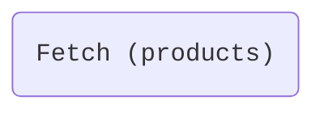
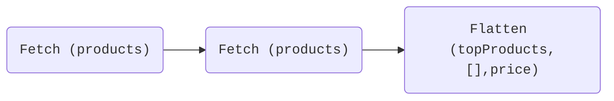

With GraphOS, your supergraph's router can **defer** the delivery of certain schema fields to a querying client. This enables the client to receive _non_-deferred data more quickly, because the router can split its response into multiple parts as data becomes available:



## How deferring works

Your router supports deferring fields of the special object types in your subgraph schemas called [**entities**](/federation/entities/).

Entities are types that usually define their fields across _multiple_ subgraph schemas. You can identify an entity by its use of the `@key` directive. In the example subgraph schemas below, the `Product` type is an entity:

<CodeColumns>

```graphql title="Products subgraph"
type Product @key(fields: "id") {
  id: ID!
  name: String!
  price: Int!
}

type Query {
  topProducts: [Product!]!
}
```

```graphql title="Reviews subgraph"
type Product @key(fields: "id") {
  id: ID!
  reviews: [Review!]!
}


type Review {
  score: Int!
}
````

</CodeColumns>

Because entities usually define their fields across multiple subgraphs, the router usually needs to _query_ multiple subgraphs to fully resolve an entity.

Consider this query:

```graphql {2,5}
query GetTopProductsAndReviews {
  topProducts { # Resolved by Products subgraph
    id
    name
    reviews {   # Resolved by Reviews subgraph
      score
    }
  }
}
```

To resolve all of these fields, the router needs to query both the Products subgraph _and_ the Reviews subgraph. Not only that, but the router specifically needs to query the Products subgraph _first_, so that it knows _which_ products to fetch reviews for.

When the router receives this query, it automatically generates a sequence of "sub-queries" that it can run on its subgraphs to resolve all requested fields. This sequence is known as a [**query plan**](/federation/query-plans/).

Here's a visualization of the query plan for the example query:



This query plan has three steps:

1. The router queries the Products subgraph and retrieves the `id` and `name` of each top product.
2. The router queries the Reviews subgraph, _providing the `id` of each top product_, and retrieves corresponding review information for those products.
3. The router combines the data from the two sub-queries into a single response for the client.

Because the second sub-query depends on data from the first, they must occur serially. But the result of the _first_ sub-query includes a meaningful portion of the data that the client requested. So to improve responsiveness, the router could theoretically return that portion as soon as it's available!

A client can request exactly this behavior by including the `@defer` directive in their query:

```graphql
query GetTopProductsAndReviews {
  topProducts {
    id
    name
    # highlight-start
    ... @defer {
      reviews { #highlight-line
        score
      }
    }
    # highlight-end
  }
}
```

> As shown, `@defer` is always applied to a **GraphQL fragment** that contains the deferred fields. You _don't_ apply `@defer` directly to individual fields. 

With the above query, the router understands that it _can_ return the result of its first sub-query as soon as its available, instead of waiting for the result of the _second_ sub-query. Later, it returns the result of the second sub-query when it's ready.

**The router can defer the `Product.reviews` field specifically because it's a field of an entity.** An entity serves as a direct entry point into each subgraph that defines it. This means that the router can always execute a followup query to fetch any entity fields that it initially defers.

### Deferring within a single subgraph

In the previous example, a client defers entity fields that happen to _already_ require executing multiple sub-queries. But what if all of a client query's fields belong to a _single_ subgraph?

Consider this client query:

```graphql
query GetTopProducts {
  topProducts { # All fields resolved by Products subgraph
    id
    name
    price
  }
}
```

Because all of these requested fields are defined in a single subgraph, by default the router generates the most basic possible query plan, with a single step:



Now, let's imagine that the `Product.price` field takes significantly longer to resolve than other `Product` fields, and a querying client wants to defer it like so:

```graphql
query GetTopProducts {
  topProducts {
    id
    name
    # highlight-start
    ... @defer {
      price @defer
    }
    # highlight-end
  }
}
```

**This is valid!** When the router sees this defer request, it generates a _different_ query plan for the query:



Now, the router queries _the same subgraph twice_, first to fetch non-deferred fields and then to fetch the deferred fields. When the _first_ sub-query returns, the router can immediately return each product's `id` and `name` to the client while sending a followup sub-query to fetch `price` information.

## Requirements

For a client to be able to defer entity fields in your supergraph, _all_ of the following are required:

- The client must support receiving deferred query responses as multipart HTTP responses.
  - This functionality is currently supported in [Apollo Client](/react/data/defer) (preview) and [Apollo Kotlin](/docs/kotlin/fetching/defer) (experimental).
- Your supergraph must be one of:
  - A [cloud supergraph](../graphs/overview#cloud-supergraphs)
  - A [self-hosted supergraph](../graphs/overview/#self-hosted-supergraphs) running the [Apollo Router](/router/)
- Your subgraphs must each use a [subgraph-compatible GraphQL server library](/federation/building-supergraphs/supported-subgraphs).
- You must [define one or more entities](/federation/entities) in your subgraph schemas.
  - Otherwise, your router can't defer any fields besides the root-level fields of the `Query` type.
- Each subgraph must define a [reference resolver](/federation/entities#2-define-a-reference-resolver) for each of its entities (or implement the corresponding functionality in your chosen subgraph library).
  - This is what enables the router to directly access entity fields with followup sub-queries.
