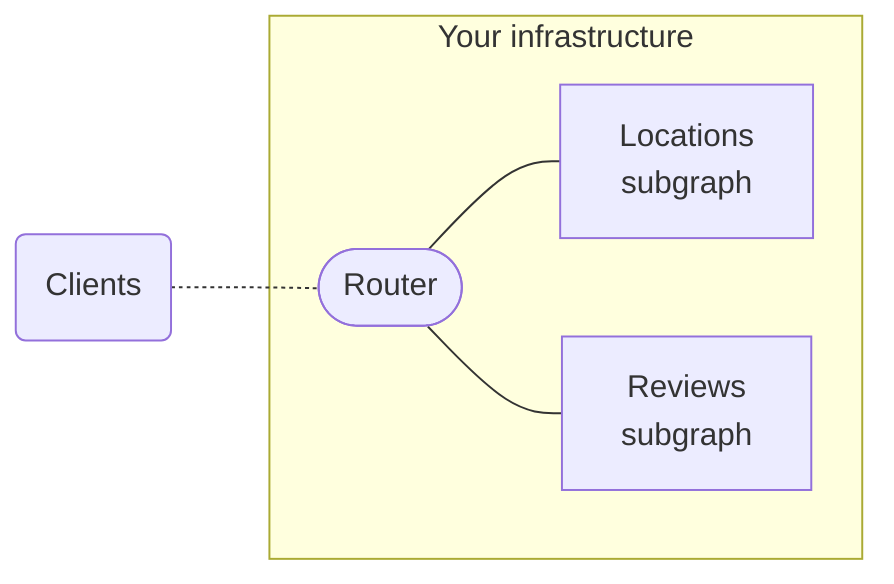

> ⚠️ **Important:** If you're just getting started with GraphOS, we recommend instead [creating a cloud supergraph](../quickstart/cloud/).
>
> Self-hosted supergraphs are recommended only for organizations that need to host their router in their own infrastructure, usually to satisfy advanced performance or compliance requirements.
>
> If you _do_ need to host your supergraph's router in your own infrastructure, you might also benefit from the expanded features of an [Enterprise plan](https://www.apollographql.com/pricing/). Please [contact us](https://www.apollographql.com/contact-sales/).

Some organizations with advanced requirements need to host every part of their supergraph in their own infrastructure, _including_ the supergraph's router:

A supergraph with this structure is called a [self-hosted supergraph](../graphs/overview/#self-hosted-supergraphs). Here are some reasons why your organization might need to use self-hosted routing instead of [cloud routing](./cloud/) (where Apollo hosts your router for you):

- **Compliance.** All of your supergraph's components must be hosted in a particular region to adhere to compliance requirements.
- **Performance.** You need to minimize latency between your router and subgraphs by enabling them to communicate _without_ traversing the public internet (e.g., by hosting all components in a VPC).
- **Customization.** You need to configure your router's behavior beyond what's currently possible with [cloud routing](./cloud-configuration/).

With the exception of Apollo-managed routing, self-hosted supergraphs benefit from all of the same GraphOS features as cloud supergraphs (metrics reporting, schema checks, the Explorer, and so on).

## Creating a self-hosted supergraph

Organizations with any Apollo plan can create self-hosted supergraphs. See the instructions for your organization's [plan type](../org/plans/):

> If you just created your organization as part of creating your account, it's on a **Serverless** plan type.

<ExpansionPanel title="Serverless plans">

1. Go to your organization's **Supergraphs** tab in [Apollo Studio](https://studio.apollographql.com/).

    - **If you see this dialog...**

        

        ...then click **Coming from Apollo Odyssey, or want to connect a self-managed router?**

    - **Otherwise,** find the following notice in the bottom-right corner of the page:

        

        Click **Head over to our classic graph flow**.

    In either case, Studio displays the following dialog for creating a graph:

    

2. Specify an organization and title for your graph.

3. Leave the **Graph Architecture** as **Supergraph (default)**.

4. Click **Next**. A dialog like the following appears:

    

5. Leave the **Supergraph Pipeline Track** dropdown set to its default value.

Your graph has been created, and your Studio organization now includes a **Classic Graphs** tab in addition to its **Supergraphs** tab.

> Note that the **Supergraphs** tab is only for _cloud_ supergraphs. Your self-hosted supergraphs are under the **Classic Graphs** tab.

</ExpansionPanel>

<ExpansionPanel title="Enterprise and legacy plans">

1. Go to your organization's **Graphs** tab in [Apollo Studio](https://studio.apollographql.com/).

2. Click **New Graph** in the top right. Studio displays the following dialog:

    

3. Specify an organization and title for your graph.

3. Leave the **Graph Architecture** as **Supergraph (default)**.

5. Click **Next**. A dialog like the following appears:

    

6. Leave the **Supergraph Pipeline Track** dropdown set to its default value.

Your graph has been created.

</ExpansionPanel>

For more information, see the [self-hosted quickstart](../quickstart/self-hosted/).
