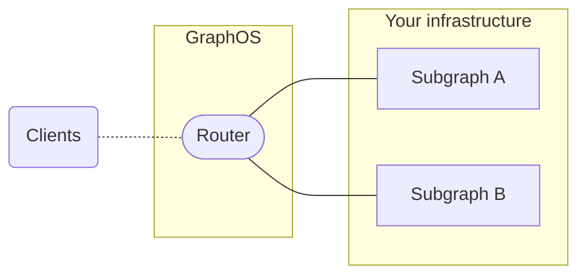

This article describes which data is and is _not_ sent to Apollo GraphOS by other Apollo tools and libraries.

**Our top priority is ensuring the privacy and security of your data and your customers' data.** No Apollo tool or library running in your environment sends _any_ data to GraphOS unless you configure it to do so. Features that potentially send highly sensitive data require additional opt-in.

## Does GraphOS store operation result data returned by my graph?

**No.** Your graph's operation results never even _reach_ any Apollo-managed service, with one important exception: [cloud supergraphs](#what-data-is-collected-by-a-cloud-supergraph) use a GraphOS-managed router, which passes results directly from your subgraphs to requesting clients, **without logging, persisting, or sending those results to any other system** (other data like operation metrics _are_ persisted).

## Which tools send data to GraphOS?

The [Apollo Router](/router/), [Apollo Server](/apollo-server/), the [Rover CLI](/rover/), and the legacy [Apollo CLI](/devtools/cli/) have **opt-in features** that send data to GraphOS.

The Rover CLI also collects anonymous usage data by default. [You can disable this.](/rover/privacy/)

If you have a [cloud supergraph](./graphs/overview/#cloud-supergraphs), its router is hosted and managed _by_ GraphOS, and it automatically enables metrics reporting. [Learn about data collection for cloud supergraphs.](#what-data-is-collected-by-a-cloud-supergraph)

Apollo Client libraries do **not** send data to GraphOS.

## Where is data sent?

All data sent to GraphOS is sent to an endpoint with one of the following base URLs:

| Base URL                                              | Used by                                                                                                                                                                                                          |
| ----------------------------------------------------- | ---------------------------------------------------------------------------------------------------------------------------------------------------------------------------------------------------------------- |
| **Latest URLs**                                       |
| `https://usage-reporting.api.apollographql.com`       | Metrics reporting from the [Apollo Router](/router/configuration/apollo-telemetry) (v0.1.0+), [Apollo Server](./metrics/sending-operation-metrics/) (v2.18.0+), and third-party API servers                   |
| `https://schema-reporting.api.apollographql.com`      | Schema registration via schema reporting in Apollo Server (v2.18.0+) and third-party API servers           |
| `https://api.apollographql.com/graphql`               | All [Rover CLI](/rover/) (v0.6+) commands that communicate with GraphOS, along with all requests to the [GraphOS Platform API](./platform-api/)
| `https://uplink.api.apollographql.com`                | Apollo Server with Apollo Gateway (v0.34.0+) with [managed federation](/federation/managed-federation/overview/) and Apollo Router (v0.1.0+) with [managed federation](/federation/managed-federation/overview/)                                                                                                 |
| `https://aws.uplink.api.apollographql.com`            | Apollo Server with Apollo Gateway (v0.45.0+) with [managed federation](/federation/managed-federation/overview/) and Apollo Router (v0.1.0+) with [managed federation](/federation/managed-federation/overview/)                                                                                                 |
| **Active legacy URLs**                                |
| `https://engine-report.apollodata.com`                | Metrics reporting from Apollo Server (v2.0-2.17.x)                                                                                                                                                               |
| `https://edge-server-reporting.api.apollographql.com` | Schema registration via schema reporting in Apollo Server (v2.15.0-2.17.x)                                                                                                                                       |
| `https://engine-graphql.apollographql.com`            | All legacy Apollo CLI (v2.30 and earlier) commands that communicate with GraphOS                                                                                                                                         |
| `https://storage.googleapis.com`                      | Apollo Server with Apollo Gateway (v0.15.1 and earlier) with [managed federation](/federation/managed-federation/overview/), or with the operation registry plugin (v0.3.1 and earlier) |
| `https://federation.api.apollographql.com`            | Apollo Server with Apollo Gateway (v0.16.0-v0.33.0) with [managed federation](/federation/managed-federation/overview/)                                                                                          |
| `https://storage-secrets.api.apollographql.com`       | Apollo Server with Apollo Gateway (v0.16.0-v0.33.0) with [managed federation](/federation/managed-federation/overview/), or with the operation registry plugin                |
| `https://operations.api.apollographql.com`            | Apollo Server with the operation registry plugin (v0.4.1+)                                                                                                                              |
| `https://graphql.api.apollographql.com`               | All [Rover CLI](/rover/) (prior to v0.6) commands and legacy [Apollo CLI](/devtools/cli/)(v2.31+) commands that communicate with GraphOS                                                           |


If your environment uses a corporate proxy or firewall, you might need to configure it to allow outbound traffic to these domains. Note that data might be sent to multiple endpoints in a given domain.

## Which types of data do the Apollo Router and Apollo Server send to GraphOS?

You can configure both the Apollo Router and Apollo Server to report certain data to GraphOS for each operation resolved by these libraries. These types of data include:

- Several fields _besides_ `data` from every operation response

    - **Neither the Apollo Router nor Apollo Server _ever_ sends the `data` field of an operation response to GraphOS.** 

- The [normalized query operation string](#query-operation-strings) for every executed operation

- [Trace data](#operation-traces) indicating the execution time for every resolver in the operation

- The values of operation [GraphQL variables](#graphql-variables) and [HTTP headers](#http-headers)

These types of data are covered in the subsections below.

In addition, you can configure a standalone instance of Apollo Server to [report its schema to GraphOS](./schema/schema-reporting).

> _All_ data sent to GraphOS from both the Apollo Router and Apollo Server is transmitted using HTTPS on port 443, and HTTP traffic on port 80 is disabled.

### Operation response fields

Let’s walk through the default behaviors of the Apollo Router and Apollo Server when reporting fields in a typical GraphQL response:

```json
// GraphQL Response
{
  "data": { ... },  // NEVER sent to GraphOS
  "errors": [ ... ] // Can be sent to GraphOS, used to report on errors for operations and fields.
}
```

#### `response.data`

As mentioned, the Apollo Router and Apollo Server **never** send the contents of this field to GraphOS. The responses from your graph stay internal to your application.

#### `response.errors`

Both the Apollo Router and Apollo Server can report certain error information to GraphOS, but the exact behavior varies:

##### The Apollo Router

Currently, the Apollo Router reports _only_ which fields in an operation produced errors. Other error details (such as messages) are masked in reports to GraphOS.

You cannot currently configure the Apollo Router to report any _additional_ error details.

##### Apollo Server 4

By default, Apollo Server 4 reports _only_ which fields in an operation produced errors.

You can configure Apollo Server 4 to provide _additional_ error details (such as error messages and extensions). To do so, provide the [`sendErrors` option](/apollo-server/api/plugin/usage-reporting#senderrors) to Apollo Server's usage reporting plugin.

##### Apollo Server 2 and 3

> Note that Apollo Server versions 2 and 3 are [deprecated](/apollo-server/previous-versions/).

By default, Apollo Server versions 2 and 3 report _all_ error details to GraphOS, including messages and extensions.

You can use the [usage reporting plugin's `rewriteError` option](/apollo-server/v3/api/plugin/usage-reporting#rewriteerror) to filter or transform errors before they're stored in GraphOS. Use this to strip sensitive data from errors or filter "safe" errors from Studio reports.

### Query operation strings

The Apollo Router and Apollo Server both report a normalized string representation of each query operation to GraphOS. By default, this [normalization algorithm](/graphos/metrics/operation-signatures/) strips out string literals that are passed as arguments. However, we highly recommend that users **do not include sensitive data (such as passwords or personally identifiable information) in operation strings**. Instead, include this information in [GraphQL variables](#graphql-variables), which you can send selectively.

### Operation traces

If you're using the Apollo Router, your subgraphs can include operation trace data in each of their responses to the router. This data includes timing information for each resolver that contributed to the operation.

> To check which subgraph libraries support federated traces, consult the `FEDERATED TRACING` entry in [this table](/federation/building-supergraphs/supported-subgraphs).

You can configure the Apollo Router to include this trace data in its reports to GraphOS ([learn how](/router/configuration/apollo-telemetry#enabling-field-level-instrumentation)). By doing so, you can visualize the performance of your operations in Apollo Studio, [broken down by resolver](./metrics/usage-reporting#resolver-level-traces).

If you're using a standalone instance of Apollo Server, you can also configure it to [report operation traces to GraphOS](/apollo-server/api/plugin/inline-trace).

### GraphQL variable values

This section pertains to the _values_ of variables that are included in GraphQL operations. The _names_ of these variables are included in [operation strings](#query-operation-strings) that are sent to GraphOS.

#### Apollo Server 2.7.0 and later

In Apollo Server 2.7.0 and later, **none** of an operation's GraphQL variable values are sent to GraphOS by default.

You can set a value for the [usage reporting plugin's `sendVariableValues` option](/apollo-server/api/plugin/usage-reporting/#sendvariablevalues) to specify a different strategy for reporting some or all variable values.

#### Apollo Server prior to 2.7.0

In versions of Apollo Server 2 _prior_ to 2.7.0, **all** of an operation's GraphQL
variable values are sent to GraphOS by default.

If you're using an earlier version of Apollo Server, it's recommended that you update. If you can't update for whatever reason, you can use the [`privateVariables` reporting option](/apollo-server/v2/migration-engine-plugins/#options-for-apolloserverpluginusagereporting) to specify the names of variables that should _not_ be sent to GraphOS. You can also set this option to `false` to prevent all variables from being sent. This reporting option is deprecated and will not be available in future versions of Apollo Server.

#### Apollo Router

By default, the Apollo Router **does not** send an operation's GraphQL variable values to GraphOS.

To enable variable value reporting in the Apollo Router, see [this section](/router/configuration/apollo-telemetry#advanced-configuration). 

### HTTP headers

Regardless of your server configuration, GraphOS **never** collects the values
of the following HTTP headers, even if they're sent:

- `Authorization`
- `Cookie`
- `Set-Cookie`

You can, however, configure reporting options for all other HTTP headers.

> **Important:** If you perform authorization in a header other than those listed above (such as `X-My-API-Key`), **do not send that header to GraphOS**.

#### Apollo Server 2.7.0 and later

In Apollo Server 2.7.0 and later, **none** of an operation's HTTP headers is sent to GraphOS by default.

You can set a value for the [usage reporting plugin's `sendHeaders` option](/apollo-server/api/plugin/usage-reporting/#sendheaders) to specify a different strategy for reporting some or all of your HTTP headers.

#### Apollo Server prior to 2.7.0

In versions of Apollo Server 2 _prior_ to 2.7.0, **all** of an operation's HTTP headers (except the confidential headers listed [above](#http-headers)) are sent to GraphOS by default.

If you're using an earlier version of Apollo Server, it's recommended that you
update. If you can't update for whatever reason, you can use the [`privateHeaders` reporting option](/apollo-server/v2/migration-engine-plugins/#options-for-apolloserverpluginusagereporting) to specify the names of variables that should _not_ be sent to GraphOS. You can also set this option to `false` to prevent all headers from being sent. This reporting option is deprecated and will not be available in future versions of Apollo Server.

#### Apollo Router

By default, the Apollo Router **does not** send an operation's HTTP header values to GraphOS.

To enable header reporting in the Apollo Router, see [this section](/router/configuration/apollo-telemetry#advanced-configuration).

## Which types of data are collected by a cloud supergraph?

A cloud supergraph uses a GraphOS-managed router to execute operations across one or more subgraphs hosted in your infrastructure:



Each GraphOS-managed router is an instance of the [Apollo Router](/router/) running in its own managed container. These instances use the _same_ mechanisms to report operation metrics to GraphOS as an Apollo Router instance running in _any other_ environment! The only difference is that metrics reporting is _always_ enabled for a cloud supergraph's router.

**GraphOS-managed routers do not persist or log any response data returned by your subgraphs.** They _only_ assemble this data into responses for requesting clients. 

## What data does GraphOS log about operations executed in the Explorer?

**Only front-end usage metrics for improving the product.** The [Apollo Studio Explorer](./explorer/explorer/) enables you to build and execute operations against your graph. These operations are sent directly from your browser and **do not** pass through Apollo systems.

## GDPR

Effective May 25, 2018, the General Data Protection Regulation (GDPR) expands European Union (EU) residents’ (Data Subjects) rights concerning their personal data. Meteor Development Group Inc. (“MDG” also dba Apollo) stands ready to assist our customers to become or remain compliant with GDPR after this crucial transition.

#### What is GDPR?

GDPR standardizes EU regulations and expands the rights of Data Subjects pertaining to personal data while expanding the definition of what constitutes personal data. GDPR provides Data Subjects with increased rights to control and delete their personal data, and it broadly prohibits the processing of special categories of personal data.

#### How has Apollo prepared for GDPR?

We have been complying with GDPR since before it became enforceable on May 25, 2018. We are enhancing our products, processes, and procedures to meet our obligations as a data processor (Processor).

#### How will GDPR affect the way companies use Apollo's products or services?

Our products and services are not intended to be used for processing personal data. Our products and services are focused on software, systems, and applications - not individuals. If a customer wishes to set up a custom API, custom attribute, or custom event to track such data, it may do so. Our processing is data agnostic and automated, so all data is processed in the same way in accordance with a customer’s configuration. If, however, a customer believes that it has included personal data in the information processed by Apollo, we will assist the customer in meeting its obligations in accordance with the requirements of GDPR and the terms of our Data Processing Agreement.

#### How can Apollo assist customers in meeting their obligations under GDPR?

As a Processor, we will assist customers in fulfilling their obligations as data controllers (Controllers) by:

- supporting customers in complying with requests from Data Subjects
- aggregating applicable personal data for customers replying to complaints from Data Subjects
- replying to investigations and inquiries from supervisory authorities concerning processing activities on behalf of a customer
- conducting Data Protection Impact Assessments

#### How can Apollo help address requests from Data Subjects?

Apollo has implemented a process to intake, review, and fulfill customer requests arising from Data Subject Access Requests (DSAR) they receive. As a result of a DSAR, customers might request that Apollo securely delete or return the Data Subject’s personal data. Due to their sensitivity, such requests will be handled by Apollo on a case-by-case basis.

#### Where can I learn more about Apollo's security and privacy policies?

The legal terms and policies that apply to Apollo's corporate websites and customer products or services are available at https://www.apollographql.com/Apollo-Website-Terms-of-Service.pdf and https://www.apollographql.com/Apollo-Terms-of-Service.pdf.

#### Where can I get more help?

If you have any additional questions or encounter any issues, please [reach out to support](https://studio.apollographql.com/support).

Organizations with an Enterprise plan can request a Data Processing Addendum (DPA) from support.

## Requesting deletion of data

To request the deletion of specific data from your Apollo organization, please email **support@apollographql.com** with the subject `Data deletion request`.

In your email, please include the following:

- A description of the data that needs to be deleted
- An approximate timestamp of when that data was reported to Apollo
- The ID of the graph that the data is associated with

> **Important:** Currently, data deletion is performed across _all variants_ of an affected graph. Per-variant deletion is not available.

You can also request that members of your organization be removed from marketing outreach. To do so, provide the email addresses of those members in your email.

<!--
######################################################################
Policies and Agreements
######################################################################
-->

## Policies and agreements

To learn about other ways that we protect your data, please read over our [Terms of Service](https://www.apollographql.com/Apollo-Terms-of-Service.pdf) and [Privacy Policy](https://www.apollographql.com/Apollo-Privacy-Policy.pdf).
