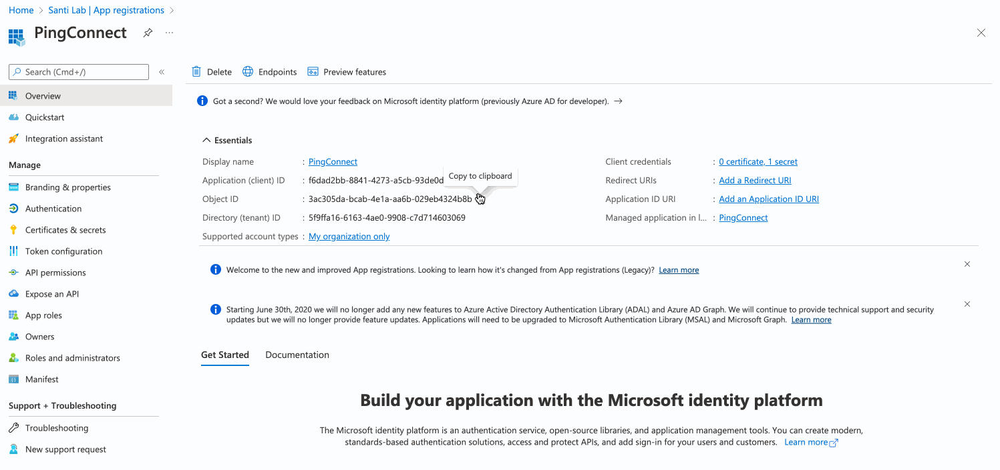
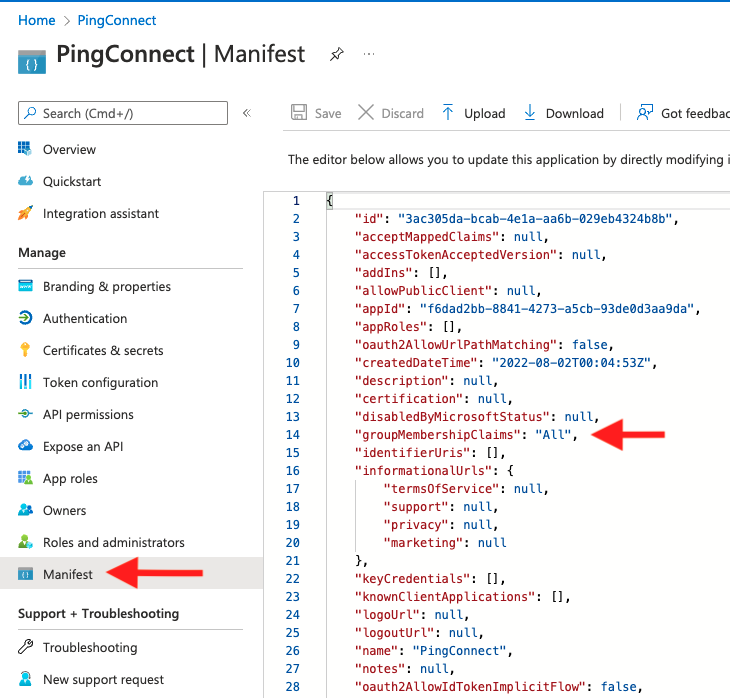
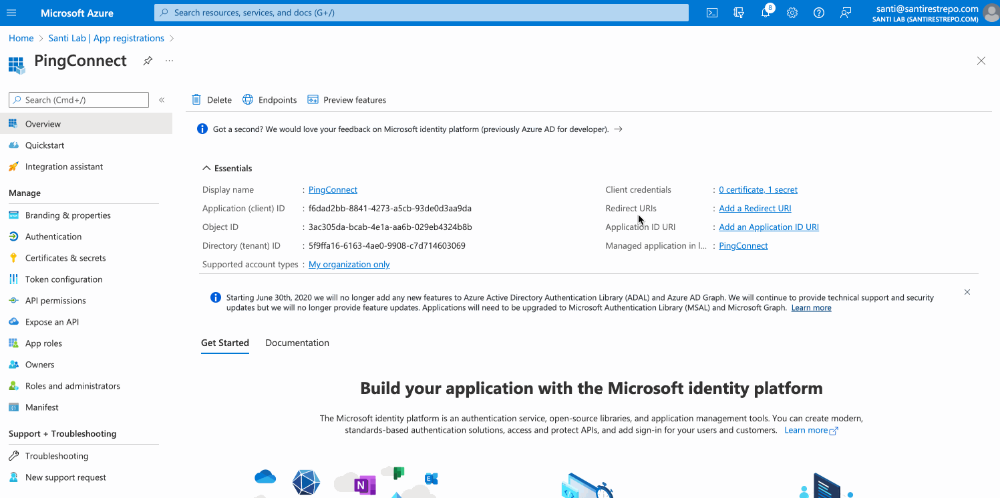

This guide walks through configuring SSO for GraphOS Studio by using Azure AD as an identity provider (IdP) using PingOne's email invite method.

> ⚠️ This is necessary in situations where Apollo's default entity ID (`PingConnect`) is already being used by another application and the alternative entity ID, which is a GUID, cannot be used with Azure.  

## Create an Azure AD App Registration
1. Navigate to [Azure Portal](http://portal.azure.com/) and navigate to **Azure Active Directory**.
1. In the left pane, select **App Registrations**, and then in the top ribbon select **+ New Registration**.
1. On the **Register an application page**:
   * Provide a friendly name for the PingOne client (e.g., `Apollo GraphOS Studio`).
   * Under **Supported account types** select which type of Microsoft accounts will have access.
   * Leave **Redirect URI** empty. You will provide this information later.  
    

### Retrieve Endpoint URL & Client ID
1. In the **Overview** section of your newly created **App Registration**, copy and paste the “Application (client) ID” to a local text file.
1. Also, in the **Overview** section, select **Endpoints** on the top menu and copy and paste the “OpenID Connect metadata document“ URL to the same local text file.  
  
 

### Create a Client Secret 
1. On the landing page of your app registration, select **Certificates & secrets** from the left hand pane.
1. Select **+ New client secret** and create a new secret. Copy and paste the **Value** field to the same text file you created earlier.

 

### Configure API Permissions
1. On the landing page of your app registration, select **API permissions**.
1. Check if **User.Read** is listed by default. If it is not, add it manually:
   * Select **+ Add a permission > Microsoft Graph > Application permissions**.
   * Search for Group, expand, and select **Group.Read.All**. **Save** changes.
   * If **User.Read** was not auto created, repeat the process for this permission.
1. Back on the **API Permissions** page, select **Grant admin consent** next to the **+ Add a permission** button. Doing this ensures your users don't need to grant consent during SSO.

 

4. In the left options pane, select **Manifest**.
   * Find the **"groupMembershipClaims"** and change it from null to either `All` or `SecurityGroup`. This ensures that the group membership claim is included in the access token during SSO.
   * **Save** changes.

 

## Integrate PingOne with Azure AD
1. Once you have received your PingOne SSO invitation email, select the enrollment link to create a new account or sign-in with an existing account.
2. On the landing page, select **Setup** on the top ribbon.
3. Select **Connect to an Identity Repository > Microsoft Azure AD** and select **Next**.
4. On the **Configure Your Microsoft Azure Connection** modal:
   * Copy and paste the endpoint URL, client ID, and client secret values saved earlier from Azure AD.  
   * Select **Verify**. PingOne will verify that it can query the endpoint or endpoints you've specified.
   * For **Scope**, select the OAuth scopes that you'd like to include in authentication requests, then select **Next**.

 

5. In Step 2 of the wizard, copy the **PingOne Redirect URI** and paste it on the Azure AD app registration.
   * Redirect URIs can be configured from the **Overview** section of your app registration under the **Essentials** menu in Azure AD.
   * Select **Redirect URIs > Add a platform > Web** and enter the Redirect URI you copied from PingOne. Select **Configure** to save changes.
   * Back on the PingOne configuration wizard, select **Next** after copying and pasting the URI.

 

6. On Step 3, configure the **Map Attributes** section by mapping the incoming attributes or claims from Azure AD to PingOne. You can leave this with the default Attribute Mapping.
7. On Step 4, choose whether or not you would like to synchronize your user groups from Azure AD to your PingOne user groups. 
   * The permissions **User.Read** and **Group.Read.All** are required for synchronization to be successful.
   * Any PingOne user groups that do not exist in your Azure provider will be replaced by the Azure groups.
   * Each of your Azure group members are automatically added to the corresponding PingOne groups when the user initially signs on (SSO) to PingOne. This is PingOne's just-in-time user provisioning.
8. Select **Save** to complete the Azure AD to PingOne connection.

## Configure the OIDC Application
Once you have successfully configured the Azure AD to PingOne identity bridge, the last step is to configure and enable GraphOS Studio as an OIDC application. The configuration for this application should already be initialized and can be accessed via the **Complete your Application Configuration** reminder under **Applications** in the PingOne admin console.

1. Select **Meteor Development Group - Apollo Studio** under **Complete your Application Configuration**.
> ⚠️ If the **Add OIDC Application** wizard doesn’t automatically pop-up, select the **SAML** tab and then select the **OIDC** tab.

 

2. On step 1 of the **Add OIDC Application** wizard, configure the application name, description, category, and icon (optional).
3. Select **Next** on steps 2-5; these are pre configured by default. 
4. On step 6 (**Attribute Mapping**), it is required to map email to email and sub to preferred_username. You may map more attributes for given name, family name, and others. 
5. On step 7 (**Group Access**), select the groups you want to grant access to SSO for GraphOS Studio. 
6. Select **Done** to complete the configuration!

## Notify Apollo
Once you have completed the steps above, reach out to your Apollo contact.  They will complete the SSO setup process.