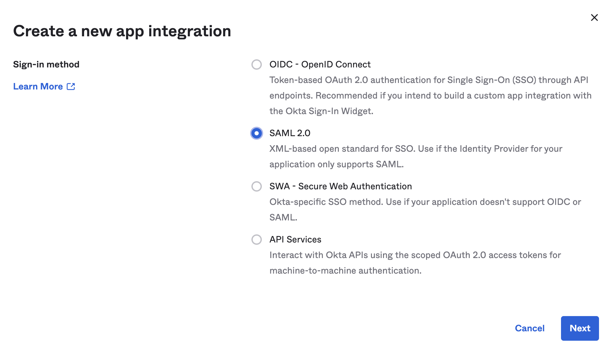
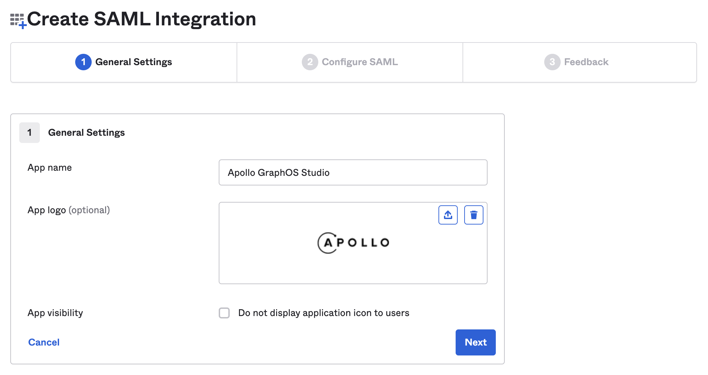
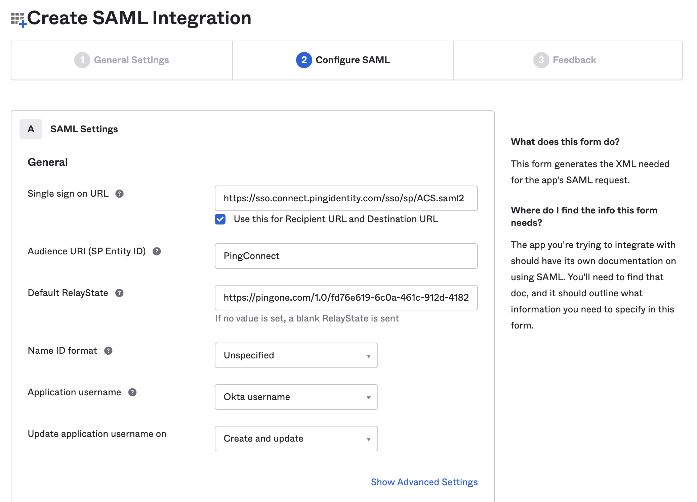
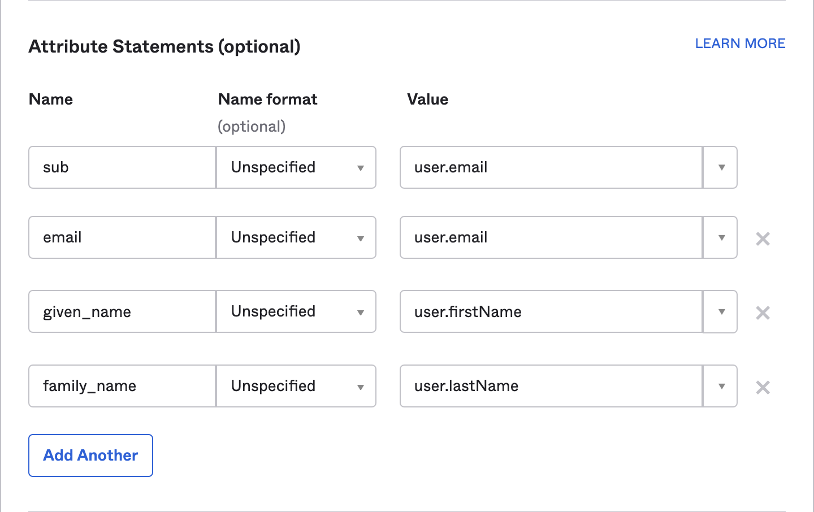
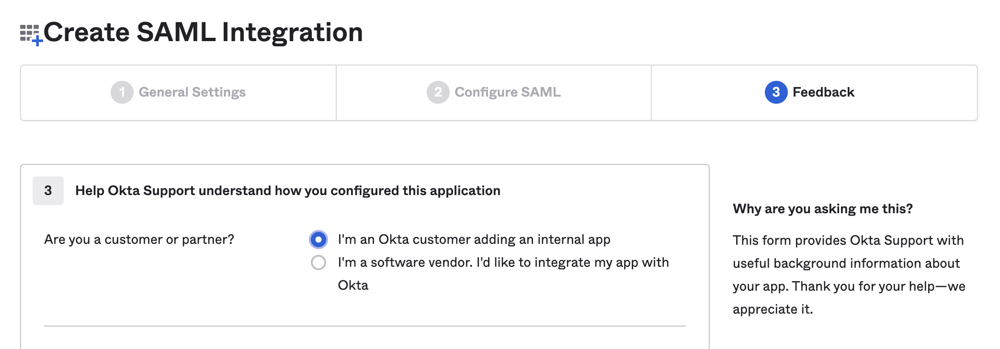
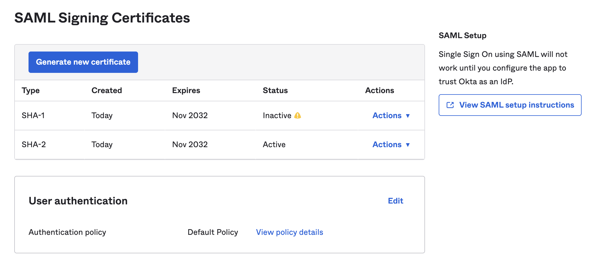
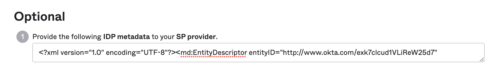

This guide walks through configuring Okta as the identity provider (IdP) for GraphOS Studio.  An Okta account with administrator privileges is required.

1. Create App Integration
    * Navigate to the _Applications_ view.  
    * Select the **Create App Integration** button.  
    * From within the _Create a new app integration_ modal select the **SAML 2.0** option.  
    * Select the **Next** button.

    

2. Create SAML Integration  
    * Set **App name**: `Apollo GraphOS Studio`  
    * Set **App logo**: [Apollo logo](../img/sso/apollo-sk-logo.png) (optional)  
    * Select the **Next** button.

    
    
3. SAML Settings  

    * Set **Single Sign On URL**: `https://sso.connect.pingidentity.com/sso/sp/ACS.saml2`  
    * Check the _Use this for Recipient URL and Destination URL_ checkbox.  
    * Set **Audience URI (SP Entity ID)**: `PingConnect`  
    
        > ⚠️ If `PingConnect` already exists use `fd76e619-6c0a-461c-912d-418278929d60`

    * Set **Default RelayState**: `https://pingone.com/1.0/fd76e619-6c0a-461c-912d-418278929d60`  

       

4. Configure Attribute Statements  
    > ⚠️ These four attribute statements are required for a seamless experience into Apollo Studio.
    * Set **sub**: this uniquely identifies the user to Apollo Studio. This is typically email or username.
    * Set **email**
    * Set **given_name**
    * Set **family_name**
    * Select the **Next** button.

       

5. Feedback
    * Select the **I'm an Okta customer adding an internal app** option.  
    * Select the **Finish** button.

           

6. Send SAML metadata to Apollo
    * Scroll down, and in the right hand column select the **View SAML setup instructions** button.

         

    * Copy and paste contents of the **IDP metadata** textbox into a text file.

     

    * Send the file to your Apollo contact.  They will continue the SSO setup.